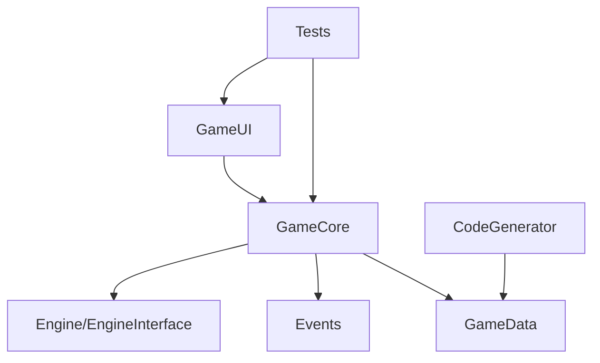

# 项目结构指南

本文档说明 WasiCore 解决方案的项目结构和依赖关系。

## 📁 解决方案结构

```text
WasiCore/
├── GameCore/                   # 🎮 游戏核心系统
│   ├── AbilitySystem/         # 技能系统
│   ├── ActorSystem/           # 表现系统
│   ├── BaseType/              # 基础类型
│   ├── EntitySystem/          # 实体系统
│   ├── Timers/                # 计时器系统
│   └── ...
├── GameUI/                     # 🖥️ UI系统
├── GameData/                   # 📊 游戏数据定义
├── Engine/                     # 🔧 引擎层
│   ├── EngineInterface/       # 引擎接口
│   ├── EngineCommon/          # 公共组件
│   └── ...
├── Events/                     # 📡 事件系统
├── TriggerEncapsulation/       # 🎯 触发器封装
├── CodeGenerator/              # 🔨 代码生成器
└── Tests/                      # 🧪 测试项目
    ├── GameCoreTests/         # 服务器端测试
    ├── GameCoreClientTests/   # 客户端测试
    ├── EventsTests/           # 事件系统测试
    └── ...
```

## 🔗 项目依赖关系

### 核心依赖链



### 关键依赖说明

1. **CodeGenerator** → **GameData**：生成数据类和扩展
2. **GameCore** → **Engine/EngineInterface**：引擎抽象层
3. **GameCore** → **Events**：事件发布订阅
4. **GameCore** → **GameData**：数据驱动配置
5. **Tests** → **GameCore**：测试核心功能

## ⚠️ 构建顺序要求

由于项目间的复杂依赖关系，必须按以下顺序构建：

1. **CodeGenerator** - 代码生成工具
2. **GameData** - 基础数据类型
3. **Events** - 事件系统
4. **Engine/** - 引擎组件
5. **GameCore** - 核心游戏逻辑
6. **GameUI** - 用户界面
7. **Tests** - 测试项目

## 🧪 测试项目结构

### 测试项目依赖

- **GameCoreTests** → GameCore, GameData, Events
- **GameCoreClientTests** → GameCore, GameUI
- **EventsTests** → Events
- **TriggerEncapsulationTests** → TriggerEncapsulation

### 为什么需要解决方案级别测试？

1. **构建顺序**：测试需要所有依赖项按正确顺序构建
2. **代码生成**：CodeGenerator 必须先运行生成必要的代码
3. **共享配置**：解决方案级别的配置和资源共享
4. **依赖解析**：复杂的项目间引用需要完整上下文

## 🔧 开发建议

### 修改代码时

1. **修改 GameData**：需要重新构建整个解决方案
2. **修改 GameCore**：影响 GameUI 和所有测试项目
3. **修改 CodeGenerator**：需要清理并重新构建

### 调试测试时

```bash
# 完整重新构建
dotnet clean *.sln
dotnet build *.sln -c Server-Debug

# 运行测试
dotnet test *.sln -c Server-Debug
```

## 📚 相关文档

- [测试指南](Testing.md) - 详细的测试策略和命令
- [快速开始](QuickStart.md) - 项目设置和基本构建
- [框架概述](../FRAMEWORK_OVERVIEW.md) - 架构设计理解 