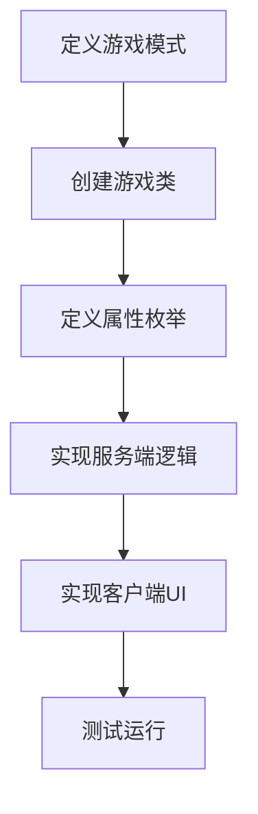

# Simple2D 联机游戏框架

## 📖 概述

`Simple2DMultiplayerGame` 是 WasiCore 提供的 2D 联机游戏开发框架，极大简化 2D 多人游戏的开发。通过继承模板基类，开发者只需编写核心游戏逻辑，框架自动处理客户端-服务端通信、PropertyObject 同步、消息路由等底层细节。

**核心理念**：**消除样板代码，让开发者专注于游戏创意**

---

## 🎯 为什么使用这个框架？

### 传统方式 vs 框架方式

| 项目 | 传统方式 | 使用框架 | 节省 |
|------|---------|---------|------|
| **代码量** | 350行样板 + 100行逻辑 | 100行逻辑 | **78%** |
| **开发时间** | 2-3天 | 2-3小时 | **90%** |
| **需要理解的概念** | IGameClass, IThinker, PropertyObject, EventClientMessage... | 继承基类，重写几个方法 | **80%** |
| **AI 辅助效率** | 低（需要解释大量样板代码） | 高（聚焦游戏逻辑） | **10倍** |

### 框架自动处理的内容

✅ **游戏类注册** - 泛型自注册，零反射  
✅ **客户端-服务端分离** - `#if SERVER` / `#if CLIENT` 自动编译  
✅ **PropertyObject 管理** - 创建、销毁、清理  
✅ **消息路由** - 客户端-服务端双向通信  
✅ **玩家事件** - 加入、离开自动处理  
✅ **游戏循环** - 服务端逻辑更新、客户端渲染  
✅ **UI 初始化** - 游戏面板自动创建  

---

## 🏗️ 框架架构

### 模板继承体系

```
Simple2DMultiplayerGame<TSelf>         ← 基础模板
    ├── RealtimeActionGameTemplate<TSelf>    ← 实时动作游戏（如FlappyBird、跑酷）
    └── TurnBasedGameTemplate<TSelf>         ← 回合制游戏（如五子棋、卡牌）
```

### 数据同步模型

框架基于 **PropertyObject** 数据同步系统：

```
服务端                                客户端
┌──────────────────┐                ┌──────────────────┐
│ PropertyObject   │  自动同步 →    │ PropertyObject   │
│ - BirdY: 350     │ ────────────→  │ - BirdY: 350     │
│ - Velocity: -100 │ ────────────→  │ - Velocity: -100 │
│ - Score: 5       │ ────────────→  │ - Score: 5       │
└──────────────────┘                └──────────────────┘
         ↑                                   ↓
    游戏逻辑更新                         读取并渲染UI
```

---

## 🚀 快速开始

**📘 新手推荐**: 先完成 [5分钟快速教程](./QUICKSTART.md)（Pong 游戏），然后再阅读本文档。

**🔍 遇到问题**: 查看 [常见错误速查表](./CommonMistakes.md)

---

### 步骤1：创建游戏类

```csharp
using TriggerEncapsulation.GameTemplates;

namespace MyGame;

// 🚨 关键：传入自身类型作为泛型参数
public partial class MyGame : RealtimeActionGameTemplate<MyGame>
{
    protected override bool ShouldInitialize()
    {
        // 指定何时初始化此游戏
        return Game.GameModeLink == MyGameData.GameMode.MyGame;
    }
}
```

### 步骤2：定义数据结构

```csharp
// 🚨 关键：必须添加这两个特性
[PropertyObjectWrapper]  // ← 触发自动生成包装器
[EnumExtension(Extendable = true)]  // ← 生成属性枚举
public enum EPropertyPlayer  // ← 必须以 EProperty 开头
{
    PlayerId,      // → int（自动推断）
    PositionY,     // → float（包含Y）
    Velocity,      // → float（包含velocity）
    IsAlive,       // → bool（以Is开头）
    Score,         // → int（默认）
}

// 定义消息类型
private enum MessageType : byte
{
    Jump = 1,
    Attack = 2,
}
```

### 步骤3：实现服务端逻辑

```csharp
#if SERVER
protected override void OnServerInitialize()
{
    // 注册消息处理器
    RegisterMessageHandler((byte)MessageType.Jump, OnJumpMessage);
}

protected override void OnPlayerJoined(Player player)
{
    base.OnPlayerJoined(player);  // 🚨 必须调用
    
    // 为玩家创建游戏对象
    var playerObj = CreateGameObject(player, SyncType.All);
    playerObj.Category = CategoryPlayer;  // 🚨 必须设置 Category
    
    var wrapper = new Player(playerObj);  // 使用自动生成的包装器
    wrapper.PlayerId = player.Id;
    wrapper.PositionY = 400f;
    wrapper.IsAlive = true;
}

protected override void OnRealtimeServerTick(float deltaTime)
{
    // 更新游戏逻辑
    UpdatePhysics(deltaTime);
    CheckCollisions();
}

private void OnJumpMessage(Player player, byte[] payload)
{
    // 处理玩家操作
}
#endif
```

### 步骤4：实现客户端UI

```csharp
#if CLIENT
protected override void OnClientInitialize()
{
    SetupInput();
}

protected override void OnClientRender(float deltaTime)
{
    // 遍历所有游戏对象并渲染
    foreach (var obj in AllPropertyObjects)
    {
        if (obj.Category == CategoryPlayer)
        {
            var player = new Player(obj);
            DrawPlayer(player.PositionY, player.IsAlive);
        }
    }
}

private void SetupInput()
{
    GamePanel.OnPointerPressed += (s, e) =>
    {
        SendMessageToServer((byte)MessageType.Jump);
    };
}
#endif
```

**完成！** 只需约100行代码，一个多人联机游戏就做好了。

---

## 🚨 开发检查清单

### 创建新游戏时
- [ ] ✅ 定义独立的 GameMode（避免冲突）
- [ ] ✅ 继承正确的模板基类
- [ ] ✅ 传入自身类型 `<MyGame>`
- [ ] ✅ 实现 `ShouldInitialize()`
- [ ] ✅ 定义 Category 常量

### 定义属性枚举时
- [ ] 🚨 **必须**添加 `[PropertyObjectWrapper]`
- [ ] 🚨 **必须**添加 `[EnumExtension(Extendable = true)]`
- [ ] ✅ 枚举名以 `EProperty` 开头
- [ ] ✅ 检查类型推断（参考 TYPE_INFERENCE_RULES.md）

### 服务端逻辑
- [ ] 🚨 **必须**调用 `base.OnPlayerJoined(player)`
- [ ] 🚨 **必须**设置 `obj.Category`
- [ ] ✅ 注册消息处理器
- [ ] ✅ 添加防作弊检查
- [ ] ✅ 使用正确的 SyncType

### 客户端渲染
- [ ] 🚨 **必须**调用 `panel.AddToRoot()`
- [ ] ✅ 缓存全局唯一对象
- [ ] ✅ 检查 `obj.IsValid`
- [ ] ✅ 添加异常处理

---

## 📚 框架 API 参考

### 生命周期方法

#### 服务端

| 方法 | 调用时机 | 用途 |
|------|---------|------|
| `OnServerInitialize()` | 服务端启动时 | 初始化游戏状态、注册消息处理器 |
| `OnServerTick(deltaTime)` | 每帧（~30 FPS） | 更新游戏逻辑 |
| `OnPlayerJoined(player)` | 玩家加入时 | 创建玩家对象、初始化数据 |
| `OnPlayerLeft(player)` | 玩家离开时 | 清理玩家对象 |

**RealtimeActionGameTemplate 额外提供：**
- `OnRealtimeServerTick(deltaTime)` - 实时游戏循环
- `OnPlayerSpawn(player)` - 玩家生成/重生
- `OnPlayerDied(player)` - 玩家死亡
- `AddPlayerScore(player, points)` - 分数管理
- `GetLeaderboard()` - 排行榜

**TurnBasedGameTemplate 额外提供：**
- `OnPlayerTurnStart(player)` - 回合开始
- `OnPlayerTurnEnd(player)` - 回合结束
- `NextTurn()` - 切换回合
- `IsPlayerTurn(player)` - 检查回合

#### 客户端

| 方法 | 调用时机 | 用途 |
|------|---------|------|
| `OnClientInitialize()` | 客户端启动时 | 初始化 UI、绑定输入 |
| `OnClientRender(deltaTime)` | 每帧（引擎频率） | 渲染游戏画面 |
| `OnPropertyObjectCreated(obj)` | PropertyObject 复制到客户端时 | 响应新对象创建 |

### 消息系统

#### 服务端接收消息

```csharp
// 方式1：原始字节数组
RegisterMessageHandler((byte)MessageType.Jump, (player, payload) => 
{
    // 处理消息
});

// 方式2：JSON 自动反序列化（推荐）
RegisterJsonMessageHandler<JumpRequest>((byte)MessageType.Jump, (player, data) => 
{
    // data 已自动反序列化为 JumpRequest 对象
});
```

#### 客户端发送消息

```csharp
// 方式1：原始字节
SendMessageToServer((byte)MessageType.Jump);

// 方式2：JSON（推荐）
SendJsonMessageToServer((byte)MessageType.Jump, new JumpRequest 
{ 
    PlayerId = LocalPlayer.Id,
    Timestamp = GameTime 
});
```

### PropertyObject 管理

#### 服务端

```csharp
// 创建游戏对象
var obj = CreateGameObject(player, SyncType.All);
obj.Category = CategoryPlayer;  // 使用 Category 分类

// 销毁游戏对象
DestroyGameObject(obj);

// 获取所有游戏对象
foreach (var obj in GameObjects) { }

// 获取在线玩家
foreach (var player in GetOnlinePlayers()) { }
```

#### 客户端

```csharp
// 遍历所有同步的 PropertyObject
foreach (var obj in AllPropertyObjects)
{
    if (obj.Category == CategoryPlayer)
    {
        // 处理玩家对象
    }
}

// 缓存唯一对象（性能优化）
private MyGameState? cachedGameState;

protected override void OnPropertyObjectCreated(PropertyObject obj)
{
    if (obj.Category == CategoryGameState)
    {
        cachedGameState = new MyGameState(obj);  // 缓存，避免每帧遍历
    }
}
```

### 游戏循环控制

```csharp
// 服务端
StartServerLoop();   // 启动服务端循环
StopServerLoop();    // 停止服务端循环
bool IsServerRunning { get; }

// 客户端
StartRenderLoop();   // 启动渲染循环（自动）
StopRenderLoop();    // 停止渲染循环
```

---

## 🔧 PropertyObjectWrapper - 自动生成包装器

### 为什么需要包装器？

**直接访问 PropertyObject（冗长且易错）：**
```csharp
// ❌ 每次访问都需要完整的泛型调用
var y = obj.GetPropertyGeneric<PropertyBird, float>(PropertyBird.BirdY) ?? 0f;
obj.SetPropertyGeneric<PropertyBird, float>(PropertyBird.BirdY, newY);
```

**使用包装器（简洁且类型安全）：**
```csharp
// ✅ 简洁的属性访问
var bird = new Bird(obj);
var y = bird.BirdY;
bird.BirdY = newY;
```

### 使用方式

```csharp
// 1. 定义枚举并标记特性
[PropertyObjectWrapper]  // 🔥 触发自动生成
[EnumExtension(Extendable = true)]
public enum EPropertyBird
{
    PlayerId,      // → int
    BirdY,         // → float（包含Y，自动推断）
    Velocity,      // → float（包含velocity，自动推断）
    IsAlive,       // → bool（以Is开头，自动推断）
    Score,         // → int（默认）
}

// 2. 框架自动生成 Bird.g.cs 类
// 包含所有属性的 getter/setter、构造函数等

// 3. 使用 partial class 添加业务方法
public partial class Bird
{
    public void Jump(float velocity)
    {
        Velocity = velocity;  // 使用生成的属性
    }
}
```

### 类型推断规则

框架会根据属性名自动推断类型：

| 关键词类别 | 推断为 | 示例 |
|-----------|--------|------|
| `id`, `count`, `index` | `int` | PlayerId, ItemCount |
| `x`, `y`, `position`, `velocity`, `speed` | `float` | BirdY, MoveSpeed |
| `duration`, `time`, `delay`, `cooldown` | `float` | GameDuration, RespawnTimer |
| `health`, `damage`, `armor`, `energy` | `float` | MaxHealth, AttackDamage |
| `is...`, `has...`, `can...`, `alive`, `active` | `bool` | IsAlive, HasWeapon |

**显式指定类型：**
```csharp
[PropertyType(typeof(double))]
PreciseValue,

[PropertyType(typeof(string))]
PlayerName,
```

---

## 🎮 开发流程

### 完整的游戏开发流程



#### 1. 定义游戏模式（GameMode）

```csharp
public class MyGameData : IGameClass
{
    public static class GameMode
    {
        public static readonly GameLink<GameDataGameMode, GameDataGameMode> 
            MyGame = new("MyGame"u8);
    }
    
    public static void OnRegisterGameClass()
    {
        Game.OnGameDataInitialization += () =>
        {
            _ = new GameDataGameMode(GameMode.MyGame)
            {
                Name = "我的游戏",
                SceneList = [],  // 2D游戏不需要场景
            };
        };
    }
}
```

#### 2. 创建游戏类

```csharp
public partial class MyGame : RealtimeActionGameTemplate<MyGame>
{
    protected override bool ShouldInitialize()
    {
        return Game.GameModeLink == MyGameData.GameMode.MyGame;
    }
}
```

#### 3. 定义数据结构

```csharp
[PropertyObjectWrapper]
[EnumExtension(Extendable = true)]
public enum EPropertyPlayer
{
    PlayerId,
    Health,
    Score,
    IsAlive,
}

private enum MessageType : byte
{
    Attack = 1,
    UseItem = 2,
}
```

#### 4. 实现服务端（MyGame.Server.cs）

```csharp
public partial class MyGame
{
#if SERVER
    private readonly List<Player> players = new();
    
    protected override void OnServerInitialize()
    {
        RegisterMessageHandler((byte)MessageType.Attack, OnAttack);
    }
    
    protected override void OnPlayerJoined(Player player)
    {
        base.OnPlayerJoined(player);
        
        var playerObj = CreateGameObject(player, SyncType.All);
        var wrapper = new Player(playerObj);
        wrapper.PlayerId = player.Id;
        wrapper.Health = 100f;
        wrapper.IsAlive = true;
        
        players.Add(wrapper);
    }
    
    protected override void OnRealtimeServerTick(float deltaTime)
    {
        // 游戏逻辑
        foreach (var p in players)
        {
            UpdatePlayer(p, deltaTime);
        }
    }
    
    private void OnAttack(Player player, byte[] payload)
    {
        // 处理攻击逻辑
    }
#endif
}
```

#### 5. 实现客户端（MyGame.Client.cs）

```csharp
public partial class MyGame
{
#if CLIENT
    private Canvas? gameCanvas;
    
    protected override void OnClientInitialize()
    {
        CreateUI();
        SetupInput();
    }
    
    protected override void OnClientRender(float deltaTime)
    {
        if (gameCanvas == null) return;
        
        gameCanvas.ResetState();
        
        // 渲染所有玩家
        foreach (var obj in AllPropertyObjects)
        {
            if (obj.Category == CategoryPlayer)
            {
                var player = new Player(obj);
                DrawPlayer(player);
            }
        }
    }
    
    private void SetupInput()
    {
        GamePanel.OnPointerPressed += (s, e) =>
        {
            SendMessageToServer((byte)MessageType.Attack);
        };
    }
#endif
}
```

---

## 💡 核心概念

### 1. Category - 对象分类

使用 `Category` 区分不同类型的 PropertyObject：

```csharp
// 定义类别常量
private const int CategoryPlayer = 1;
private const int CategoryEnemy = 2;
private const int CategoryItem = 3;

// 设置类别
var obj = CreateGameObject(player, SyncType.All);
obj.Category = CategoryPlayer;

// 按类别过滤
foreach (var obj in AllPropertyObjects)
{
    if (obj.Category == CategoryEnemy)
    {
        // 只处理敌人对象
    }
}
```

### 2. SyncType - 同步范围

**2D 游戏常用的 SyncType**：

| SyncType | 同步范围 | 适用场景 |
|----------|---------|---------|
| `SyncType.All` | 所有玩家 | 公共对象（管道、敌人、公共卡牌） |
| `SyncType.Self` | 仅对象所有者 | 私密数据（手牌、个人状态） |
| `SyncType.Ally` | 所有者和同队玩家 | 队伍游戏（队友可见的信息） |

**不推荐使用**（3D 游戏特有，需要战争迷雾）：
- `SyncType.Sight` - 基于视野同步（2D 游戏无此概念）
- `SyncType.SelfOrSight` - 自己或视野内
- `SyncType.AllyOrSight` - 盟友或视野内

```csharp
// 示例：卡牌游戏
var handCard = CreateGameObject(player, SyncType.Self);  // 只有玩家自己能看到手牌
var publicCard = CreateGameObject(player, SyncType.All); // 所有人都能看到公共区域的牌

// 示例：队伍游戏
var teamInfo = CreateGameObject(player, SyncType.Ally);  // 只有队友能看到队伍信息
```

### 3. 服务端权威

**核心原则：游戏逻辑在服务端，客户端只负责渲染和输入**

```csharp
#if SERVER
// ✅ 服务端：权威逻辑
protected override void OnRealtimeServerTick(float deltaTime)
{
    player.Health -= damage;  // 服务端计算伤害
    
    if (player.Health <= 0)
    {
        KillPlayer(player);   // 服务端判定死亡
    }
}
#endif

#if CLIENT
// ✅ 客户端：只读渲染
protected override void OnClientRender(float deltaTime)
{
    var health = player.Health;  // 只读
    DrawHealthBar(health);       // 渲染
}
#endif
```

### 4. 防作弊

在服务端验证所有玩家操作：

```csharp
private void OnJumpMessage(Player player, byte[] payload)
{
    var playerObj = GetPlayerObject(player);
    if (playerObj == null || !playerObj.IsAlive) return;  // 验证状态
    
    // 防止频繁操作
    if (GameTime - playerObj.LastJumpTime < 0.1f)
    {
        Game.Logger.LogWarning("Player {id} jump too frequent", player.Id);
        return;
    }
    
    // 执行操作
    playerObj.Jump();
    playerObj.LastJumpTime = GameTime;
}
```

---

## 🎯 适用场景

### ✅ 适合使用此框架的游戏类型

| 游戏类型 | 推荐模板 | 示例 |
|---------|---------|------|
| **2D 动作游戏** | RealtimeActionGameTemplate | 多人FlappyBird、跑酷、横版射击 |
| **卡牌对战** | TurnBasedGameTemplate | 炉石传说类、狼人杀 |
| **棋类游戏** | TurnBasedGameTemplate | 五子棋、象棋、围棋 |
| **2D 塔防** | RealtimeActionGameTemplate | 经典塔防 |
| **休闲竞技** | RealtimeActionGameTemplate | 跳一跳、贪吃蛇对战 |
| **2D MOBA** | RealtimeActionGameTemplate | 简化版MOBA |

### ❌ 不适合使用此框架的场景

- 需要 3D 场景、物理引擎的游戏 → 使用 Entity 系统
- 大规模 MMO（100+ 玩家） → 需要更复杂的架构
- 纯单机游戏 → 不需要联机框架

---

## 📋 最佳实践

### 1. 文件组织

推荐使用 `partial class` 分离关注点：

```
MyGame/
├── MyGameData.cs          # GameMode 定义
├── MyGame.cs              # 主类、枚举、常量
├── MyGame.Server.cs       # 服务端逻辑
├── MyGame.Client.cs       # 客户端 UI
├── WrapperExtensions.cs   # 包装器业务方法
├── GameConstants.cs       # 游戏常量
└── GameConfig.cs          # 可配置参数（可选）
```

### 2. 使用包装器模式

```csharp
// ✅ 推荐：封装 PropertyObject
public partial class Bird
{
    // 自动生成的属性
    public float BirdY { get; set; }
    public float Velocity { get; set; }
    
    // 手写的业务方法
    public void Jump(float jumpVelocity)
    {
        Velocity = jumpVelocity;
    }
    
    public void UpdatePhysics(float deltaTime, float gravity)
    {
        Velocity += gravity * deltaTime;
        BirdY += Velocity * deltaTime;
    }
}
```

### 3. 缓存全局唯一对象

```csharp
#if CLIENT
// 对于全局唯一的对象（如 GameState），应该缓存
private MyGameState? cachedGameState;

protected override void OnPropertyObjectCreated(PropertyObject obj)
{
    if (obj.Category == CategoryGameState)
    {
        cachedGameState = new MyGameState(obj);
    }
}

// 使用缓存，避免每帧遍历
protected override void OnClientRender(float deltaTime)
{
    var timeRemaining = cachedGameState?.TimeRemaining ?? 0f;
    DrawTimer(timeRemaining);
}
#endif
```

### 4. 配置化游戏参数

```csharp
// 分离常量和配置
public static class GameConstants
{
    // 不可变的物理常量
    internal const float GRAVITY = 1800f;
    internal const float SCREEN_WIDTH = 1200f;
}

public class GameConfig
{
    public static GameConfig Current { get; set; } = new();
    
    // 可调整的游戏参数
    public float RespawnTime { get; set; } = 3f;
    public int DeathPenalty { get; set; } = 10;
    
    // 难度预设
    public void LoadEasyMode() { RespawnTime = 2f; DeathPenalty = 5; }
    public void LoadHardMode() { RespawnTime = 5f; DeathPenalty = 20; }
}
```

### 5. 错误处理

```csharp
protected override void OnClientRender(float deltaTime)
{
    try
    {
        foreach (var obj in AllPropertyObjects)
        {
            if (!obj.IsValid) continue;  // 跳过无效对象
            
            // 渲染逻辑
        }
    }
    catch (Exception ex)
    {
        Game.Logger.LogError(ex, "Render error");
    }
}
```

---

## ⚡ 性能优化

### PropertyObject 的性能优势

| 对比项 | Entity 系统 | PropertyObject |
|--------|------------|----------------|
| **创建对象** | ~1-2ms（需要场景、GameData） | ~0.1ms（纯数据） |
| **同步开销** | 大（Transform、组件） | 小（仅同步变化的属性） |
| **客户端渲染** | 遍历场景树 | 直接遍历列表 |
| **适用场景** | 3D 游戏 | 2D 游戏 |

### 优化建议

#### 1. 合理使用 SyncType

```csharp
// ❌ 所有对象都用 SyncType.All
var privateData = CreateGameObject(player, SyncType.All);  // 浪费带宽，泄露私密信息

// ✅ 根据数据性质选择同步范围
var publicData = CreateGameObject(player, SyncType.All);   // 公共数据（所有玩家）
var privateData = CreateGameObject(player, SyncType.Self); // 私密数据（仅所有者）
var teamData = CreateGameObject(player, SyncType.Ally);    // 队伍数据（所有者和队友）
```

**2D 游戏 SyncType 选择**:
| 数据类型 | 使用 | 说明 |
|---------|------|------|
| 公共对象 | `All` | 管道、敌人、公共道具 |
| 私密数据 | `Self` | 手牌、个人金币、个人状态 |
| 队伍数据 | `Ally` | 队友标记、队伍资源 |
| ⚠️ **避免** | `Sight` 系列 | 3D 游戏的视野系统，2D 游戏用不到 |

**详细说明**: [SyncType 快速参考](./SyncType.md)

#### 2. 缓存频繁访问的对象

```csharp
// ❌ 每帧遍历查找
foreach (var obj in AllPropertyObjects)
{
    if (obj.Category == CategoryGameState)
    {
        var state = new GameState(obj);
        UpdateUI(state);  // 每帧重复查找
    }
}

// ✅ 缓存唯一对象
private GameState? cachedState;

protected override void OnClientRender(float deltaTime)
{
    if (cachedState != null)
    {
        UpdateUI(cachedState);  // 直接使用缓存
    }
}
```

#### 3. 使用包装器的字段缓存

```csharp
// 包装器在服务端自动缓存字段值
public partial class Bird
{
#if SERVER
    private float _birdY;  // 服务端缓存
#endif
    
    public float BirdY
    {
        get =>
#if SERVER
            _birdY;  // 服务端：直接返回缓存
#else
            PropertyObject.GetProperty(...);  // 客户端：读取同步值
#endif
    }
}
```

---

## 📖 示例游戏参考

框架提供了完整的示例游戏供参考：

### FlappyBird 多人版

**位置**: `Tests/Game/FlappyBirdMultiplayer/`

**游戏类型**: 实时动作游戏（使用 `RealtimeActionGameTemplate`）

**核心特性**:
- ✅ 多人竞技（2-8人同时游戏）
- ✅ 重生机制（死亡后3秒重生）
- ✅ 实时排行榜
- ✅ 防作弊检查（服务端验证）
- ✅ 配置化难度（简单/普通/困难/极限）
- ✅ PropertyObjectWrapper 自动生成包装器
- ✅ 客户端性能优化（GameState 缓存）

**代码组织**:
| 文件 | 行数 | 说明 |
|------|------|------|
| `FlappyBirdMultiplayer.cs` | 103 | 属性枚举、消息类型 |
| `FlappyBirdMultiplayer.Server.cs` | 406 | 服务端逻辑 |
| `FlappyBirdMultiplayer.Client.cs` | 611 | 客户端渲染 |
| `WrapperExtensions.cs` | 119 | 包装器业务方法 |
| `GameConfig.cs` | 196 | 配置和难度预设 |
| `GameConstants.cs` | 60 | 游戏常量 |
| **总计** | **~1,495** | 包含注释和空行 |

**效率对比**:
- 使用框架：~800 行纯逻辑代码
- 不使用框架：估计需要 2,000+ 行

**展示的框架特性**:
- ✅ PropertyObjectWrapper 自动生成
- ✅ 泛型自注册
- ✅ 消息系统
- ✅ 包装器业务扩展
- ✅ 客户端缓存优化
- ✅ 配置化设计

---

## 🔍 调试技巧

### 1. 使用日志追踪

```csharp
protected override void OnServerInitialize()
{
    Game.Logger.LogInformation("🎮 Server initialized");
}

protected override void OnPlayerJoined(Player player)
{
    Game.Logger.LogInformation("👋 Player {id} joined", player.Id);
}
```

### 2. 检查 PropertyObject 状态

```csharp
// 客户端调试
protected override void OnClientRender(float deltaTime)
{
    var count = AllPropertyObjects.Count();
    Game.Logger.LogDebug("PropertyObject count: {count}", count);
    
    foreach (var obj in AllPropertyObjects)
    {
        Game.Logger.LogDebug("Object {id}: Category={cat}, Valid={valid}", 
            obj.Id, obj.Category, obj.IsValid);
    }
}
```

### 3. 验证消息传递

```csharp
private void OnJumpMessage(Player player, byte[] payload)
{
    Game.Logger.LogDebug("📨 Received Jump from Player {id}, payload size: {size}", 
        player.Id, payload.Length);
    
    // 处理消息
}
```

---

## 🎓 学习路径

### 入门（1小时）
1. 阅读本文档理解框架概念
2. 查看 FlappyBird 示例的文件结构
3. 运行示例游戏体验

### 实践（2-3小时）
1. 创建简单的多人 Pong 游戏
2. 实现基础的碰撞和计分
3. 添加 UI 和视觉效果

### 进阶（1天）
1. 实现更复杂的游戏机制
2. 添加配置系统和难度设置
3. 优化性能和用户体验

### 精通（1周）
1. 深入理解 PropertyObject 同步原理
2. 创建自己的游戏模板变体
3. 为框架贡献新特性

---

## 🔗 相关文档

- **PropertyObject 系统** - 数据同步的基础
- **GameUI 系统** - 客户端 UI 渲染
- **Canvas 绘图 API** - 2D 图形绘制
- **消息传递系统** - 客户端-服务端通信
- **类型推断规则** - `CodeGenerator/TYPE_INFERENCE_RULES.md`

---

## ❓ 常见问题

### Q: 如何选择模板基类？

- **实时游戏**（需要高频更新）→ `RealtimeActionGameTemplate`
  - 例子：FlappyBird、跑酷、射击
- **回合制游戏**（玩家轮流行动）→ `TurnBasedGameTemplate`
  - 例子：五子棋、卡牌、策略
- **其他**（自定义游戏循环）→ `Simple2DMultiplayerGame`

### Q: PropertyObject 和 Entity 有什么区别？

| 特性 | PropertyObject | Entity |
|------|---------------|--------|
| **用途** | 轻量数据同步 | 3D 游戏对象 |
| **性能** | 极快（纯数据） | 较慢（场景、组件） |
| **功能** | 属性同步 | 位置、朝向、动画、碰撞 |
| **适用** | 2D 游戏 | 3D 游戏 |

### Q: 如何处理玩家断线重连？

PropertyObject 会自动重新同步：

```csharp
protected override void OnPlayerJoined(Player player)
{
    // 玩家重连时，PropertyObject 会自动同步
    // 如需额外逻辑，在这里处理
    SendWelcomeMessage(player);
}
```

### Q: 如何优化大量对象的渲染？

```csharp
#if CLIENT
// 1. 只渲染可见区域
protected override void OnClientRender(float deltaTime)
{
    foreach (var obj in AllPropertyObjects)
    {
        var x = GetObjectX(obj);
        if (x < -100 || x > 1300) continue;  // 视锥剔除
        
        DrawObject(obj);
    }
}

// 2. 使用对象池
private readonly Queue<Visual> visualPool = new();

// 3. 缓存频繁访问的对象
private readonly Dictionary<int, MyObject> cachedObjects = new();
#endif
```

### Q: 如何实现观战模式？

```csharp
// 观战者接收所有数据但不创建自己的对象
protected override void OnPlayerJoined(Player player)
{
    if (player.IsSpectator())
    {
        // 不创建游戏对象，只同步现有状态
        return;
    }
    
    // 正常玩家创建对象
    CreatePlayerObject(player);
}
```

---

## 🚀 快速参考卡片

### 最小可运行示例（完整代码）

```csharp
// ========== MyGameData.cs ==========
public class MyGameData : IGameClass
{
    public static class GameMode
    {
        public static readonly GameLink<GameDataGameMode, GameDataGameMode> 
            MyGame = new("MyGame"u8);
    }
    
    public static void OnRegisterGameClass()
    {
        Game.OnGameDataInitialization += () =>
        {
            _ = new GameDataGameMode(GameMode.MyGame) { Name = "My Game" };
        };
    }
}

// ========== MyGame.cs ==========
using TriggerEncapsulation.GameTemplates;

[PropertyObjectWrapper]
[EnumExtension(Extendable = true)]
public enum EPropertyPlayer
{
    PlayerId,
    PositionY,
    IsAlive,
}

public partial class MyGame : RealtimeActionGameTemplate<MyGame>
{
    private const int CategoryPlayer = 1;
    
    protected override bool ShouldInitialize() =>
        Game.GameModeLink == MyGameData.GameMode.MyGame;
    
    private enum MessageType : byte { Jump = 1 }
    
#if SERVER
    protected override void OnServerInitialize()
    {
        RegisterMessageHandler((byte)MessageType.Jump, OnJump);
    }
    
    protected override void OnPlayerJoined(Player player)
    {
        base.OnPlayerJoined(player);
        var obj = CreateGameObject(player, SyncType.All);
        obj.Category = CategoryPlayer;
        new Player(obj) { PlayerId = player.Id, PositionY = 400f, IsAlive = true };
    }
    
    private void OnJump(Player player, byte[] payload)
    {
        // 处理跳跃
    }
#endif
    
#if CLIENT
    private Canvas? canvas;
    
    protected override void OnClientInitialize()
    {
        canvas = new Canvas { Width = 800, Height = 600 };
        canvas.AddToRoot();
        
        canvas.OnPointerPressed += (s, e) =>
            SendMessageToServer((byte)MessageType.Jump);
    }
    
    protected override void OnClientRender(float deltaTime)
    {
        if (canvas == null) return;
        canvas.ResetState();
        
        foreach (var obj in AllPropertyObjects)
        {
            if (obj.Category == CategoryPlayer)
            {
                var p = new Player(obj);
                canvas.FillCircle(100, p.PositionY, 20);
            }
        }
    }
#endif
}
```

**60行代码，完整的多人联机游戏！** 🎉

---

## 📚 深入阅读

### 🎓 学习路径

**入门**（推荐顺序）:
1. [5分钟快速教程](./QUICKSTART.md) - Pong 游戏
2. 本文档 - 完整的框架介绍
3. [PropertyObject 文档](./PropertyObject.md) - 数据同步基础

**进阶**:
1. [FlappyBird 多人版示例](../../Tests/Game/FlappyBirdMultiplayer/) - 完整示例（推荐学习）
2. [类型推断规则](./TypeInference.md) - PropertyObjectWrapper 类型推断

**参考**:
1. [常见错误速查表](./CommonMistakes.md) - 遇到问题时查阅
2. [SyncType 参考](./SyncType.md) - SyncType 选择指南

### 示例项目

**FlappyBird 多人版** - `Tests/Game/FlappyBirdMultiplayer/`
- ⭐ 展示所有核心特性
- ⭐ 代码组织规范（推荐参考）
- ⭐ 包含配置系统、性能优化等最佳实践
- ⭐ 详细注释，易于理解

---

**Simple2DMultiplayerGame - 让 2D 联机游戏开发变得简单！** 🚀
