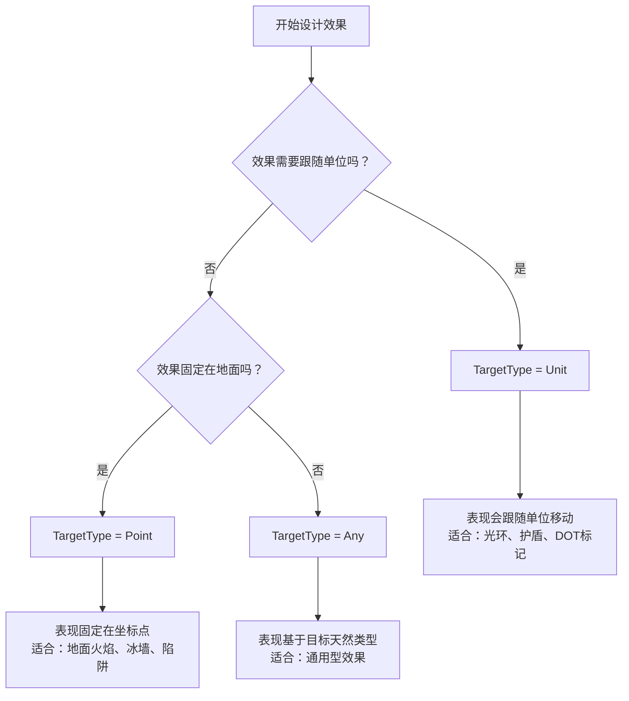

# 🎯 效果系统（Effect System）

效果系统是 WasiCore 游戏框架的核心执行机制，专门用于实现**数据驱动的Gameplay效果**，如技能效果、Buff效果、伤害计算、单位创建等各种游戏机制。

## 📋 目录

- [🏗️ 系统概述](#系统概述)
- [🌳 效果树架构](#效果树架构)
- [🔗 ExecutionParamShared 共享数据](#executionparamshared-共享数据)
- [📊 效果类型](#效果类型)
- [🎮 基本用法](#基本用法)
- [📝 表达式系统](#表达式系统)
- [⚙️ 动态数值计算](#动态数值计算)
- [📸 单位属性快照](#单位属性快照)
- [🔄 效果生命周期](#效果生命周期)
- [🎯 TargetType 深度指南](#targettype-深度指南)
- [🎯 最佳实践](#最佳实践)
- [🔧 API 参考](#api-参考)
- [💡 示例代码]

## 🏗️ 系统概述

### 设计理念

Effect系统基于**"数据驱动"**的设计理念，通过数编表配置实现复杂的游戏效果：

- **数据驱动**：效果逻辑通过数编表配置，支持热更新
- **树状结构**：效果可以组成复杂的效果树，支持嵌套执行
- **服务端计算**：所有数值计算都在服务端进行，确保安全性
- **公式系统**：支持动态公式计算，实现灵活的数值系统

```csharp
/// <summary>
/// Effect系统是数据驱动的Gameplay效果实现机制
/// 支持技能效果、Buff效果、伤害计算等各种游戏机制
/// </summary>
public partial class Effect : IExecutableObject, IGameObject<GameDataEffect>
```

### 核心特性

- ✅ **数据驱动** - 通过数编表配置效果行为
- ✅ **树状执行** - 支持效果树的层次化执行
- ✅ **共享数据** - 效果树内部共享上下文信息
- ✅ **动态计算** - 支持复杂的数值公式和表达式
- ✅ **属性快照** - 支持单位属性的快照和缓存
- ✅ **生命周期管理** - 完整的执行状态和生命周期控制

## 🌳 效果树架构

### 效果层次结构

Effect系统采用树状结构，支持父子效果的嵌套执行：

```csharp
// 🌳 效果树示例
public class Effect : IExecutableObject
{
    public IExecutableObject? Parent { get; }        // 父效果
    public ExecutionParamShared Shared { get; }      // 共享数据
    public ITarget? Target { get; }                  // 目标
    public Entity Caster => Shared.Caster;          // 施法者
}
```

### 效果创建和执行

```csharp
// 🎯 创建效果树的根节点
public static Effect? FactoryCreateTree(
    IGameLink<GameDataEffect> link, 
    ITarget defaultTarget, 
    Entity caster, 
    bool preValidateOnly = false)

// 🔗 创建子效果
public Effect? FactoryCreateChild(
    IGameLink<GameDataEffect> link, 
    ITarget defaultTarget, 
    bool preValidateOnly = false)

// ⚡ 执行子效果
public virtual CmdResult<Effect> ExecuteChild(
    IGameLink<GameDataEffect>? link, 
    ITarget? target = null, 
    Action<Effect>? initialAction = null)
```

## 🔗 ExecutionParamShared 共享数据

### 核心概念

`ExecutionParamShared` 是效果树中所有效果节点共享的数据容器，保存了效果执行所需的上下文信息：

```csharp
/// <summary>
/// 效果树的共享数据，避免频繁传递上下文参数
/// 同时支持数据快照，解决长时间效果的数据一致性问题
/// </summary>
public class ExecutionParamShared
{
    // 基础上下文信息
    public IExecutionContext CreationContext { get; }  // 创建上下文
    public Player CreatorPlayer { get; internal set; }  // 创建玩家快照
    public uint Level { get; internal set; }            // 等级快照
    public ITarget MainTarget { get; init; }            // 主目标
    public Entity Caster { get; }                       // 施法者
    
    // 关联信息
    public Ability? Ability { get; }                    // 引发技能
    public Item? Item { get; }                          // 引发物品
    public Order? Order { get; }                        // 引发指令
    public int? AbilityPhase { get; internal set; }     // 技能阶段
    
    // 属性快照系统
    public QuickDictionary<IGameLink<GameDataUnitProperty>, Fixed>? UnitPropertySnapshot { get; }
}
```

### 获取上下文信息

```csharp
// 🎯 在效果中访问共享数据
public void MyEffectLogic(Effect effect)
{
    var shared = effect.Shared;
    
    // 获取基础信息
    Entity caster = shared.Caster;              // 施法者
    Player player = shared.CreatorPlayer;       // 创建玩家
    uint level = shared.Level;                  // 效果等级
    ITarget mainTarget = shared.MainTarget;     // 主目标
    
    // 获取关联信息
    Ability? ability = shared.Ability;         // 引发的技能
    Item? item = shared.Item;                  // 引发的物品
    Order? order = shared.Order;               // 引发的指令
    
    // 获取响应上下文（如果存在）
    IExecutionContext? responseContext = shared.ResponseContext;
}
```

## 📊 效果类型

### 基础效果类型

框架提供了多种预定义的效果类型：

#### 1. **伤害效果** (`GameDataEffectDamage`)

```csharp
[GameDataNodeType<GameDataEffect, GameDataEffectUnit>]
public partial class GameDataEffectDamage
{
    public FuncNumberEffect Amount { get; set; } = (_) => 0;     // 伤害数值
    public Fixed Random { get; set; }                           // 随机变化
    public IGameLink<GameDataDamageType> Type { get; set; }     // 伤害类型
    public DeathType DeathType { get; set; }                    // 死亡类型
}
```

#### 2. **搜索效果** (`GameDataEffectSearch`)

```csharp
[GameDataNodeType<GameDataEffect, GameDataEffect>]
public partial class GameDataEffectSearch
{
    public FuncUIntEffect? MinCount { get; set; }               // 最小目标数
    public FuncUIntEffect? MaxCount { get; set; }               // 最大目标数
    public FuncNumberEffect? Radius { get; set; }               // 搜索半径
    public SearchMethod Method { get; set; }                    // 搜索方法
    public IGameLink<GameDataEffect>? Effect { get; set; }      // 对目标执行的效果
    public TargetFilterComplex? SearchFilters { get; set; }     // 目标过滤器
}
```

#### 3. **效果集合** (`GameDataEffectSet`)

```csharp
[GameDataNodeType<GameDataEffect, GameDataEffect>]
public partial class GameDataEffectSet
{
    public required WeightedLinkComplex<IGameLink<GameDataEffect>?> Effects { get; set; }  // 效果列表
    public SetFlags SetFlags { get; set; }                      // 执行标志
    public FuncUIntEffect? MinCount { get; set; }               // 最小执行数
    public FuncUIntEffect? MaxCount { get; set; }               // 最大执行数
}
```

#### 4. **持续效果** (`GameDataEffectPersist`)

```csharp
[GameDataNodeType<GameDataEffect, GameDataEffect>]
public abstract partial class GameDataEffectPersist
{
    public IGameLink<GameDataEffect>? StartEffect { get; set; }     // 开始效果
    public IGameLink<GameDataEffect>? CompleteEffect { get; set; }  // 完成效果
    public IGameLink<GameDataEffect>? FinalEffect { get; set; }     // 结束效果
    public ValidatorEffect? PersistValidator { get; set; }          // 持续验证器
}
```

#### 5. **循环效果** (`GameDataEffectPersistLoop`)

```csharp
[GameDataNodeType<GameDataEffect, GameDataEffectPersist>]
public partial class GameDataEffectPersistLoop
{
    public List<IGameLink<GameDataEffect>?> PeriodicEffects { get; set; }  // 周期效果
    public FuncTimeEffect? Period { get; set; }                           // 执行周期
    public FuncUIntEffect? Count { get; set; }                            // 执行次数
    public FuncTimeEffect? Duration { get; set; }                         // 持续时间
}
```

#### 6. **创建单位效果** (`GameDataEffectCreateUnit`)

```csharp
[GameDataNodeType<GameDataEffect, GameDataEffect>]
public partial class GameDataEffectCreateUnit
{
    public LeveledData<IGameLink<GameDataUnit>> SpawnUnitTypePerLevel { get; set; }  // 单位类型
    public FuncUIntEffect SpawnCount { get; set; }                                  // 创建数量
    public EffectOwnerExpression SpawnOwner { get; set; }                           // 单位所有者
    public IGameLink<GameDataEffect>? SpawnEffect { get; set; }                     // 创建后效果
}
```

#### 7. **自定义动作效果** (`GameDataEffectCustomAction`)

```csharp
[GameDataNodeType<GameDataEffect, GameDataEffect>]
public partial class GameDataEffectCustomAction
{
    public Func<Effect, bool> Func { get; set; } = static (_) => true;     // 自定义逻辑
    public IGameLink<GameDataEffect>? Effect { get; set; }                 // 后续效果
}
```

## 🎮 基本用法

### 创建和执行效果

```csharp
// 🎯 基本效果创建示例
public class SkillSystem : IGameClass
{
    public static void CastSpell(Unit caster, Unit target, IGameLink<GameDataEffect> spellEffect)
    {
        // 创建效果树
        Effect? effect = Effect.FactoryCreateTree(spellEffect, target, caster);
        if (effect == null) return;
        
        // 解析目标
        if (!effect.ResolveTarget()) return;
        
        // 执行效果
        CmdResult result = effect.Execute();
        
        if (result.IsSuccess)
        {
            Game.Logger.LogInformation("技能施放成功: {effect}", effect);
        }
        else
        {
            Game.Logger.LogWarning("技能施放失败: {error}", result);
        }
    }
}
```

### 链式效果执行

下面展示一个完整的链式闪电效果，使用官方效果节点组合实现：

```csharp
// 🔗 链式闪电完整实现 - 使用官方效果节点组合
public class ChainLightningSystem : IGameClass
{
    public static void OnRegisterGameClass()
    {
        Game.OnGameDataInitialization += OnGameDataInitialization;
    }
    
    private static void OnGameDataInitialization()
    {
        CreateChainLightningMainEffect();
        CreateChainLightningJumpEffect();
        CreateLightningDamageEffect();
        CreateChainLightningVisualEffect();
    }
    
    // 🎯 主效果：对初始目标执行并开始链式传播
    private static void CreateChainLightningMainEffect()
    {
        var mainLink = new GameLink<GameDataEffect, GameDataEffectSet>("chain_lightning_main");
        var mainData = new GameDataEffectSet(mainLink)
        {
            Name = "链式闪电主效果",
            Effects = new()
            {
                { GetLightningDamageLink(), 1.0f },      // 对主目标造成伤害
                { GetChainVisualLink(), 1.0f },          // 视觉效果
                { GetChainJumpLink(), 1.0f }             // 开始链式传播
            },
            SetFlags = new SetFlags()
            {
                WeightedRandom = false  // 顺序执行所有效果
            }
        };
    }
    
    // ⚡ 链式跳跃效果：搜索下一个目标并传播
    private static void CreateChainLightningJumpEffect()
    {
        var jumpLink = new GameLink<GameDataEffect, GameDataEffectSearch>("chain_lightning_jump");
        var jumpData = new GameDataEffectSearch(jumpLink)
        {
            Name = "链式闪电跳跃",
            Method = SearchMethod.Circle,
            
            // 搜索范围随链式次数递减
            Radius = (effect) => 
            {
                var jumpCount = effect.GetUnitProperty(PropertyUnit.ChainLightningJumps) ?? 0;
                return Math.Max(200, 500 - jumpCount * 100);  // 500→400→300→200
            },
            
            MinCount = (effect) => 0,  // 允许找不到目标
            MaxCount = (effect) => 1,  // 每次只跳到一个目标
            
            // 搜索过滤器：敌方单位，排除已被链击过的
            SearchFilters = new TargetFilterComplex
            {
                Required = [UnitFilter.Unit, UnitFilter.Enemy],
                Excluded = [UnitState.Dead, UnitState.Invulnerable]
            },
            
            // 自定义验证器：检查链式次数限制
            SearchValidator = (effect) =>
            {
                var jumpCount = effect.GetUnitProperty(PropertyUnit.ChainLightningJumps) ?? 0;
                var maxJumps = effect.GetUnitProperty(PropertyUnit.ChainLightningMaxJumps) ?? 3;
                
                return jumpCount < maxJumps ? CmdResult.Ok : CmdError.MaxCountReached;
            },
            
            // 对找到的目标执行链式传播效果
            Effect = GetChainPropagateLink(),
            
            // 按距离排序，优先选择近的目标
            TargetSorts = new List<Comparison<Entity>>
            {
                (a, b) => a.Position.DistanceTo(effect.Source.Position)
                        .CompareTo(b.Position.DistanceTo(effect.Source.Position))
            },
            
            SearchFlags = new SearchFlags()
            {
                ValidateChildren = true,  // 验证子效果可以执行
                FailIfNotEnoughTarget = false  // 找不到目标时不失败
            }
        };
    }
    
    // 💥 传播到新目标的效果组合
    private static void CreateChainPropagateEffect()
    {
        var propagateLink = new GameLink<GameDataEffect, GameDataEffectSet>("chain_lightning_propagate");
        var propagateData = new GameDataEffectSet(propagateLink)
        {
            Name = "链式闪电传播",
            Effects = new()
            {
                { GetIncrementJumpCountLink(), 1.0f },    // 增加跳跃计数
                { GetLightningDamageLink(), 1.0f },       // 造成递减伤害
                { GetChainVisualLink(), 1.0f },           // 视觉效果
                { GetMarkTargetLink(), 1.0f },            // 标记目标已被链击
                { GetChainJumpLink(), 1.0f }              // 继续链式传播
            },
            SetFlags = new SetFlags()
            {
                WeightedRandom = false
            }
        };
    }
    
    // ⚡ 闪电伤害效果：随链式次数递减
    private static void CreateLightningDamageEffect()
    {
        var damageLink = new GameLink<GameDataEffect, GameDataEffectDamage>("lightning_chain_damage");
        var damageData = new GameDataEffectDamage(damageLink)
        {
            Name = "链式闪电伤害",
            
            // 伤害随链式次数递减
            Amount = (effect) =>
            {
                var baseDamage = 200;
                var spellPower = effect.GetUnitProperty(PropertyUnit.SpellPower) ?? 0;
                var jumpCount = effect.GetUnitProperty(PropertyUnit.ChainLightningJumps) ?? 0;
                
                // 每次跳跃减少25%伤害
                var damageReduction = Math.Pow(0.75, jumpCount);
                var totalDamage = (baseDamage + spellPower * 0.8) * damageReduction;
                
                return totalDamage;
            },
            
            Random = 15,  // ±15随机伤害
            Type = ScopeData.DamageType.Lightning,
            
            // 验证目标有效性
            Validators = (effect) =>
            {
                if (effect.Target?.Entity?.IsValid != true)
                    return CmdError.MustTargetEntity;
                    
                // 检查目标是否已被标记（避免重复链击同一目标）
                var isMarked = effect.Target.Entity.GetComponent<UnitPropertyComplex>()?
                    .GetFinalOrNull(PropertyUnit.ChainLightningMarked) > 0;
                    
                return isMarked ? CmdError.TargetAlreadyAffected : CmdResult.Ok;
            }
        };
    }
    
    // 📊 辅助效果：增加跳跃计数
    private static void CreateIncrementJumpCountEffect()
    {
        var incrementLink = new GameLink<GameDataEffect, GameDataEffectCustomAction>("increment_jump_count");
        var incrementData = new GameDataEffectCustomAction(incrementLink)
        {
            Name = "增加链式跳跃计数",
            Func = (effect) =>
            {
                var caster = effect.Caster;
                var propertyComponent = caster.GetComponent<UnitPropertyComplex>();
                if (propertyComponent != null)
                {
                    var currentJumps = propertyComponent.GetFinalOrNull(PropertyUnit.ChainLightningJumps) ?? 0;
                    propertyComponent.SetProperty(PropertyUnit.ChainLightningJumps, currentJumps + 1);
                }
                return true;
            }
        };
    }
    
    // 🏷️ 辅助效果：标记目标已被链击
    private static void CreateMarkTargetEffect()
    {
        var markLink = new GameLink<GameDataEffect, GameDataEffectCustomAction>("mark_chain_target");
        var markData = new GameDataEffectCustomAction(markLink)
        {
            Name = "标记链式目标",
            Func = (effect) =>
            {
                if (effect.Target?.Entity is Unit target)
                {
                    var propertyComponent = target.GetComponent<UnitPropertyComplex>();
                    propertyComponent?.SetProperty(PropertyUnit.ChainLightningMarked, 1);
                    
                    // 设置标记过期时间（防止永久标记）
                    Game.DelayCall(TimeSpan.FromSeconds(0.5), () =>
                    {
                        propertyComponent?.SetProperty(PropertyUnit.ChainLightningMarked, 0);
                    });
                }
                return true;
            }
        };
    }
    
    // 🎨 视觉效果
    private static void CreateChainLightningVisualEffect()
    {
        var visualLink = new GameLink<GameDataEffect, GameDataEffectCustomAction>("chain_lightning_visual");
        var visualData = new GameDataEffectCustomAction(visualLink)
        {
            Name = "链式闪电视觉效果",
            Func = (effect) =>
            {
                // 在源和目标之间创建闪电视觉效果
                if (effect.Source != null && effect.Target != null)
                {
                    var lightningActor = new ActorParticle(
                        LightningBeamEffect, 
                        false, 
                        effect as IActorScopeContext);
                    
                    lightningActor.SetBeamEndpoints(effect.Source.Position, effect.Target.Position);
                }
                return true;
            }
        };
    }
    
    // 🔗 获取效果链接的辅助方法
    private static IGameLink<GameDataEffect> GetChainJumpLink() => 
        GameDataCategory<GameDataEffect>.Get("chain_lightning_jump")?.Link;
    private static IGameLink<GameDataEffect> GetChainPropagateLink() => 
        GameDataCategory<GameDataEffect>.Get("chain_lightning_propagate")?.Link;
    private static IGameLink<GameDataEffect> GetLightningDamageLink() => 
        GameDataCategory<GameDataEffect>.Get("lightning_chain_damage")?.Link;
    private static IGameLink<GameDataEffect> GetIncrementJumpCountLink() => 
        GameDataCategory<GameDataEffect>.Get("increment_jump_count")?.Link;
    private static IGameLink<GameDataEffect> GetMarkTargetLink() => 
        GameDataCategory<GameDataEffect>.Get("mark_chain_target")?.Link;
    private static IGameLink<GameDataEffect> GetChainVisualLink() => 
        GameDataCategory<GameDataEffect>.Get("chain_lightning_visual")?.Link;
}

// 🎯 使用链式闪电
public class PlayerSpellSystem
{
    public static void CastChainLightning(Unit caster, Unit initialTarget)
    {
        // 初始化施法者的链式属性
        var casterProps = caster.GetOrCreateComponent<UnitPropertyComplex>();
        casterProps.SetProperty(PropertyUnit.ChainLightningJumps, 0);      // 重置跳跃计数
        casterProps.SetProperty(PropertyUnit.ChainLightningMaxJumps, 3);   // 最大3次跳跃
        
        // 执行链式闪电主效果
        var chainEffect = GameDataCategory<GameDataEffect>.Get("chain_lightning_main");
        if (chainEffect != null)
        {
            var effect = Effect.FactoryCreateTree(chainEffect.Link, initialTarget, caster);
            if (effect?.ResolveTarget() == true)
            {
                var result = effect.Execute();
                if (result.IsSuccess)
                {
                    Game.Logger.LogInformation("{caster} 对 {target} 施放了链式闪电", 
                        caster.FriendlyName, initialTarget.FriendlyName);
                }
            }
        }
    }
}
```

### 🔧 链式效果的配置要点

#### 1. **状态管理**
- 使用单位属性 `ChainLightningJumps` 跟踪当前跳跃次数
- 使用 `ChainLightningMaxJumps` 限制最大跳跃次数
- 使用 `ChainLightningMarked` 防止重复链击同一目标

#### 2. **搜索策略**
- `GameDataEffectSearch` 的半径随跳跃次数递减
- 使用距离排序优先选择近距离目标
- 通过 `SearchValidator` 检查链式限制条件

#### 3. **递减机制**
- 伤害按 75% 的比例递减：100% → 75% → 56% → 42%
- 搜索半径递减：500 → 400 → 300 → 200
- 通过 `effect.GetUnitProperty()` 获取当前跳跃状态

#### 4. **效果组合**
- `GameDataEffectSet` 组合多个原子效果
- 每个跳跃包含：伤害 + 视觉 + 标记 + 继续传播
- 使用 `SetFlags.WeightedRandom = false` 确保顺序执行

## 📝 表达式系统

### 角度表达式

用于计算效果的方向角度：

```csharp
public class EffectAngleExpression
{
    public EffectAngleMethod Method { get; set; }              // 角度计算方法
    public TargetLocationExpression Location { get; set; }     // 主要位置
    public TargetLocationExpression OtherLocation { get; set; } // 其他位置
    public FuncAngleEffect? LocalOffset { get; set; }          // 本地偏移
}

// 使用示例
var angleExpr = new EffectAngleExpression
{
    Method = EffectAngleMethod.AngleBetweenTwoPoints,
    Location = new() { Value = TargetLocation.Caster },
    OtherLocation = new() { Value = TargetLocation.Target },
    LocalOffset = (_) => 15f  // 偏移15度
};
```

### 偏移表达式

用于计算位置偏移：

```csharp
public class EffectOffsetExpression
{
    public EffectAngleExpression Angle { get; set; }       // 偏移角度
    public FuncNumberEffect Distance { get; set; }         // 偏移距离
}

// 使用示例：在施法者前方100单位创建效果
var offsetExpr = new EffectOffsetExpression
{
    Angle = new() { Method = EffectAngleMethod.Facing },
    Distance = (_) => 100d
};
```

### 目标位置表达式

用于指定效果的目标位置：

```csharp
public class TargetLocationExpression
{
    public TargetLocation Value { get; set; }              // 位置类型
    public LocVarType LocalVar { get; set; }               // 本地变量
    public IGameLink<GameDataEffect>? Effect { get; set; } // 动态效果
}

// 常用位置类型
public enum TargetLocation
{
    Default,        // 默认目标
    Target,         // 当前目标
    Caster,         // 施法者
    Source,         // 效果源
    MainTarget,     // 主目标
    UnitLocalVar,   // 本地单位变量
    PointLocalVar   // 本地位置变量
}
```

## ⚙️ 动态数值计算

### 动态修改数编表的最佳实践

虽然框架不建议动态创建和修改数编表，但由于Effect的数值计算都在服务端进行，动态修改服务端数编表字段是可行的。

#### ❌ 不推荐的做法

```csharp
// 直接修改数编表字段 - 会影响所有使用该数据的效果实例
var damageEffect = GameDataCategory<GameDataEffectDamage>.Get("FireBall");
damageEffect.Amount = (_) => 500;  // 危险：影响所有火球术
```

#### ✅ 推荐的最佳实践

**方案1：使用单位属性公式（直接配置数编表实例）**

```csharp
// 通过数编表配置动态公式，无需继承
public class FireballSpellSystem : IGameClass
{
    public static void OnRegisterGameClass()
    {
        Game.OnGameDataInitialization += OnGameDataInitialization;
    }
    
    private static void OnGameDataInitialization()
    {
        // 创建火球伤害效果数据
        var fireballDamageLink = new GameLink<GameDataEffect, GameDataEffectDamage>("fireball_damage");
        var fireballDamageData = new GameDataEffectDamage(fireballDamageLink)
        {
            Name = "火球术伤害",
            
            // 伤害 = 施法者攻击力 × 技能系数
            Amount = (effect) => 
            {
                var attackPower = effect.GetUnitProperty(PropertyUnit.AttackPower);
                var skillLevel = effect.Shared.Level;
                return (attackPower ?? 0) * (1.0 + skillLevel * 0.1);
            },
            
            Random = 20,  // ±20随机伤害
            Type = ScopeData.DamageType.Fire
        };
    }
}
```

**方案2：使用技能属性（配置数编表实例）**

```csharp
public class SkillBasedDamageSystem : IGameClass
{
    public static void OnRegisterGameClass()
    {
        Game.OnGameDataInitialization += OnGameDataInitialization;
    }
    
    private static void OnGameDataInitialization()
    {
        // 基于技能属性的伤害效果
        var skillDamageLink = new GameLink<GameDataEffect, GameDataEffectDamage>("skill_based_damage");
        var skillDamageData = new GameDataEffectDamage(skillDamageLink)
        {
            Name = "技能伤害",
            
            // 通过技能属性来控制效果数值
            Amount = (effect) =>
            {
                var ability = effect.Shared.Ability;
                if (ability?.Cache.Properties.TryGetValue("DamageMultiplier", out var multiplier) == true)
                {
                    var baseDamage = effect.GetUnitProperty(PropertyUnit.AttackPower) ?? 0;
                    return baseDamage * multiplier;
                }
                return 100; // 默认伤害
            },
            
            Type = ScopeData.DamageType.Physical
        };
    }
}
```

**方案3：使用等级相关的数值（配置数编表实例）**

```csharp
public class LevelScaledDamageSystem : IGameClass
{
    public static void OnRegisterGameClass()
    {
        Game.OnGameDataInitialization += OnGameDataInitialization;
    }
    
    private static void OnGameDataInitialization()
    {
        // 基于效果等级的动态计算
        var levelDamageLink = new GameLink<GameDataEffect, GameDataEffectDamage>("level_scaled_damage");
        var levelDamageData = new GameDataEffectDamage(levelDamageLink)
        {
            Name = "等级伤害",
            
            // 基于等级的动态伤害计算
            Amount = (effect) =>
            {
                var baseDamage = 50 + effect.Level * 25;  // 每级增加25基础伤害
                var casterPower = effect.GetUnitProperty(PropertyUnit.SpellPower) ?? 0;
                return baseDamage + casterPower * 0.5;
            },
            
            // 等级越高随机性越大
            Random = effect => effect.Level * 5,
            
            Type = ScopeData.DamageType.Magic
        };
    }
}
```

### 函数委托系统

框架提供了丰富的函数委托类型用于动态计算：

```csharp
// 数值计算函数
public delegate Fixed FuncNumberEffect(Effect context);
public delegate float FuncFloatEffect(Effect context);
public delegate uint FuncUIntEffect(Effect context);

// 角度和时间函数
public delegate Angle FuncAngleEffect(Effect context);
public delegate TimeSpan FuncTimeEffect(Effect context);

// 概率和验证函数
public delegate Probability FuncProbabilityEffect(Effect context);
public delegate CmdResult ValidatorEffect(Effect context);

// 使用示例
public class DynamicEffectSystem : IGameClass
{
    public static void OnRegisterGameClass()
    {
        Game.OnGameDataInitialization += OnGameDataInitialization;
    }
    
    private static void OnGameDataInitialization()
    {
        var dynamicLink = new GameLink<GameDataEffect, GameDataEffectDamage>("dynamic_damage");
        var dynamicData = new GameDataEffectDamage(dynamicLink)
        {
            Name = "动态伤害",
            
            // 动态伤害计算
            Amount = (effect) =>
            {
                var time = DateTime.Now.Hour;
                var baseDamage = 100;
                var timeBonus = time > 12 ? 50 : 0;  // 下午伤害更高
                return baseDamage + timeBonus;
            },
            
            // 动态概率计算
            Chance = (effect) =>
            {
                var luck = effect.GetUnitProperty(PropertyUnit.Luck) ?? 0;
                return 0.5 + luck * 0.01;  // 基础50%概率 + 幸运值加成
            }
        };
    }
}
```

## 📸 单位属性快照

### 快照机制

`ExecutionParamShared` 提供了单位属性快照功能，解决长时间效果的数据一致性问题：

```csharp
public class ExecutionParamShared
{
    // 单位属性快照字典
    public QuickDictionary<IGameLink<GameDataUnitProperty>, Fixed>? UnitPropertySnapshot { get; }
    
    // 获取单位属性（支持快照模式）
    public Fixed? GetUnitProperty(
        IGameLink<GameDataUnitProperty> property, 
        PropertyFetchMethod method = PropertyFetchMethod.SnapshotBeforeProperty)
    
    // 更新属性快照
    public void UpdateUnitPropertySnapshot(IEnumerable<IGameLink<GameDataUnitProperty>> properties)
}
```

### 属性获取方法

```csharp
public enum PropertyFetchMethod
{
    SnapshotBeforeProperty,    // 优先使用快照，没有则获取当前值
    PropertyAndUpdate,         // 获取当前值并更新快照
    PropertyFirst             // 优先使用当前值，没有则使用快照
}
```

### 快照使用示例

```csharp
// 🎯 在长期效果中使用属性快照
public class BuffEffectSystem : IGameClass
{
    public static void OnRegisterGameClass()
    {
        Game.OnGameDataInitialization += OnGameDataInitialization;
    }
    
    private static void OnGameDataInitialization()
    {
        var buffLink = new GameLink<GameDataEffect, GameDataEffectPersistLoop>("snapshot_buff");
        var buffData = new GameDataEffectPersistLoop(buffLink)
        {
            Name = "快照Buff",
            Period = (effect) => TimeSpan.FromSeconds(1),
            Count = (effect) => 10,
            
            // 开始效果：创建属性快照
            StartEffect = CreateSnapshotEffect()
        };
    }
    
    private static IGameLink<GameDataEffect> CreateSnapshotEffect()
    {
        var snapshotLink = new GameLink<GameDataEffect, GameDataEffectCustomAction>("create_snapshot");
        var snapshotData = new GameDataEffectCustomAction(snapshotLink)
        {
            Name = "创建属性快照",
            Func = (effect) =>
            {
                // 在效果开始时创建属性快照
                var importantProperties = new[]
                {
                    PropertyUnit.AttackPower,
                    PropertyUnit.SpellPower,
                    PropertyUnit.MovementSpeed
                };
                
                effect.Shared.UpdateUnitPropertySnapshot(importantProperties);
                return true;
            }
        };
        return snapshotLink;
    }
}
```

### 快照应用场景

```csharp
// 🔥 DOT伤害效果 - 使用施法时的法术强度
public class PoisonDOTSystem : IGameClass
{
    public static void OnRegisterGameClass()
    {
        Game.OnGameDataInitialization += OnGameDataInitialization;
    }
    
    private static void OnGameDataInitialization()
    {
        var poisonLink = new GameLink<GameDataEffect, GameDataEffectPersistLoop>("poison_dot");
        var poisonData = new GameDataEffectPersistLoop(poisonLink)
        {
            Name = "中毒DOT",
            Period = (effect) => TimeSpan.FromSeconds(2),
            Count = (effect) => 5,
            Duration = (effect) => TimeSpan.FromSeconds(10),
            
            // 开始时创建快照
            StartEffect = CreatePoisonSnapshotEffect(),
            
            // 每次伤害使用快照数值
            PeriodicEffects = new List<IGameLink<GameDataEffect>?>
            {
                CreatePoisonDamageEffect()
            }
        };
    }
    
    private static IGameLink<GameDataEffect> CreatePoisonSnapshotEffect()
    {
        var snapshotLink = new GameLink<GameDataEffect, GameDataEffectCustomAction>("poison_snapshot");
        var snapshotData = new GameDataEffectCustomAction(snapshotLink)
        {
            Name = "中毒快照",
            Func = (effect) =>
            {
                // 快照施法时的属性
                effect.Shared.UpdateUnitPropertySnapshot(new[]
                {
                    PropertyUnit.SpellPower,
                    PropertyUnit.PoisonDamageBonus
                });
                return true;
            }
        };
        return snapshotLink;
    }
    
    private static IGameLink<GameDataEffect> CreatePoisonDamageEffect()
    {
        var damageLink = new GameLink<GameDataEffect, GameDataEffectDamage>("poison_damage");
        var damageData = new GameDataEffectDamage(damageLink)
        {
            Name = "中毒伤害",
            Amount = (effect) =>
            {
                // 即使施法者属性改变或死亡，伤害仍基于施法时的数值
                var spellPower = effect.GetUnitProperty(PropertyUnit.SpellPower, PropertyFetchMethod.SnapshotBeforeProperty);
                return (spellPower ?? 0) * 0.3;
            },
            Type = ScopeData.DamageType.Poison
        };
        return damageLink;
    }
}
```

## 🔄 效果生命周期

### 执行状态

```csharp
public enum ExecutionState
{
    Pending,      // 等待执行
    Executing,    // 正在执行
    Completed,    // 执行完成
    Failed,       // 执行失败
    Aborted       // 被中止
}
```

### 瞬态效果 vs 持续效果

```csharp
// 🔥 瞬态效果 - 立即执行完成（使用内置GameDataEffectDamage）
public class InstantDamageSystem : IGameClass
{
    public static void OnRegisterGameClass()
    {
        Game.OnGameDataInitialization += OnGameDataInitialization;
    }
    
    private static void OnGameDataInitialization()
    {
        var instantLink = new GameLink<GameDataEffect, GameDataEffectDamage>("instant_damage");
        var instantData = new GameDataEffectDamage(instantLink)
        {
            Name = "瞬发伤害",
            Amount = (effect) => 150,  // 立即造成150点伤害
            Type = ScopeData.DamageType.Physical
            // GameDataEffectDamage 创建的 Effect 默认 IsTransient = true
        };
    }
}

// ⏰ 持续效果 - 需要时间管理（使用内置GameDataEffectPersist）
public class ShieldBuffSystem : IGameClass
{
    public static void OnRegisterGameClass()
    {
        Game.OnGameDataInitialization += OnGameDataInitialization;
    }
    
    private static void OnGameDataInitialization()
    {
        var shieldLink = new GameLink<GameDataEffect, GameDataEffectPersistDelay>("shield_buff");
        var shieldData = new GameDataEffectPersistDelay(shieldLink)
        {
            Name = "护盾持续",
            Amount = (effect) => TimeSpan.FromSeconds(10),  // 持续10秒
            
            // 开始时添加护盾状态
            StartEffect = CreateShieldStartEffect(),
            
            // 结束时移除护盾状态
            CompleteEffect = CreateShieldEndEffect()
            // GameDataEffectPersist 创建的 EffectPersist 默认 IsTransient = false
        };
    }
    
    private static IGameLink<GameDataEffect> CreateShieldStartEffect()
    {
        var startLink = new GameLink<GameDataEffect, GameDataEffectCustomAction>("shield_start");
        var startData = new GameDataEffectCustomAction(startLink)
        {
            Name = "添加护盾",
            Func = (effect) =>
            {
                if (effect.Target?.Entity is Unit target)
                {
                    target.AddState(UnitState.Shielded);
                }
                return true;
            }
        };
        return startLink;
    }
    
    private static IGameLink<GameDataEffect> CreateShieldEndEffect()
    {
        var endLink = new GameLink<GameDataEffect, GameDataEffectCustomAction>("shield_end");
        var endData = new GameDataEffectCustomAction(endLink)
        {
            Name = "移除护盾",
            Func = (effect) =>
            {
                if (effect.Target?.Entity is Unit target)
                {
                    target.RemoveState(UnitState.Shielded);
                }
                return true;
            }
        };
        return endLink;
    }
}
```

### 效果验证

```csharp
// 🔍 效果验证示例
public class ConditionalEffectSystem : IGameClass
{
    public static void OnRegisterGameClass()
    {
        Game.OnGameDataInitialization += OnGameDataInitialization;
    }
    
    private static void OnGameDataInitialization()
    {
        var conditionalLink = new GameLink<GameDataEffect, GameDataEffectDamage>("conditional_damage");
        var conditionalData = new GameDataEffectDamage(conditionalLink)
        {
            Name = "条件伤害",
            Amount = (effect) => 200,
            Type = ScopeData.DamageType.Magic,
            
            // 复杂的验证逻辑
            Validators = (context) =>
            {
                // 验证目标有效性
                if (context.Target?.Entity?.IsValid != true)
                    return CmdError.MustTargetEntity;
                
                // 验证距离
                var distance = context.Caster.Position.DistanceTo(context.Target.Position);
                if (distance > 1000)
                    return CmdError.TargetTooFar;
                
                // 验证资源
                var mana = context.GetUnitProperty(PropertyUnit.Mana);
                if (mana < 50)
                    return CmdError.NotEnoughMana;
                
                return CmdResult.Ok;
            }
        };
    }
}
```

## 🎯 最佳实践

### 1. 效果设计原则

#### ✅ 推荐做法

```csharp
// 🎯 明确的效果职责
public class FireballEffectSystem : IGameClass
{
    public static void OnRegisterGameClass()
    {
        Game.OnGameDataInitialization += OnGameDataInitialization;
    }
    
    private static void OnGameDataInitialization()
    {
        // 单一职责：只负责造成火焰伤害
        var damageLink = new GameLink<GameDataEffect, GameDataEffectDamage>("fireball_damage");
        var damageData = new GameDataEffectDamage(damageLink)
        {
            Name = "火球伤害",
            Amount = (effect) => GetFireDamage(effect),
            Type = ScopeData.DamageType.Fire
        };
        
        // 🔗 组合复杂效果
        var completeLink = new GameLink<GameDataEffect, GameDataEffectSet>("fireball_complete");
        var completeData = new GameDataEffectSet(completeLink)
        {
            Name = "完整火球",
            Effects = new()
            {
                { GetFireballDamageEffect(), 1.0f },     // 造成伤害
                { GetFireballVisualEffect(), 1.0f },     // 视觉效果  
                { GetFireballSoundEffect(), 1.0f },      // 音效
                { GetFireballDebuffEffect(), 0.3f }      // 30%概率上Debuff
            }
        };
    }
    
    private static Fixed GetFireDamage(Effect effect)
    {
        var spellPower = effect.GetUnitProperty(PropertyUnit.SpellPower) ?? 0;
        return 120 + spellPower * 0.6;
    }
}
```

#### ❌ 应避免的做法

```csharp
// 避免在单个效果中处理过多逻辑
public class BadFireballSystem : IGameClass
{
    public static void OnRegisterGameClass()
    {
        Game.OnGameDataInitialization += OnGameDataInitialization;
    }
    
    private static void OnGameDataInitialization()
    {
        var badFireballLink = new GameLink<GameDataEffect, GameDataEffectCustomAction>("bad_fireball");
        var badFireballData = new GameDataEffectCustomAction(badFireballLink)
        {
            Name = "糟糕的火球",
            Func = (context) =>
            {
                // ❌ 单个效果承担过多职责
                DealDamage(context);
                PlaySound(context);
                CreateVisualEffect(context);
                ApplyDebuff(context);
                UpdatePlayerStats(context);
                LogToDatabase(context);
                return true;
            }
        };
    }
}
```

### 2. 性能优化

#### 缓存计算结果

```csharp
public class OptimizedEffectSystem : IGameClass
{
    private static readonly Dictionary<uint, Fixed> _damageCache = new();
    
    public static void OnRegisterGameClass()
    {
        Game.OnGameDataInitialization += OnGameDataInitialization;
    }
    
    private static void OnGameDataInitialization()
    {
        var optimizedLink = new GameLink<GameDataEffect, GameDataEffectDamage>("optimized_damage");
        var optimizedData = new GameDataEffectDamage(optimizedLink)
        {
            Name = "优化伤害",
            Amount = (effect) =>
            {
                var level = effect.Level;
                
                // 缓存相同等级的计算结果
                if (!_damageCache.TryGetValue(level, out var damage))
                {
                    damage = CalculateComplexDamage(effect);
                    _damageCache[level] = damage;
                }
                
                return damage;
            },
            Type = ScopeData.DamageType.Physical
        };
    }
    
    private static Fixed CalculateComplexDamage(Effect effect)
    {
        // 复杂的伤害计算逻辑
        var baseDamage = effect.Level * 50;
        var spellPower = effect.GetUnitProperty(PropertyUnit.SpellPower) ?? 0;
        return baseDamage + spellPower * 0.8;
    }
}
```

#### 延迟计算

```csharp
public class LazyCalculationEffectSystem : IGameClass
{
    public static void OnRegisterGameClass()
    {
        Game.OnGameDataInitialization += OnGameDataInitialization;
    }
    
    private static void OnGameDataInitialization()
    {
        var lazyLink = new GameLink<GameDataEffect, GameDataEffectCustomAction>("lazy_calculation");
        var lazyData = new GameDataEffectCustomAction(lazyLink)
        {
            Name = "延迟计算",
            Func = (effect) =>
            {
                // 只在真正需要时才进行复杂计算
                if (ShouldExecute(effect))
                {
                    return PerformExpensiveCalculation(effect);
                }
                return false;
            }
        };
    }
    
    private static bool ShouldExecute(Effect effect)
    {
        // 检查是否需要执行复杂计算
        return effect.Target?.Entity?.IsValid == true;
    }
    
    private static bool PerformExpensiveCalculation(Effect effect)
    {
        // 执行复杂计算逻辑
        return true;
    }
}
```

### 3. 错误处理

```csharp
public class RobustEffectSystem : IGameClass
{
    public static void OnRegisterGameClass()
    {
        Game.OnGameDataInitialization += OnGameDataInitialization;
    }
    
    private static void OnGameDataInitialization()
    {
        var robustLink = new GameLink<GameDataEffect, GameDataEffectCustomAction>("robust_effect");
        var robustData = new GameDataEffectCustomAction(robustLink)
        {
            Name = "健壮效果",
            Func = (effect) =>
            {
                try
                {
                    return ExecuteMainLogic(effect);
                }
                catch (Exception ex)
                {
                    Game.Logger.LogError(ex, "效果执行失败: {effect}", effect);
                    
                    // 执行备用逻辑或安全清理
                    ExecuteFallbackLogic(effect);
                    return false;
                }
            },
            
            // 充分的前置验证
            Validators = (context) =>
            {
                if (context.Target?.Entity?.IsValid != true)
                    return CmdError.MustTargetEntity;
                    
                if (!HasRequiredComponents(context))
                    return CmdError.ComponentNotFound;
                    
                return CmdResult.Ok;
            }
        };
    }
    
    private static bool ExecuteMainLogic(Effect effect)
    {
        // 主要逻辑
        return true;
    }
    
    private static void ExecuteFallbackLogic(Effect effect)
    {
        // 备用逻辑或清理
    }
    
    private static bool HasRequiredComponents(Effect context)
    {
        // 检查必需的组件
        return true;
    }
}
```

### 4. 可维护性

#### 使用描述性名称

```csharp
// ✅ 清晰的命名
public class LightningChainEffectSystem : IGameClass
{
    public static void OnRegisterGameClass()
    {
        Game.OnGameDataInitialization += OnGameDataInitialization;
    }
    
    private static void OnGameDataInitialization()
    {
        // 清晰描述性的Link名称
        var chainLightningLink = new GameLink<GameDataEffect, GameDataEffectSearch>("chain_lightning_damage");
        var healOvertimeLink = new GameLink<GameDataEffect, GameDataEffectPersistLoop>("heal_over_time_restoration");
        var stunDebuffLink = new GameLink<GameDataEffect, GameDataEffectCustomAction>("stun_debuff_application");
    }
}

// ❌ 模糊的命名  
public class BadNamingSystem : IGameClass
{
    public static void OnRegisterGameClass()
    {
        Game.OnGameDataInitialization += OnGameDataInitialization;
    }
    
    private static void OnGameDataInitialization()
    {
        var link1 = new GameLink<GameDataEffect, GameDataEffectDamage>("effect1");  // 模糊不清
        var link2 = new GameLink<GameDataEffect, GameDataEffectDamage>("damage2");  // 缺乏描述性
    }
}
```

#### 添加详细注释

```csharp
/// <summary>
/// 闪电链效果系统
/// 对主目标造成满额伤害，对链式目标造成递减伤害
/// 最多可以链式传播到3个额外目标
/// </summary>
public class LightningChainEffectSystem : IGameClass
{
    /// <summary>
    /// 链式传播的伤害衰减率，每跳减少20%
    /// </summary>
    private const float DamageDecayRate = 0.2f;
    
    /// <summary>
    /// 最大链式目标数量
    /// </summary>
    private const uint MaxChainTargets = 3;
    
    public static void OnRegisterGameClass()
    {
        Game.OnGameDataInitialization += OnGameDataInitialization;
    }
    
    private static void OnGameDataInitialization()
    {
        var chainLightningLink = new GameLink<GameDataEffect, GameDataEffectSearch>("lightning_chain_search");
        var chainLightningData = new GameDataEffectSearch(chainLightningLink)
        {
            Name = "闪电链搜索",
            Method = SearchMethod.Circle,
            Radius = (effect) => 400f,  // 搜索半径400单位
            MaxCount = (effect) => MaxChainTargets,
            
            // 对找到的每个目标造成递减伤害
            Effect = CreateChainDamageEffect()
        };
    }
    
    /// <summary>
    /// 创建链式伤害效果，伤害随跳跃次数递减
    /// </summary>
    private static IGameLink<GameDataEffect> CreateChainDamageEffect()
    {
        var damageLink = new GameLink<GameDataEffect, GameDataEffectDamage>("chain_lightning_damage");
        var damageData = new GameDataEffectDamage(damageLink)
        {
            Name = "闪电链伤害",
            Amount = (effect) =>
            {
                var baseDamage = 200;
                var jumpCount = GetChainJumpCount(effect);
                
                // 每次跳跃减少20%伤害
                var damageMultiplier = Math.Pow(1 - DamageDecayRate, jumpCount);
                return baseDamage * damageMultiplier;
            },
            Type = ScopeData.DamageType.Lightning
        };
        return damageLink;
    }
    
    private static int GetChainJumpCount(Effect effect)
    {
        // 获取当前链式跳跃次数的逻辑
        return 0;
    }
}
```

## 🎭 视觉表现系统

Effect系统不仅提供强大的游戏逻辑功能，还与Actor系统深度集成，为效果和Buff提供丰富的视觉表现。

### ActorArray 字段

`GameDataEffect` 和 `GameDataBuff` 都提供 `ActorArray` 字段，用于定义效果执行时的视觉表现：

```csharp
public class GameDataEffect
{
    /// <summary>
    /// 效果的视觉表现Actor数组
    /// </summary>
    public List<IGameLink<GameDataActor>>? ActorArray { get; set; }
}

public class GameDataBuff  
{
    /// <summary>
    /// Buff的视觉表现Actor数组
    /// </summary>
    public List<IGameLink<GameDataActor>>? ActorArray { get; set; }
}
```

### 表现创建规则

#### 位置规则

视觉表现的创建位置由效果的目标类型决定：

| 目标类型 | 表现位置 | 说明 |
|----------|---------|------|
| **单位目标** | 附着到单位身上 | 使用单位的插槽系统（如"effect_socket"） |
| **点目标** | 世界坐标 | 在指定的世界坐标创建独立表现 |
| **Buff** | 必然附着到单位 | Buff总是作用于单位，表现始终附着 |

#### 播放规则

表现的播放模式由效果的持续性决定：

```csharp
// 瞬时效果（IsTransient = true）
if (effect.IsTransient)
{
    // 🔥 所有表现强制一次性播放
    // 即使配置为循环，也会被设置为 ForceOneShot = true
}
else
{
    // 持续效果（IsTransient = false）
    // ✨ 瞬态表现：一次性播放（如爆炸、闪光）
    // 🔄 持续表现：持续到效果结束（如光环、护盾特效）
}
```

### 配置示例

#### 火球术效果表现

```csharp
public class FireballEffectSystem : IGameClass
{
    public static void OnRegisterGameClass()
    {
        Game.OnGameDataInitialization += OnGameDataInitialization;
    }
    
    private static void OnGameDataInitialization()
    {
        // 创建火球伤害效果，包含视觉表现
        var fireballDamageLink = new GameLink<GameDataEffect, GameDataEffectDamage>("fireball_damage");
        var fireballDamageData = new GameDataEffectDamage(fireballDamageLink)
        {
            Name = "火球伤害",
            Amount = (effect) => 200,
            Type = ScopeData.DamageType.Fire,
            
            // 🎭 视觉表现配置
            ActorArray = new List<IGameLink<GameDataActor>>
            {
                CreateFireballImpactActor(),    // 命中爆炸效果
                CreateFireballBurnActor(),      // 燃烧效果
                CreateFireballSoundActor()      // 声音效果
            }
        };
    }
    
    private static IGameLink<GameDataActor> CreateFireballImpactActor()
    {
        var impactLink = new GameLink<GameDataActor, GameDataActorParticle>("fireball_impact");
        var impactData = new GameDataActorParticle(impactLink)
        {
            AutoPlay = true,
            Particle = CreateFireballExplosionParticle(),
            KillOnFinish = true,
            ForceOneShot = true,  // 瞬时效果强制一次性播放
            Scale = 1.2f
        };
        return impactLink;
    }
    
    private static IGameLink<GameDataActor> CreateFireballBurnActor()
    {
        var burnLink = new GameLink<GameDataActor, GameDataActorParticle>("fireball_burn");
        var burnData = new GameDataActorParticle(burnLink)
        {
            AutoPlay = true,
            Particle = CreateBurnEffectParticle(),
            Socket = "effect_socket"u8,  // 附着到目标的效果插槽
            KillOnFinish = false,         // 持续播放
            ForceOneShot = false          // 根据效果类型决定
        };
        return burnLink;
    }
}
```

#### 持续治疗Buff表现

```csharp
public class HealingBuffSystem : IGameClass
{
    public static void OnRegisterGameClass()
    {
        Game.OnGameDataInitialization += OnGameDataInitialization;
    }
    
    private static void OnGameDataInitialization()
    {
        var healingBuffLink = new GameLink<GameDataBuff, GameDataBuffVitalModify>("healing_buff");
        var healingBuffData = new GameDataBuffVitalModify(healingBuffLink)
        {
            Name = "持续治疗",
            Duration = (buff) => TimeSpan.FromSeconds(10),
            
            // 🎭 持续治疗的视觉表现
            ActorArray = new List<IGameLink<GameDataActor>>
            {
                CreateHealingAuraActor(),       // 治疗光环（持续）
                CreateHealingSparkleActor(),    // 治疗闪光（间歇）
                CreateHealingSoundActor()       // 治疗音效
            }
        };
    }
    
    private static IGameLink<GameDataActor> CreateHealingAuraActor()
    {
        var auraLink = new GameLink<GameDataActor, GameDataActorParticle>("healing_aura");
        var auraData = new GameDataActorParticle(auraLink)
        {
            AutoPlay = true,
            Particle = CreateHealingAuraParticle(),
            Socket = "body_center"u8,    // 附着到身体中心
            KillOnFinish = false,        // Buff结束时停止
            InheritRotation = false      // 不继承单位旋转
        };
        return auraLink;
    }
}
```

### 投射物命中表现

投射物效果（`GameDataEffectLaunchMissile`）提供专门的命中表现配置：

```csharp
public class ProjectileEffectSystem : IGameClass
{
    public static void OnRegisterGameClass()
    {
        Game.OnGameDataInitialization += OnGameDataInitialization;
    }
    
    private static void OnGameDataInitialization()
    {
        var projectileLink = new GameLink<GameDataEffect, GameDataEffectLaunchMissile>("fireball_projectile");
        var projectileData = new GameDataEffectLaunchMissile(projectileLink)
        {
            Name = "火球投射物",
            Method = EffectLaunchMissileMethod.CreateMissile,
            Missile = CreateFireballMissileUnit(),
            Speed = (effect) => 800f,
            
            // ⚡ 命中时的表现配置
            ImpactActors = new List<IGameLink<GameDataActor>>
            {
                CreateExplosionActor(),      // 爆炸效果
                CreateShockwaveActor(),      // 冲击波
                CreateDebrisActor()          // 碎片效果
            },
            
            // 🎯 命中后执行的效果（包含自己的表现）
            ImpactEffect = CreateFireballDamageEffect()
        };
    }
    
    private static IGameLink<GameDataActor> CreateExplosionActor()
    {
        var explosionLink = new GameLink<GameDataActor, GameDataActorParticle>("fireball_explosion");
        var explosionData = new GameDataActorParticle(explosionLink)
        {
            AutoPlay = true,
            Particle = CreateExplosionParticle(),
            KillOnFinish = true,
            ForceOneShot = true,         // 命中表现总是一次性的
            Scale = 1.5f                 // 放大爆炸效果
        };
        return explosionLink;
    }
}
```

### 表现播放时机

#### 效果表现时机

```csharp
// 🎯 效果开始时
effect.Execute() 
    → 创建 ActorArray 中的表现
    → 根据效果类型决定播放模式

// 🔄 持续效果过程中
effect.Update()
    → 持续表现继续播放
    → 瞬态表现已结束

// ⏹️ 效果结束时  
effect.Complete()
    → 停止所有持续表现
    → 清理表现资源
```

#### Buff表现时机

```csharp
// 🎭 Buff应用时
buff.Apply()
    → 创建 ActorArray 中的表现
    → 表现附着到目标单位

// 🔄 Buff存在期间
buff.Update()
    → 表现持续播放
    → 根据Buff状态调整表现

// 🏁 Buff移除时
buff.Remove()
    → 停止并清理所有表现
    → 播放移除表现（如果配置）
```

#### 优雅消失流程

重要的是，当Effect、Buff或Unit主体消失时，其关联的Actor表现**不会立即移除**，而是会执行优雅的消失流程：

```csharp
// 🎭 主体消失 → 优雅消失流程

主体（Effect/Buff/Unit）消失
    ↓
触发Actor优雅消失流程
    ↓
各表现按类型执行消失动画：
    ├─ ✨ 粒子表现 → 淡出效果
    ├─ 🔊 音效表现 → 音量渐减  
    ├─ 🎪 模型表现 → 播放Death动画
    └─ 🎯 其他表现 → 自定义消失流程
    ↓
所有表现完成消失后清理资源
```

#### 不同表现类型的消失行为

```csharp
// ✨ 粒子表现优雅消失
public class ParticleEffectGracefulDestroy
{
    public static void OnEffectEnd(Effect effect)
    {
        foreach (var particleActor in effect.ParticleActors)
        {
            // 粒子系统会自动执行淡出
            particleActor.BeginFadeOut(
                duration: TimeSpan.FromSeconds(1.0),
                curve: AnimationCurve.EaseOut
            );
        }
    }
}

// 🔊 音效表现优雅消失  
public class SoundEffectGracefulDestroy
{
    public static void OnBuffRemove(Buff buff)
    {
        foreach (var soundActor in buff.SoundActors)
        {
            // 音效会逐渐降低音量直到消失
            soundActor.FadeOut(
                fadeTime: TimeSpan.FromSeconds(0.5),
                targetVolume: 0.0f
            );
        }
    }
}

// 🎪 模型表现优雅消失
public class ModelActorGracefulDestroy  
{
    public static void OnUnitDestroy(Unit unit)
    {
        foreach (var modelActor in unit.ModelActors)
        {
            // 播放模型的死亡动画
            var deathAnimation = modelActor.Model.BirthStandDeathAnimation?.DeathAnimation;
            if (deathAnimation != null)
            {
                modelActor.PlayAnimation(deathAnimation, () =>
                {
                    // 死亡动画完成后才真正销毁
                    modelActor.Dispose();
                });
            }
            else
            {
                // 没有死亡动画则直接销毁
                modelActor.Dispose();
            }
        }
    }
}
```

#### 单位ActorArray的优雅消失

单位的ActorArray表现在单位进入客户端死亡流程时也会执行优雅消失：

```csharp
// 🏰 单位附属表现死亡流程示例
public class UnitDeathVisualFlow
{
    public static async void OnUnitClientDeath(Unit unit)
    {
        Game.Logger.LogDebug("单位 {name} 开始客户端死亡流程", unit.FriendlyName);
        
        // 1. 停止单位的主要行为
        unit.StopAllAbilities();
        unit.StopMovement();
        
        // 2. 单位本体模型的死亡处理（独立处理）
        await unit.PlayMainModelDeathAnimation();
        
        // 3. 触发ActorArray附属表现的优雅消失流程
        foreach (var actorLink in unit.Cache.ActorArray ?? Enumerable.Empty<IGameLink<GameDataActor>>())
        {
            var actor = unit.GetActor(actorLink);
            if (actor != null)
            {
                await actor.BeginGracefulDestroy(); // 武器、装备、光环等附属表现的消失
            }
        }
        
        // 4. 等待所有附属表现完成消失
        await unit.WaitForAllAttachedActorsDestroyed();
        
        // 5. 最终清理单位
        unit.FinalDestroy();
        
        Game.Logger.LogDebug("单位 {name} 完成优雅消失流程", unit.FriendlyName);
    }
}
```

**重要说明：**
- 单位的 `ActorArray` 仅影响**附属表现**（武器、装备、光环等）
- 单位**本体模型**的死亡动画由单独的机制处理
- 两者可以并行或按序执行优雅消失流程

#### 附属表现的BirthStandDeathAnimation配置

附属表现（如武器、装备）的消失动画通过模型的 `BirthStandDeathAnimation` 配置：

```csharp
// 🗡️ 武器附属表现的优雅消失配置
var enchantedSwordModel = new GameDataModel(swordModelLink)
{
    Asset = "weapons/sword/enchanted_sword.prefab"u8,
    BirthStandDeathAnimation = new BirthStandDeathAnimation
    {
        BirthAnimation = "sword_materialize"u8,  // 武器具现化动画
        StandAnimation = "sword_glow_idle"u8,    // 武器待机发光动画
        DeathAnimation = "sword_dissolve"u8      // 武器消解动画
    }
};

// 🛡️ 护甲光效附属表现的优雅消失
var armorGlowActor = new GameDataActorParticle(armorGlowLink)
{
    AutoPlay = true,
    Particle = armorGlowParticleLink,
};

// 在单位中配置附属表现
var warriorUnit = new GameDataUnit(warriorLink)
{
    Name = "战士",
    Model = warriorMainModelLink,  // 单位本体模型（独立管理）
    
    // 附属表现配置
    ActorArray = new List<IGameLink<GameDataActor>>
    {
        enchantedSwordActor,     // 武器表现（有消解动画）
        armorGlowActor,          // 护甲光效（有淡出效果）
        statusAuraActor          // 状态光环（其他消失方式）
    }
};
```

### 性能优化建议

#### 1. 表现复用

```csharp
// ✅ 推荐：定义可复用的表现组件
public static class CommonActors
{
    public static readonly IGameLink<GameDataActor> HitSparkle = 
        new GameLink<GameDataActor, GameDataActorParticle>("common_hit_sparkle");
    
    public static readonly IGameLink<GameDataActor> DamageNumber = 
        new GameLink<GameDataActor, GameDataActorText>("common_damage_number");
    
    public static readonly IGameLink<GameDataActor> ImpactSound = 
        new GameLink<GameDataActor, GameDataActorSound>("common_impact_sound");
}

// 在多个效果中复用
ActorArray = new List<IGameLink<GameDataActor>>
{
    CommonActors.HitSparkle,
    CommonActors.DamageNumber,
    CommonActors.ImpactSound
}
```

#### 2. 条件表现

```csharp
// 根据条件决定表现
var conditionalActors = new List<IGameLink<GameDataActor>>();

// 基础表现总是存在
conditionalActors.Add(CreateBasicImpactActor());

// 根据伤害类型添加特殊表现
if (damageType == DamageType.Fire)
{
    conditionalActors.Add(CreateFireEffectActor());
}
else if (damageType == DamageType.Ice)
{
    conditionalActors.Add(CreateIceEffectActor());
}

ActorArray = conditionalActors;
```

#### 3. 表现分层

```csharp
// 根据重要性分层管理表现
public enum EffectVisualPriority
{
    Essential,    // 核心表现（必须显示）
    Important,    // 重要表现（可降级）
    Optional      // 可选表现（可禁用）
}

// 配置表现优先级
ActorArray = new List<IGameLink<GameDataActor>>
{
    // 必须显示的核心表现
    CreateEssentialEffect(),
    
    // 根据性能设置决定是否显示
    ...(showDetailEffects ? new[] { CreateDetailEffect() } : Array.Empty<IGameLink<GameDataActor>>()),
    
    // 可选的装饰表现
    ...(showOptionalEffects ? new[] { CreateOptionalEffect() } : Array.Empty<IGameLink<GameDataActor>>())
};
```

### 调试和测试

#### 表现调试工具

```csharp
// 启用视觉效果调试
#if DEBUG
public static class EffectVisualDebugger
{
    public static void DebugEffectVisuals(Effect effect)
    {
        Game.Logger.LogDebug("Effect {name} visual count: {count}", 
            effect.Cache.Name, effect.Cache.ActorArray?.Count ?? 0);
        
        foreach (var actorLink in effect.Cache.ActorArray ?? Enumerable.Empty<IGameLink<GameDataActor>>())
        {
            var actorData = actorLink.Data;
            if (actorData != null)
            {
                Game.Logger.LogDebug("  - Actor: {name}, Type: {type}", 
                    actorData.Name, actorData.GetType().Name);
            }
        }
    }
}
#endif
```

#### 性能监控

```csharp
// 监控表现创建性能
public static class EffectPerformanceMonitor
{
    private static readonly Dictionary<string, int> _activeEffectCounts = new();
    
    public static void OnEffectCreated(string effectName)
    {
        _activeEffectCounts[effectName] = _activeEffectCounts.GetValueOrDefault(effectName) + 1;
        
        if (_activeEffectCounts[effectName] > 50) // 警告阈值
        {
            Game.Logger.LogWarning("High effect count for {effect}: {count}", 
                effectName, _activeEffectCounts[effectName]);
        }
    }
    
    public static void OnEffectDestroyed(string effectName)
    {
        if (_activeEffectCounts.ContainsKey(effectName))
        {
            _activeEffectCounts[effectName]--;
            if (_activeEffectCounts[effectName] <= 0)
            {
                _activeEffectCounts.Remove(effectName);
            }
        }
    }
}
```

### 最佳实践

#### ✅ 推荐做法

1. **表现与逻辑分离**
   - 效果逻辑在 GameDataEffect 中配置
   - 视觉表现在 ActorArray 中定义
   - 避免在表现中处理游戏逻辑

2. **合理使用表现类型**
   - 瞬时效果：爆炸、闪光、冲击
   - 持续效果：光环、护盾、燃烧
   - 根据效果性质选择合适的表现

3. **优化性能表现**
   - 复用通用表现组件
   - 根据距离和重要性调整表现精度
   - 避免过多的同时表现

4. **统一表现风格**
   - 建立表现库和命名规范
   - 保持同类效果的视觉一致性
   - 使用配置化的表现参数

#### ❌ 避免的做法

1. **表现职责混乱**
   ```csharp
   // ❌ 错误：在表现中处理游戏逻辑
   public class DamageEffectActor : ActorParticle
   {
       public void ApplyDamage(Unit target) // 应该在Effect中！
       {
           target.TakeDamage(100);
       }
   }
   ```

2. **忽略性能优化**
   ```csharp
   // ❌ 错误：为每个小伤害创建复杂表现
   ActorArray = new List<IGameLink<GameDataActor>>
   {
       CreateComplexExplosion(),  // 对于1点伤害过于复杂
       CreateShockwave(),
       CreateDebris(),
       CreateSmoke(),
       CreateFire()
   }
   ```

3. **表现设计不当**
   ```csharp
   // ❌ 错误：瞬时效果配置为持续表现
   var instantDamage = new GameDataEffectDamage(link)
   {
       ActorArray = new[] { CreateLoopingEffect() } // 应该是一次性表现
   };
   ``` 

## 🔧 API 参考

### Effect 核心类

```csharp
public partial class Effect : IExecutableObject, IGameObject<GameDataEffect>
{
    // 基础属性
    public IGameLink<GameDataEffect> Link { get; }
    public GameDataEffect Cache { get; }
    public Entity Caster => Shared.Caster;
    public ITarget? Target { get; private set; }
    public ExecutionParamShared Shared { get; init; }
    public IExecutableObject? Parent { get; }
    
    // 状态管理
    public CmdResult Result { get; protected set; }
    public ExecutionState State { get; protected set; }
    public virtual bool IsTransient => true;
    
    // 核心方法
    public CmdResult Execute();
    public CmdResult Validate();
    public bool ResolveTarget();
    public CmdResult PreValidate(ITarget target);
    
    // 子效果管理
    public Effect? FactoryCreateChild(IGameLink<GameDataEffect> link, ITarget defaultTarget, bool preValidateOnly = false);
    public virtual CmdResult<Effect> ExecuteChild(IGameLink<GameDataEffect>? link, ITarget? target = null, Action<Effect>? initialAction = null);
    
    // 静态工厂方法
    public static Effect? FactoryCreateTree(IGameLink<GameDataEffect> link, ITarget defaultTarget, Entity caster, bool preValidateOnly = false);
}
```

### ExecutionParamShared 共享数据

```csharp
public class ExecutionParamShared
{
    // 只读属性
    public IExecutionContext CreationContext { get; }
    public Entity Caster { get; }
    public Ability? Ability { get; }
    public Item? Item { get; }
    public Order? Order { get; }
    
    // 快照属性
    public Player CreatorPlayer { get; internal set; }
    public uint Level { get; internal set; }
    public ITarget MainTarget { get; init; }
    
    // 属性快照方法
    public Fixed? GetUnitProperty(IGameLink<GameDataUnitProperty> property, PropertyFetchMethod method = PropertyFetchMethod.SnapshotBeforeProperty);
    public void UpdateUnitPropertySnapshot(IEnumerable<IGameLink<GameDataUnitProperty>> properties);
    
    // 引导管理
    public bool IsChanneling { get; }
    public void StopAllChannel();
    public bool AddChanneled(IChannelUser user);
    public bool RemoveChanneled(IChannelUser user);
}
```

### GameDataEffect 基类

```csharp
[GameDataCategory]
public abstract partial class GameDataEffect : IExecutableData, IGameDataActorScopeOwner
{
    // 基础配置
    public FuncProbabilityEffect? Chance { get; set; }          // 触发概率
    public ValidatorEffect? Validators { get; set; }            // 验证器
    public TargetLocationExpression TargetLocation { get; set; } // 目标位置
    public EffectAngleExpression? Facing { get; set; }          // 朝向
    public FuncFloatEffect? Scale { get; set; }                 // 缩放
    public TargetType TargetType { get; set; }                  // 目标类型
    public bool LogExecutionFailure { get; set; }               // 记录失败
    
    // 视觉表现
    public List<IGameLink<GameDataActor>>? ActorArray { get; set; } // Actor表现数组
    
    // 虚方法
    public virtual void Execute(Effect context) { }
    public virtual CmdResult Validate(Effect context) => CmdResult.Ok;
    public virtual Effect CreateEffect(ITarget defaultTarget, IExecutionContext context, bool preValidateOnly = false);
}
```

### 常用效果节点类型

#### 伤害效果
```csharp
public class GameDataEffectDamage : GameDataEffect
{
    public FuncNumberEffect? Amount { get; set; }               // 伤害数值
    public FuncNumberEffect? Random { get; set; }               // 随机伤害
    public DamageType Type { get; set; }                        // 伤害类型
    public bool IgnoreArmor { get; set; }                       // 忽略护甲
    public bool IgnoreMagicResistance { get; set; }             // 忽略魔抗
    public FuncFloatEffect? ArmorPenetration { get; set; }      // 护甲穿透
    public FuncFloatEffect? MagicPenetration { get; set; }      // 法术穿透
}
```

#### 搜索效果
```csharp
public class GameDataEffectSearch : GameDataEffect
{
    public SearchMethod Method { get; set; }                    // 搜索方法
    public FuncFloatEffect? Radius { get; set; }                // 搜索半径
    public FuncUIntEffect? MaxCount { get; set; }               // 最大数量
    public List<TargetFilterComplex> SearchFilters { get; set; } // 搜索过滤器
    public IGameLink<GameDataEffect>? Effect { get; set; }      // 对找到目标执行的效果
    public List<Comparison<Entity>>? TargetSorts { get; set; }  // 目标排序
}
```

#### 投射物效果
```csharp
public class GameDataEffectLaunchMissile : GameDataEffect
{
    public EffectLaunchMissileMethod Method { get; set; }       // 发射方法
    public IGameLink<GameDataUnit>? Missile { get; set; }      // 投射物单位
    public FuncFloatEffect? Speed { get; set; }                // 飞行速度
    public FuncFloatEffect? LaunchHeight { get; set; }         // 发射高度
    public bool DoImpactEntity { get; set; }                   // 是否撞击实体
    public bool DoStaticCollision { get; set; }                // 是否静态碰撞
    public FuncUIntEffect? ImpactMaxCount { get; set; }        // 最大撞击数
    public FuncFloatEffect? ImpactSearchRadius { get; set; }   // 撞击搜索半径
    public IGameLink<GameDataEffect>? ImpactEffect { get; set; } // 撞击效果
    public List<IGameLink<GameDataActor>>? ImpactActors { get; set; } // 撞击表现
    public List<TargetFilterComplex> ImpactSearchFilter { get; set; } // 撞击过滤器
}
```

#### 持续效果
```csharp
public class GameDataEffectPersistLoop : GameDataEffect
{
    public FuncTimeEffect? Period { get; set; }                 // 触发周期
    public FuncUIntEffect? Count { get; set; }                  // 触发次数
    public FuncTimeEffect? Duration { get; set; }               // 总持续时间
    public List<IGameLink<GameDataEffect>?> PeriodicEffects { get; set; } // 周期效果
    public IGameLink<GameDataEffect>? StartEffect { get; set; } // 开始效果
    public IGameLink<GameDataEffect>? CompleteEffect { get; set; } // 完成效果
    public ValidatorEffect? PersistValidator { get; set; }      // 持续验证器
}
```

#### 自定义动作效果
```csharp
public class GameDataEffectCustomAction : GameDataEffect
{
    public Func<Effect, bool>? Func { get; set; }              // 自定义函数
    public string? Description { get; set; }                    // 描述信息
}
```

### 函数委托类型

```csharp
// 数值函数
public delegate Fixed FuncNumberEffect(Effect context);
public delegate float FuncFloatEffect(Effect context);
public delegate uint FuncUIntEffect(Effect context);

// 时间和角度函数
public delegate TimeSpan FuncTimeEffect(Effect context);
public delegate Angle FuncAngleEffect(Effect context);

// 概率和验证函数
public delegate Probability FuncProbabilityEffect(Effect context);
public delegate CmdResult ValidatorEffect(Effect context);

// 使用示例
public class DynamicEffectSystem : IGameClass
{
    public static void OnRegisterGameClass()
    {
        Game.OnGameDataInitialization += OnGameDataInitialization;
    }
    
    private static void OnGameDataInitialization()
    {
        var dynamicLink = new GameLink<GameDataEffect, GameDataEffectDamage>("dynamic_damage");
        var dynamicData = new GameDataEffectDamage(dynamicLink)
        {
            Name = "动态伤害",
            
            // 动态伤害计算
            Amount = (effect) =>
            {
                var time = DateTime.Now.Hour;
                var baseDamage = 100;
                var timeBonus = time > 12 ? 50 : 0;  // 下午伤害更高
                return baseDamage + timeBonus;
            },
            
            // 动态概率计算
            Chance = (effect) =>
            {
                var luck = effect.GetUnitProperty(PropertyUnit.Luck) ?? 0;
                return 0.5 + luck * 0.01;  // 基础50%概率 + 幸运值加成
            }
        };
    }
}
```

## 📸 单位属性快照

### 快照机制

`ExecutionParamShared` 提供了单位属性快照功能，解决长时间效果的数据一致性问题：

```csharp
public class ExecutionParamShared
{
    // 单位属性快照字典
    public QuickDictionary<IGameLink<GameDataUnitProperty>, Fixed>? UnitPropertySnapshot { get; }
    
    // 获取单位属性（支持快照模式）
    public Fixed? GetUnitProperty(
        IGameLink<GameDataUnitProperty> property, 
        PropertyFetchMethod method = PropertyFetchMethod.SnapshotBeforeProperty)
    
    // 更新属性快照
    public void UpdateUnitPropertySnapshot(IEnumerable<IGameLink<GameDataUnitProperty>> properties)
}
```

### 属性获取方法

```csharp
public enum PropertyFetchMethod
{
    SnapshotBeforeProperty,    // 优先使用快照，没有则获取当前值
    PropertyAndUpdate,         // 获取当前值并更新快照
    PropertyFirst             // 优先使用当前值，没有则使用快照
}
```

### 快照使用示例

```csharp
// 🎯 在长期效果中使用属性快照
public class BuffEffectSystem : IGameClass
{
    public static void OnRegisterGameClass()
    {
        Game.OnGameDataInitialization += OnGameDataInitialization;
    }
    
    private static void OnGameDataInitialization()
    {
        var buffLink = new GameLink<GameDataEffect, GameDataEffectPersistLoop>("snapshot_buff");
        var buffData = new GameDataEffectPersistLoop(buffLink)
        {
            Name = "快照Buff",
            Period = (effect) => TimeSpan.FromSeconds(1),
            Count = (effect) => 10,
            
            // 开始效果：创建属性快照
            StartEffect = CreateSnapshotEffect()
        };
    }
    
    private static IGameLink<GameDataEffect> CreateSnapshotEffect()
    {
        var snapshotLink = new GameLink<GameDataEffect, GameDataEffectCustomAction>("create_snapshot");
        var snapshotData = new GameDataEffectCustomAction(snapshotLink)
        {
            Name = "创建属性快照",
            Func = (effect) =>
            {
                // 在效果开始时创建属性快照
                var importantProperties = new[]
                {
                    PropertyUnit.AttackPower,
                    PropertyUnit.SpellPower,
                    PropertyUnit.MovementSpeed
                };
                
                effect.Shared.UpdateUnitPropertySnapshot(importantProperties);
                return true;
            }
        };
        return snapshotLink;
    }
}
```

### 快照应用场景

```csharp
// 🔥 DOT伤害效果 - 使用施法时的法术强度
public class PoisonDOTSystem : IGameClass
{
    public static void OnRegisterGameClass()
    {
        Game.OnGameDataInitialization += OnGameDataInitialization;
    }
    
    private static void OnGameDataInitialization()
    {
        var poisonLink = new GameLink<GameDataEffect, GameDataEffectPersistLoop>("poison_dot");
        var poisonData = new GameDataEffectPersistLoop(poisonLink)
        {
            Name = "中毒DOT",
            Period = (effect) => TimeSpan.FromSeconds(2),
            Count = (effect) => 5,
            Duration = (effect) => TimeSpan.FromSeconds(10),
            
            // 开始时创建快照
            StartEffect = CreatePoisonSnapshotEffect(),
            
            // 每次伤害使用快照数值
            PeriodicEffects = new List<IGameLink<GameDataEffect>?>
            {
                CreatePoisonDamageEffect()
            }
        };
    }
    
    private static IGameLink<GameDataEffect> CreatePoisonSnapshotEffect()
    {
        var snapshotLink = new GameLink<GameDataEffect, GameDataEffectCustomAction>("poison_snapshot");
        var snapshotData = new GameDataEffectCustomAction(snapshotLink)
        {
            Name = "中毒快照",
            Func = (effect) =>
            {
                // 快照施法时的属性
                effect.Shared.UpdateUnitPropertySnapshot(new[]
                {
                    PropertyUnit.SpellPower,
                    PropertyUnit.PoisonDamageBonus
                });
                return true;
            }
        };
        return snapshotLink;
    }
    
    private static IGameLink<GameDataEffect> CreatePoisonDamageEffect()
    {
        var damageLink = new GameLink<GameDataEffect, GameDataEffectDamage>("poison_damage");
        var damageData = new GameDataEffectDamage(damageLink)
        {
            Name = "中毒伤害",
            Amount = (effect) =>
            {
                // 即使施法者属性改变或死亡，伤害仍基于施法时的数值
                var spellPower = effect.GetUnitProperty(PropertyUnit.SpellPower, PropertyFetchMethod.SnapshotBeforeProperty);
                return (spellPower ?? 0) * 0.3;
            },
            Type = ScopeData.DamageType.Poison
        };
        return damageLink;
    }
}
```

## 🔄 效果生命周期

### 执行状态

```csharp
public enum ExecutionState
{
    Pending,      // 等待执行
    Executing,    // 正在执行
    Completed,    // 执行完成
    Failed,       // 执行失败
    Aborted       // 被中止
}
```

### 瞬态效果 vs 持续效果

```csharp
// 🔥 瞬态效果 - 立即执行完成（使用内置GameDataEffectDamage）
public class InstantDamageSystem : IGameClass
{
    public static void OnRegisterGameClass()
    {
        Game.OnGameDataInitialization += OnGameDataInitialization;
    }
    
    private static void OnGameDataInitialization()
    {
        var instantLink = new GameLink<GameDataEffect, GameDataEffectDamage>("instant_damage");
        var instantData = new GameDataEffectDamage(instantLink)
        {
            Name = "瞬发伤害",
            Amount = (effect) => 150,  // 立即造成150点伤害
            Type = ScopeData.DamageType.Physical
            // GameDataEffectDamage 创建的 Effect 默认 IsTransient = true
        };
    }
}

// ⏰ 持续效果 - 需要时间管理（使用内置GameDataEffectPersist）
public class ShieldBuffSystem : IGameClass
{
    public static void OnRegisterGameClass()
    {
        Game.OnGameDataInitialization += OnGameDataInitialization;
    }
    
    private static void OnGameDataInitialization()
    {
        var shieldLink = new GameLink<GameDataEffect, GameDataEffectPersistDelay>("shield_buff");
        var shieldData = new GameDataEffectPersistDelay(shieldLink)
        {
            Name = "护盾持续",
            Amount = (effect) => TimeSpan.FromSeconds(10),  // 持续10秒
            
            // 开始时添加护盾状态
            StartEffect = CreateShieldStartEffect(),
            
            // 结束时移除护盾状态
            CompleteEffect = CreateShieldEndEffect()
            // GameDataEffectPersist 创建的 EffectPersist 默认 IsTransient = false
        };
    }
    
    private static IGameLink<GameDataEffect> CreateShieldStartEffect()
    {
        var startLink = new GameLink<GameDataEffect, GameDataEffectCustomAction>("shield_start");
        var startData = new GameDataEffectCustomAction(startLink)
        {
            Name = "添加护盾",
            Func = (effect) =>
            {
                if (effect.Target?.Entity is Unit target)
                {
                    target.AddState(UnitState.Shielded);
                }
                return true;
            }
        };
        return startLink;
    }
    
    private static IGameLink<GameDataEffect> CreateShieldEndEffect()
    {
        var endLink = new GameLink<GameDataEffect, GameDataEffectCustomAction>("shield_end");
        var endData = new GameDataEffectCustomAction(endLink)
        {
            Name = "移除护盾",
            Func = (effect) =>
            {
                if (effect.Target?.Entity is Unit target)
                {
                    target.RemoveState(UnitState.Shielded);
                }
                return true;
            }
        };
        return endLink;
    }
}
```

### 效果验证

```csharp
// 🔍 效果验证示例
public class ConditionalEffectSystem : IGameClass
{
    public static void OnRegisterGameClass()
    {
        Game.OnGameDataInitialization += OnGameDataInitialization;
    }
    
    private static void OnGameDataInitialization()
    {
        var conditionalLink = new GameLink<GameDataEffect, GameDataEffectDamage>("conditional_damage");
        var conditionalData = new GameDataEffectDamage(conditionalLink)
        {
            Name = "条件伤害",
            Amount = (effect) => 200,
            Type = ScopeData.DamageType.Magic,
            
            // 复杂的验证逻辑
            Validators = (context) =>
            {
                // 验证目标有效性
                if (context.Target?.Entity?.IsValid != true)
                    return CmdError.MustTargetEntity;
                
                // 验证距离
                var distance = context.Caster.Position.DistanceTo(context.Target.Position);
                if (distance > 1000)
                    return CmdError.TargetTooFar;
                
                // 验证资源
                var mana = context.GetUnitProperty(PropertyUnit.Mana);
                if (mana < 50)
                    return CmdError.NotEnoughMana;
                
                return CmdResult.Ok;
            }
        };
    }
}
```

## 🎯 最佳实践

### 1. 效果设计原则

#### ✅ 推荐做法

```csharp
// 🎯 明确的效果职责
public class FireballEffectSystem : IGameClass
{
    public static void OnRegisterGameClass()
    {
        Game.OnGameDataInitialization += OnGameDataInitialization;
    }
    
    private static void OnGameDataInitialization()
    {
        // 单一职责：只负责造成火焰伤害
        var damageLink = new GameLink<GameDataEffect, GameDataEffectDamage>("fireball_damage");
        var damageData = new GameDataEffectDamage(damageLink)
        {
            Name = "火球伤害",
            Amount = (effect) => GetFireDamage(effect),
            Type = ScopeData.DamageType.Fire
        };
        
        // 🔗 组合复杂效果
        var completeLink = new GameLink<GameDataEffect, GameDataEffectSet>("fireball_complete");
        var completeData = new GameDataEffectSet(completeLink)
        {
            Name = "完整火球",
            Effects = new()
            {
                { GetFireballDamageEffect(), 1.0f },     // 造成伤害
                { GetFireballVisualEffect(), 1.0f },     // 视觉效果  
                { GetFireballSoundEffect(), 1.0f },      // 音效
                { GetFireballDebuffEffect(), 0.3f }      // 30%概率上Debuff
            }
        };
    }
    
    private static Fixed GetFireDamage(Effect effect)
    {
        var spellPower = effect.GetUnitProperty(PropertyUnit.SpellPower) ?? 0;
        return 120 + spellPower * 0.6;
    }
}
```

#### ❌ 应避免的做法

```csharp
// 避免在单个效果中处理过多逻辑
public class BadFireballSystem : IGameClass
{
    public static void OnRegisterGameClass()
    {
        Game.OnGameDataInitialization += OnGameDataInitialization;
    }
    
    private static void OnGameDataInitialization()
    {
        var badFireballLink = new GameLink<GameDataEffect, GameDataEffectCustomAction>("bad_fireball");
        var badFireballData = new GameDataEffectCustomAction(badFireballLink)
        {
            Name = "糟糕的火球",
            Func = (context) =>
            {
                // ❌ 单个效果承担过多职责
                DealDamage(context);
                PlaySound(context);
                CreateVisualEffect(context);
                ApplyDebuff(context);
                UpdatePlayerStats(context);
                LogToDatabase(context);
                return true;
            }
        };
    }
}
```

### 2. 性能优化

#### 缓存计算结果

```csharp
public class OptimizedEffectSystem : IGameClass
{
    private static readonly Dictionary<uint, Fixed> _damageCache = new();
    
    public static void OnRegisterGameClass()
    {
        Game.OnGameDataInitialization += OnGameDataInitialization;
    }
    
    private static void OnGameDataInitialization()
    {
        var optimizedLink = new GameLink<GameDataEffect, GameDataEffectDamage>("optimized_damage");
        var optimizedData = new GameDataEffectDamage(optimizedLink)
        {
            Name = "优化伤害",
            Amount = (effect) =>
            {
                var level = effect.Level;
                
                // 缓存相同等级的计算结果
                if (!_damageCache.TryGetValue(level, out var damage))
                {
                    damage = CalculateComplexDamage(effect);
                    _damageCache[level] = damage;
                }
                
                return damage;
            },
            Type = ScopeData.DamageType.Physical
        };
    }
    
    private static Fixed CalculateComplexDamage(Effect effect)
    {
        // 复杂的伤害计算逻辑
        var baseDamage = effect.Level * 50;
        var spellPower = effect.GetUnitProperty(PropertyUnit.SpellPower) ?? 0;
        return baseDamage + spellPower * 0.8;
    }
}
```

#### 延迟计算

```csharp
public class LazyCalculationEffectSystem : IGameClass
{
    public static void OnRegisterGameClass()
    {
        Game.OnGameDataInitialization += OnGameDataInitialization;
    }
    
    private static void OnGameDataInitialization()
    {
        var lazyLink = new GameLink<GameDataEffect, GameDataEffectCustomAction>("lazy_calculation");
        var lazyData = new GameDataEffectCustomAction(lazyLink)
        {
            Name = "延迟计算",
            Func = (effect) =>
            {
                // 只在真正需要时才进行复杂计算
                if (ShouldExecute(effect))
                {
                    return PerformExpensiveCalculation(effect);
                }
                return false;
            }
        };
    }
    
    private static bool ShouldExecute(Effect effect)
    {
        // 检查是否需要执行复杂计算
        return effect.Target?.Entity?.IsValid == true;
    }
    
    private static bool PerformExpensiveCalculation(Effect effect)
    {
        // 执行复杂计算逻辑
        return true;
    }
}
```

### 3. 错误处理

```csharp
public class RobustEffectSystem : IGameClass
{
    public static void OnRegisterGameClass()
    {
        Game.OnGameDataInitialization += OnGameDataInitialization;
    }
    
    private static void OnGameDataInitialization()
    {
        var robustLink = new GameLink<GameDataEffect, GameDataEffectCustomAction>("robust_effect");
        var robustData = new GameDataEffectCustomAction(robustLink)
        {
            Name = "健壮效果",
            Func = (effect) =>
            {
                try
                {
                    return ExecuteMainLogic(effect);
                }
                catch (Exception ex)
                {
                    Game.Logger.LogError(ex, "效果执行失败: {effect}", effect);
                    
                    // 执行备用逻辑或安全清理
                    ExecuteFallbackLogic(effect);
                    return false;
                }
            },
            
            // 充分的前置验证
            Validators = (context) =>
            {
                if (context.Target?.Entity?.IsValid != true)
                    return CmdError.MustTargetEntity;
                    
                if (!HasRequiredComponents(context))
                    return CmdError.ComponentNotFound;
                    
                return CmdResult.Ok;
            }
        };
    }
    
    private static bool ExecuteMainLogic(Effect effect)
    {
        // 主要逻辑
        return true;
    }
    
    private static void ExecuteFallbackLogic(Effect effect)
    {
        // 备用逻辑或清理
    }
    
    private static bool HasRequiredComponents(Effect context)
    {
        // 检查必需的组件
        return true;
    }
}
```

### 4. 可维护性

#### 使用描述性名称

```csharp
// ✅ 清晰的命名
public class LightningChainEffectSystem : IGameClass
{
    public static void OnRegisterGameClass()
    {
        Game.OnGameDataInitialization += OnGameDataInitialization;
    }
    
    private static void OnGameDataInitialization()
    {
        // 清晰描述性的Link名称
        var chainLightningLink = new GameLink<GameDataEffect, GameDataEffectSearch>("chain_lightning_damage");
        var healOvertimeLink = new GameLink<GameDataEffect, GameDataEffectPersistLoop>("heal_over_time_restoration");
        var stunDebuffLink = new GameLink<GameDataEffect, GameDataEffectCustomAction>("stun_debuff_application");
    }
}

// ❌ 模糊的命名  
public class BadNamingSystem : IGameClass
{
    public static void OnRegisterGameClass()
    {
        Game.OnGameDataInitialization += OnGameDataInitialization;
    }
    
    private static void OnGameDataInitialization()
    {
        var link1 = new GameLink<GameDataEffect, GameDataEffectDamage>("effect1");  // 模糊不清
        var link2 = new GameLink<GameDataEffect, GameDataEffectDamage>("damage2");  // 缺乏描述性
    }
}
```

#### 添加详细注释

```csharp
/// <summary>
/// 闪电链效果系统
/// 对主目标造成满额伤害，对链式目标造成递减伤害
/// 最多可以链式传播到3个额外目标
/// </summary>
public class LightningChainEffectSystem : IGameClass
{
    /// <summary>
    /// 链式传播的伤害衰减率，每跳减少20%
    /// </summary>
    private const float DamageDecayRate = 0.2f;
    
    /// <summary>
    /// 最大链式目标数量
    /// </summary>
    private const uint MaxChainTargets = 3;
    
    public static void OnRegisterGameClass()
    {
        Game.OnGameDataInitialization += OnGameDataInitialization;
    }
    
    private static void OnGameDataInitialization()
    {
        var chainLightningLink = new GameLink<GameDataEffect, GameDataEffectSearch>("lightning_chain_search");
        var chainLightningData = new GameDataEffectSearch(chainLightningLink)
        {
            Name = "闪电链搜索",
            Method = SearchMethod.Circle,
            Radius = (effect) => 400f,  // 搜索半径400单位
            MaxCount = (effect) => MaxChainTargets,
            
            // 对找到的每个目标造成递减伤害
            Effect = CreateChainDamageEffect()
        };
    }
    
    /// <summary>
    /// 创建链式伤害效果，伤害随跳跃次数递减
    /// </summary>
    private static IGameLink<GameDataEffect> CreateChainDamageEffect()
    {
        var damageLink = new GameLink<GameDataEffect, GameDataEffectDamage>("chain_lightning_damage");
        var damageData = new GameDataEffectDamage(damageLink)
        {
            Name = "闪电链伤害",
            Amount = (effect) =>
            {
                var baseDamage = 200;
                var jumpCount = GetChainJumpCount(effect);
                
                // 每次跳跃减少20%伤害
                var damageMultiplier = Math.Pow(1 - DamageDecayRate, jumpCount);
                return baseDamage * damageMultiplier;
            },
            Type = ScopeData.DamageType.Lightning
        };
        return damageLink;
    }
    
    private static int GetChainJumpCount(Effect effect)
    {
        // 获取当前链式跳跃次数的逻辑
        return 0;
    }
}
```

## 🎭 视觉表现系统

Effect系统不仅提供强大的游戏逻辑功能，还与Actor系统深度集成，为效果和Buff提供丰富的视觉表现。

### ActorArray 字段

`GameDataEffect` 和 `GameDataBuff` 都提供 `ActorArray` 字段，用于定义效果执行时的视觉表现：

```csharp
public class GameDataEffect
{
    /// <summary>
    /// 效果的视觉表现Actor数组
    /// </summary>
    public List<IGameLink<GameDataActor>>? ActorArray { get; set; }
}

public class GameDataBuff  
{
    /// <summary>
    /// Buff的视觉表现Actor数组
    /// </summary>
    public List<IGameLink<GameDataActor>>? ActorArray { get; set; }
}
```

### 表现创建规则

#### 位置规则

视觉表现的创建位置由效果的目标类型决定：

| 目标类型 | 表现位置 | 说明 |
|----------|---------|------|
| **单位目标** | 附着到单位身上 | 使用单位的插槽系统（如"effect_socket"） |
| **点目标** | 世界坐标 | 在指定的世界坐标创建独立表现 |
| **Buff** | 必然附着到单位 | Buff总是作用于单位，表现始终附着 |

#### 播放规则

表现的播放模式由效果的持续性决定：

```csharp
// 瞬时效果（IsTransient = true）
if (effect.IsTransient)
{
    // 🔥 所有表现强制一次性播放
    // 即使配置为循环，也会被设置为 ForceOneShot = true
}
else
{
    // 持续效果（IsTransient = false）
    // ✨ 瞬态表现：一次性播放（如爆炸、闪光）
    // 🔄 持续表现：持续到效果结束（如光环、护盾特效）
}
```

### 配置示例

#### 火球术效果表现

```csharp
public class FireballEffectSystem : IGameClass
{
    public static void OnRegisterGameClass()
    {
        Game.OnGameDataInitialization += OnGameDataInitialization;
    }
    
    private static void OnGameDataInitialization()
    {
        // 创建火球伤害效果，包含视觉表现
        var fireballDamageLink = new GameLink<GameDataEffect, GameDataEffectDamage>("fireball_damage");
        var fireballDamageData = new GameDataEffectDamage(fireballDamageLink)
        {
            Name = "火球伤害",
            Amount = (effect) => 200,
            Type = ScopeData.DamageType.Fire,
            
            // 🎭 视觉表现配置
            ActorArray = new List<IGameLink<GameDataActor>>
            {
                CreateFireballImpactActor(),    // 命中爆炸效果
                CreateFireballBurnActor(),      // 燃烧效果
                CreateFireballSoundActor()      // 声音效果
            }
        };
    }
    
    private static IGameLink<GameDataActor> CreateFireballImpactActor()
    {
        var impactLink = new GameLink<GameDataActor, GameDataActorParticle>("fireball_impact");
        var impactData = new GameDataActorParticle(impactLink)
        {
            AutoPlay = true,
            Particle = CreateFireballExplosionParticle(),
            KillOnFinish = true,
            ForceOneShot = true,  // 瞬时效果强制一次性播放
            Scale = 1.2f
        };
        return impactLink;
    }
    
    private static IGameLink<GameDataActor> CreateFireballBurnActor()
    {
        var burnLink = new GameLink<GameDataActor, GameDataActorParticle>("fireball_burn");
        var burnData = new GameDataActorParticle(burnLink)
        {
            AutoPlay = true,
            Particle = CreateBurnEffectParticle(),
            Socket = "effect_socket"u8,  // 附着到目标的效果插槽
            KillOnFinish = false,         // 持续播放
            ForceOneShot = false          // 根据效果类型决定
        };
        return burnLink;
    }
}
```

#### 持续治疗Buff表现

```csharp
public class HealingBuffSystem : IGameClass
{
    public static void OnRegisterGameClass()
    {
        Game.OnGameDataInitialization += OnGameDataInitialization;
    }
    
    private static void OnGameDataInitialization()
    {
        var healingBuffLink = new GameLink<GameDataBuff, GameDataBuffVitalModify>("healing_buff");
        var healingBuffData = new GameDataBuffVitalModify(healingBuffLink)
        {
            Name = "持续治疗",
            Duration = (buff) => TimeSpan.FromSeconds(10),
            
            // 🎭 持续治疗的视觉表现
            ActorArray = new List<IGameLink<GameDataActor>>
            {
                CreateHealingAuraActor(),       // 治疗光环（持续）
                CreateHealingSparkleActor(),    // 治疗闪光（间歇）
                CreateHealingSoundActor()       // 治疗音效
            }
        };
    }
    
    private static IGameLink<GameDataActor> CreateHealingAuraActor()
    {
        var auraLink = new GameLink<GameDataActor, GameDataActorParticle>("healing_aura");
        var auraData = new GameDataActorParticle(auraLink)
        {
            AutoPlay = true,
            Particle = CreateHealingAuraParticle(),
            Socket = "body_center"u8,    // 附着到身体中心
            KillOnFinish = false,        // Buff结束时停止
            InheritRotation = false      // 不继承单位旋转
        };
        return auraLink;
    }
}
```

### 投射物命中表现

投射物效果（`GameDataEffectLaunchMissile`）提供专门的命中表现配置：

```csharp
public class ProjectileEffectSystem : IGameClass
{
    public static void OnRegisterGameClass()
    {
        Game.OnGameDataInitialization += OnGameDataInitialization;
    }
    
    private static void OnGameDataInitialization()
    {
        var projectileLink = new GameLink<GameDataEffect, GameDataEffectLaunchMissile>("fireball_projectile");
        var projectileData = new GameDataEffectLaunchMissile(projectileLink)
        {
            Name = "火球投射物",
            Method = EffectLaunchMissileMethod.CreateMissile,
            Missile = CreateFireballMissileUnit(),
            Speed = (effect) => 800f,
            
            // ⚡ 命中时的表现配置
            ImpactActors = new List<IGameLink<GameDataActor>>
            {
                CreateExplosionActor(),      // 爆炸效果
                CreateShockwaveActor(),      // 冲击波
                CreateDebrisActor()          // 碎片效果
            },
            
            // 🎯 命中后执行的效果（包含自己的表现）
            ImpactEffect = CreateFireballDamageEffect()
        };
    }
    
    private static IGameLink<GameDataActor> CreateExplosionActor()
    {
        var explosionLink = new GameLink<GameDataActor, GameDataActorParticle>("fireball_explosion");
        var explosionData = new GameDataActorParticle(explosionLink)
        {
            AutoPlay = true,
            Particle = CreateExplosionParticle(),
            KillOnFinish = true,
            ForceOneShot = true,         // 命中表现总是一次性的
            Scale = 1.5f                 // 放大爆炸效果
        };
        return explosionLink;
    }
}
```

### 表现播放时机

#### 效果表现时机

```csharp
// 🎯 效果开始时
effect.Execute() 
    → 创建 ActorArray 中的表现
    → 根据效果类型决定播放模式

// 🔄 持续效果过程中
effect.Update()
    → 持续表现继续播放
    → 瞬态表现已结束

// ⏹️ 效果结束时  
effect.Complete()
    → 停止所有持续表现
    → 清理表现资源
```

#### Buff表现时机

```csharp
// 🎭 Buff应用时
buff.Apply()
    → 创建 ActorArray 中的表现
    → 表现附着到目标单位

// 🔄 Buff存在期间
buff.Update()
    → 表现持续播放
    → 根据Buff状态调整表现

// 🏁 Buff移除时
buff.Remove()
    → 停止并清理所有表现
    → 播放移除表现（如果配置）
```

#### 优雅消失流程

重要的是，当Effect、Buff或Unit主体消失时，其关联的Actor表现**不会立即移除**，而是会执行优雅的消失流程：

```csharp
// 🎭 主体消失 → 优雅消失流程

主体（Effect/Buff/Unit）消失
    ↓
触发Actor优雅消失流程
    ↓
各表现按类型执行消失动画：
    ├─ ✨ 粒子表现 → 淡出效果
    ├─ 🔊 音效表现 → 音量渐减  
    ├─ 🎪 模型表现 → 播放Death动画
    └─ 🎯 其他表现 → 自定义消失流程
    ↓
所有表现完成消失后清理资源
```

#### 不同表现类型的消失行为

```csharp
// ✨ 粒子表现优雅消失
public class ParticleEffectGracefulDestroy
{
    public static void OnEffectEnd(Effect effect)
    {
        foreach (var particleActor in effect.ParticleActors)
        {
            // 粒子系统会自动执行淡出
            particleActor.BeginFadeOut(
                duration: TimeSpan.FromSeconds(1.0),
                curve: AnimationCurve.EaseOut
            );
        }
    }
}

// 🔊 音效表现优雅消失  
public class SoundEffectGracefulDestroy
{
    public static void OnBuffRemove(Buff buff)
    {
        foreach (var soundActor in buff.SoundActors)
        {
            // 音效会逐渐降低音量直到消失
            soundActor.FadeOut(
                fadeTime: TimeSpan.FromSeconds(0.5),
                targetVolume: 0.0f
            );
        }
    }
}

// 🎪 模型表现优雅消失
public class ModelActorGracefulDestroy  
{
    public static void OnUnitDestroy(Unit unit)
    {
        foreach (var modelActor in unit.ModelActors)
        {
            // 播放模型的死亡动画
            var deathAnimation = modelActor.Model.BirthStandDeathAnimation?.DeathAnimation;
            if (deathAnimation != null)
            {
                modelActor.PlayAnimation(deathAnimation, () =>
                {
                    // 死亡动画完成后才真正销毁
                    modelActor.Dispose();
                });
            }
            else
            {
                // 没有死亡动画则直接销毁
                modelActor.Dispose();
            }
        }
    }
}
```

#### 单位ActorArray的优雅消失

单位的ActorArray表现在单位进入客户端死亡流程时也会执行优雅消失：

```csharp
// 🏰 单位附属表现死亡流程示例
public class UnitDeathVisualFlow
{
    public static async void OnUnitClientDeath(Unit unit)
    {
        Game.Logger.LogDebug("单位 {name} 开始客户端死亡流程", unit.FriendlyName);
        
        // 1. 停止单位的主要行为
        unit.StopAllAbilities();
        unit.StopMovement();
        
        // 2. 单位本体模型的死亡处理（独立处理）
        await unit.PlayMainModelDeathAnimation();
        
        // 3. 触发ActorArray附属表现的优雅消失流程
        foreach (var actorLink in unit.Cache.ActorArray ?? Enumerable.Empty<IGameLink<GameDataActor>>())
        {
            var actor = unit.GetActor(actorLink);
            if (actor != null)
            {
                await actor.BeginGracefulDestroy(); // 武器、装备、光环等附属表现的消失
            }
        }
        
        // 4. 等待所有附属表现完成消失
        await unit.WaitForAllAttachedActorsDestroyed();
        
        // 5. 最终清理单位
        unit.FinalDestroy();
        
        Game.Logger.LogDebug("单位 {name} 完成优雅消失流程", unit.FriendlyName);
    }
}
```

**重要说明：**
- 单位的 `ActorArray` 仅影响**附属表现**（武器、装备、光环等）
- 单位**本体模型**的死亡动画由单独的机制处理
- 两者可以并行或按序执行优雅消失流程

#### 附属表现的BirthStandDeathAnimation配置

附属表现（如武器、装备）的消失动画通过模型的 `BirthStandDeathAnimation` 配置：

```csharp
// 🗡️ 武器附属表现的优雅消失配置
var enchantedSwordModel = new GameDataModel(swordModelLink)
{
    Asset = "weapons/sword/enchanted_sword.prefab"u8,
    BirthStandDeathAnimation = new BirthStandDeathAnimation
    {
        BirthAnimation = "sword_materialize"u8,  // 武器具现化动画
        StandAnimation = "sword_glow_idle"u8,    // 武器待机发光动画
        DeathAnimation = "sword_dissolve"u8      // 武器消解动画
    }
};

// 🛡️ 护甲光效附属表现的优雅消失
var armorGlowActor = new GameDataActorParticle(armorGlowLink)
{
    AutoPlay = true,
    Particle = armorGlowParticleLink,
};

// 在单位中配置附属表现
var warriorUnit = new GameDataUnit(warriorLink)
{
    Name = "战士",
    Model = warriorMainModelLink,  // 单位本体模型（独立管理）
    
    // 附属表现配置
    ActorArray = new List<IGameLink<GameDataActor>>
    {
        enchantedSwordActor,     // 武器表现（有消解动画）
        armorGlowActor,          // 护甲光效（有淡出效果）
        statusAuraActor          // 状态光环（其他消失方式）
    }
};
```

### 性能优化建议

#### 1. 表现复用

```csharp
// ✅ 推荐：定义可复用的表现组件
public static class CommonActors
{
    public static readonly IGameLink<GameDataActor> HitSparkle = 
        new GameLink<GameDataActor, GameDataActorParticle>("common_hit_sparkle");
    
    public static readonly IGameLink<GameDataActor> DamageNumber = 
        new GameLink<GameDataActor, GameDataActorText>("common_damage_number");
    
    public static readonly IGameLink<GameDataActor> ImpactSound = 
        new GameLink<GameDataActor, GameDataActorSound>("common_impact_sound");
}

// 在多个效果中复用
ActorArray = new List<IGameLink<GameDataActor>>
{
    CommonActors.HitSparkle,
    CommonActors.DamageNumber,
    CommonActors.ImpactSound
}
```

#### 2. 条件表现

```csharp
// 根据条件决定表现
var conditionalActors = new List<IGameLink<GameDataActor>>();

// 基础表现总是存在
conditionalActors.Add(CreateBasicImpactActor());

// 根据伤害类型添加特殊表现
if (damageType == DamageType.Fire)
{
    conditionalActors.Add(CreateFireEffectActor());
}
else if (damageType == DamageType.Ice)
{
    conditionalActors.Add(CreateIceEffectActor());
}

ActorArray = conditionalActors;
```

#### 3. 表现分层

```csharp
// 根据重要性分层管理表现
public enum EffectVisualPriority
{
    Essential,    // 核心表现（必须显示）
    Important,    // 重要表现（可降级）
    Optional      // 可选表现（可禁用）
}

// 配置表现优先级
ActorArray = new List<IGameLink<GameDataActor>>
{
    // 必须显示的核心表现
    CreateEssentialEffect(),
    
    // 根据性能设置决定是否显示
    ...(showDetailEffects ? new[] { CreateDetailEffect() } : Array.Empty<IGameLink<GameDataActor>>()),
    
    // 可选的装饰表现
    ...(showOptionalEffects ? new[] { CreateOptionalEffect() } : Array.Empty<IGameLink<GameDataActor>>())
};
```

### 调试和测试

#### 表现调试工具

```csharp
// 启用视觉效果调试
#if DEBUG
public static class EffectVisualDebugger
{
    public static void DebugEffectVisuals(Effect effect)
    {
        Game.Logger.LogDebug("Effect {name} visual count: {count}", 
            effect.Cache.Name, effect.Cache.ActorArray?.Count ?? 0);
        
        foreach (var actorLink in effect.Cache.ActorArray ?? Enumerable.Empty<IGameLink<GameDataActor>>())
        {
            var actorData = actorLink.Data;
            if (actorData != null)
            {
                Game.Logger.LogDebug("  - Actor: {name}, Type: {type}", 
                    actorData.Name, actorData.GetType().Name);
            }
        }
    }
}
#endif
```

#### 性能监控

```csharp
// 监控表现创建性能
public static class EffectPerformanceMonitor
{
    private static readonly Dictionary<string, int> _activeEffectCounts = new();
    
    public static void OnEffectCreated(string effectName)
    {
        _activeEffectCounts[effectName] = _activeEffectCounts.GetValueOrDefault(effectName) + 1;
        
        if (_activeEffectCounts[effectName] > 50) // 警告阈值
        {
            Game.Logger.LogWarning("High effect count for {effect}: {count}", 
                effectName, _activeEffectCounts[effectName]);
        }
    }
    
    public static void OnEffectDestroyed(string effectName)
    {
        if (_activeEffectCounts.ContainsKey(effectName))
        {
            _activeEffectCounts[effectName]--;
            if (_activeEffectCounts[effectName] <= 0)
            {
                _activeEffectCounts.Remove(effectName);
            }
        }
    }
}
```

### 最佳实践

#### ✅ 推荐做法

1. **表现与逻辑分离**
   - 效果逻辑在 GameDataEffect 中配置
   - 视觉表现在 ActorArray 中定义
   - 避免在表现中处理游戏逻辑

2. **合理使用表现类型**
   - 瞬时效果：爆炸、闪光、冲击
   - 持续效果：光环、护盾、燃烧
   - 根据效果性质选择合适的表现

3. **优化性能表现**
   - 复用通用表现组件
   - 根据距离和重要性调整表现精度
   - 避免过多的同时表现

4. **统一表现风格**
   - 建立表现库和命名规范
   - 保持同类效果的视觉一致性
   - 使用配置化的表现参数

#### ❌ 避免的做法

1. **表现职责混乱**
   ```csharp
   // ❌ 错误：在表现中处理游戏逻辑
   public class DamageEffectActor : ActorParticle
   {
       public void ApplyDamage(Unit target) // 应该在Effect中！
       {
           target.TakeDamage(100);
       }
   }
   ```

2. **忽略性能优化**
   ```csharp
   // ❌ 错误：为每个小伤害创建复杂表现
   ActorArray = new List<IGameLink<GameDataActor>>
   {
       CreateComplexExplosion(),  // 对于1点伤害过于复杂
       CreateShockwave(),
       CreateDebris(),
       CreateSmoke(),
       CreateFire()
   }
   ```

3. **表现设计不当**
   ```csharp
   // ❌ 错误：瞬时效果配置为持续表现
   var instantDamage = new GameDataEffectDamage(link)
   {
       ActorArray = new[] { CreateLoopingEffect() } // 应该是一次性表现
   };
   ``` 

## 🔧 API 参考

### Effect 核心类

```csharp
public partial class Effect : IExecutableObject, IGameObject<GameDataEffect>
{
    // 基础属性
    public IGameLink<GameDataEffect> Link { get; }
    public GameDataEffect Cache { get; }
    public Entity Caster => Shared.Caster;
    public ITarget? Target { get; private set; }
    public ExecutionParamShared Shared { get; init; }
    public IExecutableObject? Parent { get; }
    
    // 状态管理
    public CmdResult Result { get; protected set; }
    public ExecutionState State { get; protected set; }
    public virtual bool IsTransient => true;
    
    // 核心方法
    public CmdResult Execute();
    public CmdResult Validate();
    public bool ResolveTarget();
    public CmdResult PreValidate(ITarget target);
    
    // 子效果管理
    public Effect? FactoryCreateChild(IGameLink<GameDataEffect> link, ITarget defaultTarget, bool preValidateOnly = false);
    public virtual CmdResult<Effect> ExecuteChild(IGameLink<GameDataEffect>? link, ITarget? target = null, Action<Effect>? initialAction = null);
    
    // 静态工厂方法
    public static Effect? FactoryCreateTree(IGameLink<GameDataEffect> link, ITarget defaultTarget, Entity caster, bool preValidateOnly = false);
}
```

### ExecutionParamShared 共享数据

```csharp
public class ExecutionParamShared
{
    // 只读属性
    public IExecutionContext CreationContext { get; }
    public Entity Caster { get; }
    public Ability? Ability { get; }
    public Item? Item { get; }
    public Order? Order { get; }
    
    // 快照属性
    public Player CreatorPlayer { get; internal set; }
    public uint Level { get; internal set; }
    public ITarget MainTarget { get; init; }
    
    // 属性快照方法
    public Fixed? GetUnitProperty(IGameLink<GameDataUnitProperty> property, PropertyFetchMethod method = PropertyFetchMethod.SnapshotBeforeProperty);
    public void UpdateUnitPropertySnapshot(IEnumerable<IGameLink<GameDataUnitProperty>> properties);
    
    // 引导管理
    public bool IsChanneling { get; }
    public void StopAllChannel();
    public bool AddChanneled(IChannelUser user);
    public bool RemoveChanneled(IChannelUser user);
}
```

### GameDataEffect 基类

```csharp
[GameDataCategory]
public abstract partial class GameDataEffect : IExecutableData, IGameDataActorScopeOwner
{
    // 基础配置
    public FuncProbabilityEffect? Chance { get; set; }          // 触发概率
    public ValidatorEffect? Validators { get; set; }            // 验证器
    public TargetLocationExpression TargetLocation { get; set; } // 目标位置
    public EffectAngleExpression? Facing { get; set; }          // 朝向
    public FuncFloatEffect? Scale { get; set; }                 // 缩放
    public TargetType TargetType { get; set; }                  // 目标类型
    public bool LogExecutionFailure { get; set; }               // 记录失败
    
    // 视觉表现
    public List<IGameLink<GameDataActor>>? ActorArray { get; set; } // Actor表现数组
    
    // 虚方法
    public virtual void Execute(Effect context) { }
    public virtual CmdResult Validate(Effect context) => CmdResult.Ok;
    public virtual Effect CreateEffect(ITarget defaultTarget, IExecutionContext context, bool preValidateOnly = false);
}
```

### 常用效果节点类型

#### 伤害效果
```csharp
public class GameDataEffectDamage : GameDataEffect
{
    public FuncNumberEffect? Amount { get; set; }               // 伤害数值
    public FuncNumberEffect? Random { get; set; }               // 随机伤害
    public DamageType Type { get; set; }                        // 伤害类型
    public bool IgnoreArmor { get; set; }                       // 忽略护甲
    public bool IgnoreMagicResistance { get; set; }             // 忽略魔抗
    public FuncFloatEffect? ArmorPenetration { get; set; }      // 护甲穿透
    public FuncFloatEffect? MagicPenetration { get; set; }      // 法术穿透
}
```

#### 搜索效果
```csharp
public class GameDataEffectSearch : GameDataEffect
{
    public SearchMethod Method { get; set; }                    // 搜索方法
    public FuncFloatEffect? Radius { get; set; }                // 搜索半径
    public FuncUIntEffect? MaxCount { get; set; }               // 最大数量
    public List<TargetFilterComplex> SearchFilters { get; set; } // 搜索过滤器
    public IGameLink<GameDataEffect>? Effect { get; set; }      // 对找到目标执行的效果
    public List<Comparison<Entity>>? TargetSorts { get; set; }  // 目标排序
}
```

#### 投射物效果
```csharp
public class GameDataEffectLaunchMissile : GameDataEffect
{
    public EffectLaunchMissileMethod Method { get; set; }       // 发射方法
    public IGameLink<GameDataUnit>? Missile { get; set; }      // 投射物单位
    public FuncFloatEffect? Speed { get; set; }                // 飞行速度
    public FuncFloatEffect? LaunchHeight { get; set; }         // 发射高度
    public bool DoImpactEntity { get; set; }                   // 是否撞击实体
    public bool DoStaticCollision { get; set; }                // 是否静态碰撞
    public FuncUIntEffect? ImpactMaxCount { get; set; }        // 最大撞击数
    public FuncFloatEffect? ImpactSearchRadius { get; set; }   // 撞击搜索半径
    public IGameLink<GameDataEffect>? ImpactEffect { get; set; } // 撞击效果
    public List<IGameLink<GameDataActor>>? ImpactActors { get; set; } // 撞击表现
    public List<TargetFilterComplex> ImpactSearchFilter { get; set; } // 撞击过滤器
}
```

#### 持续效果
```csharp
public class GameDataEffectPersistLoop : GameDataEffect
{
    public FuncTimeEffect? Period { get; set; }                 // 触发周期
    public FuncUIntEffect? Count { get; set; }                  // 触发次数
    public FuncTimeEffect? Duration { get; set; }               // 总持续时间
    public List<IGameLink<GameDataEffect>?> PeriodicEffects { get; set; } // 周期效果
    public IGameLink<GameDataEffect>? StartEffect { get; set; } // 开始效果
    public IGameLink<GameDataEffect>? CompleteEffect { get; set; } // 完成效果
    public ValidatorEffect? PersistValidator { get; set; }      // 持续验证器
}
```

#### 自定义动作效果
```csharp
public class GameDataEffectCustomAction : GameDataEffect
{
    public Func<Effect, bool>? Func { get; set; }              // 自定义函数
    public string? Description { get; set; }                    // 描述信息
}
```

### 函数委托类型

```csharp
// 数值函数
public delegate Fixed FuncNumberEffect(Effect context);
public delegate float FuncFloatEffect(Effect context);
public delegate uint FuncUIntEffect(Effect context);

// 时间和角度函数
public delegate TimeSpan FuncTimeEffect(Effect context);
public delegate Angle FuncAngleEffect(Effect context);

// 概率和验证函数
public delegate Probability FuncProbabilityEffect(Effect context);
public delegate CmdResult ValidatorEffect(Effect context);

// 使用示例
public class DynamicEffectSystem : IGameClass
{
    public static void OnRegisterGameClass()
    {
        Game.OnGameDataInitialization += OnGameDataInitialization;
    }
    
    private static void OnGameDataInitialization()
    {
        var dynamicLink = new GameLink<GameDataEffect, GameDataEffectDamage>("dynamic_damage");
        var dynamicData = new GameDataEffectDamage(dynamicLink)
        {
            Name = "动态伤害",
            
            // 动态伤害计算
            Amount = (effect) =>
            {
                var time = DateTime.Now.Hour;
                var baseDamage = 100;
                var timeBonus = time > 12 ? 50 : 0;  // 下午伤害更高
                return baseDamage + timeBonus;
            },
            
            // 动态概率计算
            Chance = (effect) =>
            {
                var luck = effect.GetUnitProperty(PropertyUnit.Luck) ?? 0;
                return 0.5 + luck * 0.01;  // 基础50%概率 + 幸运值加成
            }
        };
    }
}
```

## 📸 单位属性快照

### 快照机制

`ExecutionParamShared` 提供了单位属性快照功能，解决长时间效果的数据一致性问题：

```csharp
public class ExecutionParamShared
{
    // 单位属性快照字典
    public QuickDictionary<IGameLink<GameDataUnitProperty>, Fixed>? UnitPropertySnapshot { get; }
    
    // 获取单位属性（支持快照模式）
    public Fixed? GetUnitProperty(
        IGameLink<GameDataUnitProperty> property, 
        PropertyFetchMethod method = PropertyFetchMethod.SnapshotBeforeProperty)
    
    // 更新属性快照
    public void UpdateUnitPropertySnapshot(IEnumerable<IGameLink<GameDataUnitProperty>> properties)
}
```

### 属性获取方法

```csharp
public enum PropertyFetchMethod
{
    SnapshotBeforeProperty,    // 优先使用快照，没有则获取当前值
    PropertyAndUpdate,         // 获取当前值并更新快照
    PropertyFirst             // 优先使用当前值，没有则使用快照
}
```

### 快照使用示例

```csharp
// 🎯 在长期效果中使用属性快照
public class BuffEffectSystem : IGameClass
{
    public static void OnRegisterGameClass()
    {
        Game.OnGameDataInitialization += OnGameDataInitialization;
    }
    
    private static void OnGameDataInitialization()
    {
        var buffLink = new GameLink<GameDataEffect, GameDataEffectPersistLoop>("snapshot_buff");
        var buffData = new GameDataEffectPersistLoop(buffLink)
        {
            Name = "快照Buff",
            Period = (effect) => TimeSpan.FromSeconds(1),
            Count = (effect) => 10,
            
            // 开始效果：创建属性快照
            StartEffect = CreateSnapshotEffect()
        };
    }
    
    private static IGameLink<GameDataEffect> CreateSnapshotEffect()
    {
        var snapshotLink = new GameLink<GameDataEffect, GameDataEffectCustomAction>("create_snapshot");
        var snapshotData = new GameDataEffectCustomAction(snapshotLink)
        {
            Name = "创建属性快照",
            Func = (effect) =>
            {
                // 在效果开始时创建属性快照
                var importantProperties = new[]
                {
                    PropertyUnit.AttackPower,
                    PropertyUnit.SpellPower,
                    PropertyUnit.MovementSpeed
                };
                
                effect.Shared.UpdateUnitPropertySnapshot(importantProperties);
                return true;
            }
        };
        return snapshotLink;
    }
}
```

### 快照应用场景

```csharp
// 🔥 DOT伤害效果 - 使用施法时的法术强度
public class PoisonDOTSystem : IGameClass
{
    public static void OnRegisterGameClass()
    {
        Game.OnGameDataInitialization += OnGameDataInitialization;
    }
    
    private static void OnGameDataInitialization()
    {
        var poisonLink = new GameLink<GameDataEffect, GameDataEffectPersistLoop>("poison_dot");
        var poisonData = new GameDataEffectPersistLoop(poisonLink)
        {
            Name = "中毒DOT",
            Period = (effect) => TimeSpan.FromSeconds(2),
            Count = (effect) => 5,
            Duration = (effect) => TimeSpan.FromSeconds(10),
            
            // 开始时创建快照
            StartEffect = CreatePoisonSnapshotEffect(),
            
            // 每次伤害使用快照数值
            PeriodicEffects = new List<IGameLink<GameDataEffect>?>
            {
                CreatePoisonDamageEffect()
            }
        };
    }
    
    private static IGameLink<GameDataEffect> CreatePoisonSnapshotEffect()
    {
        var snapshotLink = new GameLink<GameDataEffect, GameDataEffectCustomAction>("poison_snapshot");
        var snapshotData = new GameDataEffectCustomAction(snapshotLink)
        {
            Name = "中毒快照",
            Func = (effect) =>
            {
                // 快照施法时的属性
                effect.Shared.UpdateUnitPropertySnapshot(new[]
                {
                    PropertyUnit.SpellPower,
                    PropertyUnit.PoisonDamageBonus
                });
                return true;
            }
        };
        return snapshotLink;
    }
    
    private static IGameLink<GameDataEffect> CreatePoisonDamageEffect()
    {
        var damageLink = new GameLink<GameDataEffect, GameDataEffectDamage>("poison_damage");
        var damageData = new GameDataEffectDamage(damageLink)
        {
            Name = "中毒伤害",
            Amount = (effect) =>
            {
                // 即使施法者属性改变或死亡，伤害仍基于施法时的数值
                var spellPower = effect.GetUnitProperty(PropertyUnit.SpellPower, PropertyFetchMethod.SnapshotBeforeProperty);
                return (spellPower ?? 0) * 0.3;
            },
            Type = ScopeData.DamageType.Poison
        };
        return damageLink;
    }
}
```

## 🔄 效果生命周期

### 执行状态

```csharp
public enum ExecutionState
{
    Pending,      // 等待执行
    Executing,    // 正在执行
    Completed,    // 执行完成
    Failed,       // 执行失败
    Aborted       // 被中止
}
```

### 瞬态效果 vs 持续效果

```csharp
// 🔥 瞬态效果 - 立即执行完成（使用内置GameDataEffectDamage）
public class InstantDamageSystem : IGameClass
{
    public static void OnRegisterGameClass()
    {
        Game.OnGameDataInitialization += OnGameDataInitialization;
    }
    
    private static void OnGameDataInitialization()
    {
        var instantLink = new GameLink<GameDataEffect, GameDataEffectDamage>("instant_damage");
        var instantData = new GameDataEffectDamage(instantLink)
        {
            Name = "瞬发伤害",
            Amount = (effect) => 150,  // 立即造成150点伤害
            Type = ScopeData.DamageType.Physical
            // GameDataEffectDamage 创建的 Effect 默认 IsTransient = true
        };
    }
}

// ⏰ 持续效果 - 需要时间管理（使用内置GameDataEffectPersist）
public class ShieldBuffSystem : IGameClass
{
    public static void OnRegisterGameClass()
    {
        Game.OnGameDataInitialization += OnGameDataInitialization;
    }
    
    private static void OnGameDataInitialization()
    {
        var shieldLink = new GameLink<GameDataEffect, GameDataEffectPersistDelay>("shield_buff");
        var shieldData = new GameDataEffectPersistDelay(shieldLink)
        {
            Name = "护盾持续",
            Amount = (effect) => TimeSpan.FromSeconds(10),  // 持续10秒
            
            // 开始时添加护盾状态
            StartEffect = CreateShieldStartEffect(),
            
            // 结束时移除护盾状态
            CompleteEffect = CreateShieldEndEffect()
            // GameDataEffectPersist 创建的 EffectPersist 默认 IsTransient = false
        };
    }
    
    private static IGameLink<GameDataEffect> CreateShieldStartEffect()
    {
        var startLink = new GameLink<GameDataEffect, GameDataEffectCustomAction>("shield_start");
        var startData = new GameDataEffectCustomAction(startLink)
        {
            Name = "添加护盾",
            Func = (effect) =>
            {
                if (effect.Target?.Entity is Unit target)
                {
                    target.AddState(UnitState.Shielded);
                }
                return true;
            }
        };
        return startLink;
    }
    
    private static IGameLink<GameDataEffect> CreateShieldEndEffect()
    {
        var endLink = new GameLink<GameDataEffect, GameDataEffectCustomAction>("shield_end");
        var endData = new GameDataEffectCustomAction(endLink)
        {
            Name = "移除护盾",
            Func = (effect) =>
            {
                if (effect.Target?.Entity is Unit target)
                {
                    target.RemoveState(UnitState.Shielded);
                }
                return true;
            }
        };
        return endLink;
    }
}
```

### 效果验证

```csharp
// 🔍 效果验证示例
public class ConditionalEffectSystem : IGameClass
{
    public static void OnRegisterGameClass()
    {
        Game.OnGameDataInitialization += OnGameDataInitialization;
    }
    
    private static void OnGameDataInitialization()
    {
        var conditionalLink = new GameLink<GameDataEffect, GameDataEffectDamage>("conditional_damage");
        var conditionalData = new GameDataEffectDamage(conditionalLink)
        {
            Name = "条件伤害",
            Amount = (effect) => 200,
            Type = ScopeData.DamageType.Magic,
            
            // 复杂的验证逻辑
            Validators = (context) =>
            {
                // 验证目标有效性
                if (context.Target?.Entity?.IsValid != true)
                    return CmdError.MustTargetEntity;
                
                // 验证距离
                var distance = context.Caster.Position.DistanceTo(context.Target.Position);
                if (distance > 1000)
                    return CmdError.TargetTooFar;
                
                // 验证资源
                var mana = context.GetUnitProperty(PropertyUnit.Mana);
                if (mana < 50)
                    return CmdError.NotEnoughMana;
                
                return CmdResult.Ok;
            }
        };
    }
}
```

## 🎯 最佳实践

### 1. 效果设计原则

#### ✅ 推荐做法

```csharp
// 🎯 明确的效果职责
public class FireballEffectSystem : IGameClass
{
    public static void OnRegisterGameClass()
    {
        Game.OnGameDataInitialization += OnGameDataInitialization;
    }
    
    private static void OnGameDataInitialization()
    {
        // 单一职责：只负责造成火焰伤害
        var damageLink = new GameLink<GameDataEffect, GameDataEffectDamage>("fireball_damage");
        var damageData = new GameDataEffectDamage(damageLink)
        {
            Name = "火球伤害",
            Amount = (effect) => GetFireDamage(effect),
            Type = ScopeData.DamageType.Fire
        };
        
        // 🔗 组合复杂效果
        var completeLink = new GameLink<GameDataEffect, GameDataEffectSet>("fireball_complete");
        var completeData = new GameDataEffectSet(completeLink)
        {
            Name = "完整火球",
            Effects = new()
            {
                { GetFireballDamageEffect(), 1.0f },     // 造成伤害
                { GetFireballVisualEffect(), 1.0f },     // 视觉效果  
                { GetFireballSoundEffect(), 1.0f },      // 音效
                { GetFireballDebuffEffect(), 0.3f }      // 30%概率上Debuff
            }
        };
    }
    
    private static Fixed GetFireDamage(Effect effect)
    {
        var spellPower = effect.GetUnitProperty(PropertyUnit.SpellPower) ?? 0;
        return 120 + spellPower * 0.6;
    }
}
```

#### ❌ 应避免的做法

```csharp
// 避免在单个效果中处理过多逻辑
public class BadFireballSystem : IGameClass
{
    public static void OnRegisterGameClass()
    {
        Game.OnGameDataInitialization += OnGameDataInitialization;
    }
    
    private static void OnGameDataInitialization()
    {
        var badFireballLink = new GameLink<GameDataEffect, GameDataEffectCustomAction>("bad_fireball");
        var badFireballData = new GameDataEffectCustomAction(badFireballLink)
        {
            Name = "糟糕的火球",
            Func = (context) =>
            {
                // ❌ 单个效果承担过多职责
                DealDamage(context);
                PlaySound(context);
                CreateVisualEffect(context);
                ApplyDebuff(context);
                UpdatePlayerStats(context);
                LogToDatabase(context);
                return true;
            }
        };
    }
}
```

### 2. 性能优化

#### 缓存计算结果

```csharp
public class OptimizedEffectSystem : IGameClass
{
    private static readonly Dictionary<uint, Fixed> _damageCache = new();
    
    public static void OnRegisterGameClass()
    {
        Game.OnGameDataInitialization += OnGameDataInitialization;
    }
    
    private static void OnGameDataInitialization()
    {
        var optimizedLink = new GameLink<GameDataEffect, GameDataEffectDamage>("optimized_damage");
        var optimizedData = new GameDataEffectDamage(optimizedLink)
        {
            Name = "优化伤害",
            Amount = (effect) =>
            {
                var level = effect.Level;
                
                // 缓存相同等级的计算结果
                if (!_damageCache.TryGetValue(level, out var damage))
                {
                    damage = CalculateComplexDamage(effect);
                    _damageCache[level] = damage;
                }
                
                return damage;
            },
            Type = ScopeData.DamageType.Physical
        };
    }
    
    private static Fixed CalculateComplexDamage(Effect effect)
    {
        // 复杂的伤害计算逻辑
        var baseDamage = effect.Level * 50;
        var spellPower = effect.GetUnitProperty(PropertyUnit.SpellPower) ?? 0;
        return baseDamage + spellPower * 0.8;
    }
}
```

#### 延迟计算

```csharp
public class LazyCalculationEffectSystem : IGameClass
{
    public static void OnRegisterGameClass()
    {
        Game.OnGameDataInitialization += OnGameDataInitialization;
    }
    
    private static void OnGameDataInitialization()
    {
        var lazyLink = new GameLink<GameDataEffect, GameDataEffectCustomAction>("lazy_calculation");
        var lazyData = new GameDataEffectCustomAction(lazyLink)
        {
            Name = "延迟计算",
            Func = (effect) =>
            {
                // 只在真正需要时才进行复杂计算
                if (ShouldExecute(effect))
                {
                    return PerformExpensiveCalculation(effect);
                }
                return false;
            }
        };
    }
    
    private static bool ShouldExecute(Effect effect)
    {
        // 检查是否需要执行复杂计算
        return effect.Target?.Entity?.IsValid == true;
    }
    
    private static bool PerformExpensiveCalculation(Effect effect)
    {
        // 执行复杂计算逻辑
        return true;
    }
}
```

### 3. 错误处理

```csharp
public class RobustEffectSystem : IGameClass
{
    public static void OnRegisterGameClass()
    {
        Game.OnGameDataInitialization += OnGameDataInitialization;
    }
    
    private static void OnGameDataInitialization()
    {
        var robustLink = new GameLink<GameDataEffect, GameDataEffectCustomAction>("robust_effect");
        var robustData = new GameDataEffectCustomAction(robustLink)
        {
            Name = "健壮效果",
            Func = (effect) =>
            {
                try
                {
                    return ExecuteMainLogic(effect);
                }
                catch (Exception ex)
                {
                    Game.Logger.LogError(ex, "效果执行失败: {effect}", effect);
                    
                    // 执行备用逻辑或安全清理
                    ExecuteFallbackLogic(effect);
                    return false;
                }
            },
            
            // 充分的前置验证
            Validators = (context) =>
            {
                if (context.Target?.Entity?.IsValid != true)
                    return CmdError.MustTargetEntity;
                    
                if (!HasRequiredComponents(context))
                    return CmdError.ComponentNotFound;
                    
                return CmdResult.Ok;
            }
        };
    }
    
    private static bool ExecuteMainLogic(Effect effect)
    {
        // 主要逻辑
        return true;
    }
    
    private static void ExecuteFallbackLogic(Effect effect)
    {
        // 备用逻辑或清理
    }
    
    private static bool HasRequiredComponents(Effect context)
    {
        // 检查必需的组件
        return true;
    }
}
```

### 4. 可维护性

#### 使用描述性名称

```csharp
// ✅ 清晰的命名
public class LightningChainEffectSystem : IGameClass
{
    public static void OnRegisterGameClass()
    {
        Game.OnGameDataInitialization += OnGameDataInitialization;
    }
    
    private static void OnGameDataInitialization()
    {
        // 清晰描述性的Link名称
        var chainLightningLink = new GameLink<GameDataEffect, GameDataEffectSearch>("chain_lightning_damage");
        var healOvertimeLink = new GameLink<GameDataEffect, GameDataEffectPersistLoop>("heal_over_time_restoration");
        var stunDebuffLink = new GameLink<GameDataEffect, GameDataEffectCustomAction>("stun_debuff_application");
    }
}

// ❌ 模糊的命名  
public class BadNamingSystem : IGameClass
{
    public static void OnRegisterGameClass()
    {
        Game.OnGameDataInitialization += OnGameDataInitialization;
    }
    
    private static void OnGameDataInitialization()
    {
        var link1 = new GameLink<GameDataEffect, GameDataEffectDamage>("effect1");  // 模糊不清
        var link2 = new GameLink<GameDataEffect, GameDataEffectDamage>("damage2");  // 缺乏描述性
    }
}
```

#### 添加详细注释

```csharp
/// <summary>
/// 闪电链效果系统
/// 对主目标造成满额伤害，对链式目标造成递减伤害
/// 最多可以链式传播到3个额外目标
/// </summary>
public class LightningChainEffectSystem : IGameClass
{
    /// <summary>
    /// 链式传播的伤害衰减率，每跳减少20%
    /// </summary>
    private const float DamageDecayRate = 0.2f;
    
    /// <summary>
    /// 最大链式目标数量
    /// </summary>
    private const uint MaxChainTargets = 3;
    
    public static void OnRegisterGameClass()
    {
        Game.OnGameDataInitialization += OnGameDataInitialization;
    }
    
    private static void OnGameDataInitialization()
    {
        var chainLightningLink = new GameLink<GameDataEffect, GameDataEffectSearch>("lightning_chain_search");
        var chainLightningData = new GameDataEffectSearch(chainLightningLink)
        {
            Name = "闪电链搜索",
            Method = SearchMethod.Circle,
            Radius = (effect) => 400f,  // 搜索半径400单位
            MaxCount = (effect) => MaxChainTargets,
            
            // 对找到的每个目标造成递减伤害
            Effect = CreateChainDamageEffect()
        };
    }
    
    /// <summary>
    /// 创建链式伤害效果，伤害随跳跃次数递减
    /// </summary>
    private static IGameLink<GameDataEffect> CreateChainDamageEffect()
    {
        var damageLink = new GameLink<GameDataEffect, GameDataEffectDamage>("chain_lightning_damage");
        var damageData = new GameDataEffectDamage(damageLink)
        {
            Name = "闪电链伤害",
            Amount = (effect) =>
            {
                var baseDamage = 200;
                var jumpCount = GetChainJumpCount(effect);
                
                // 每次跳跃减少20%伤害
                var damageMultiplier = Math.Pow(1 - DamageDecayRate, jumpCount);
                return baseDamage * damageMultiplier;
            },
            Type = ScopeData.DamageType.Lightning
        };
        return damageLink;
    }
    
    private static int GetChainJumpCount(Effect effect)
    {
        // 获取当前链式跳跃次数的逻辑
        return 0;
    }
}
```

## 🎭 视觉表现系统

Effect系统不仅提供强大的游戏逻辑功能，还与Actor系统深度集成，为效果和Buff提供丰富的视觉表现。

### ActorArray 字段

`GameDataEffect` 和 `GameDataBuff` 都提供 `ActorArray` 字段，用于定义效果执行时的视觉表现：

```csharp
public class GameDataEffect
{
    /// <summary>
    /// 效果的视觉表现Actor数组
    /// </summary>
    public List<IGameLink<GameDataActor>>? ActorArray { get; set; }
}

public class GameDataBuff  
{
    /// <summary>
    /// Buff的视觉表现Actor数组
    /// </summary>
    public List<IGameLink<GameDataActor>>? ActorArray { get; set; }
}
```

### 表现创建规则

#### 位置规则

视觉表现的创建位置由效果的目标类型决定：

| 目标类型 | 表现位置 | 说明 |
|----------|---------|------|
| **单位目标** | 附着到单位身上 | 使用单位的插槽系统（如"effect_socket"） |
| **点目标** | 世界坐标 | 在指定的世界坐标创建独立表现 |
| **Buff** | 必然附着到单位 | Buff总是作用于单位，表现始终附着 |

#### 播放规则

表现的播放模式由效果的持续性决定：

```csharp
// 瞬时效果（IsTransient = true）
if (effect.IsTransient)
{
    // 🔥 所有表现强制一次性播放
    // 即使配置为循环，也会被设置为 ForceOneShot = true
}
else
{
    // 持续效果（IsTransient = false）
    // ✨ 瞬态表现：一次性播放（如爆炸、闪光）
    // 🔄 持续表现：持续到效果结束（如光环、护盾特效）
}
```

### 配置示例

#### 火球术效果表现

```csharp
public class FireballEffectSystem : IGameClass
{
    public static void OnRegisterGameClass()
    {
        Game.OnGameDataInitialization += OnGameDataInitialization;
    }
    
    private static void OnGameDataInitialization()
    {
        // 创建火球伤害效果，包含视觉表现
        var fireballDamageLink = new GameLink<GameDataEffect, GameDataEffectDamage>("fireball_damage");
        var fireballDamageData = new GameDataEffectDamage(fireballDamageLink)
        {
            Name = "火球伤害",
            Amount = (effect) => 200,
            Type = ScopeData.DamageType.Fire,
            
            // 🎭 视觉表现配置
            ActorArray = new List<IGameLink<GameDataActor>>
            {
                CreateFireballImpactActor(),    // 命中爆炸效果
                CreateFireballBurnActor(),      // 燃烧效果
                CreateFireballSoundActor()      // 声音效果
            }
        };
    }
    
    private static IGameLink<GameDataActor> CreateFireballImpactActor()
    {
        var impactLink = new GameLink<GameDataActor, GameDataActorParticle>("fireball_impact");
        var impactData = new GameDataActorParticle(impactLink)
        {
            AutoPlay = true,
            Particle = CreateFireballExplosionParticle(),
            KillOnFinish = true,
            ForceOneShot = true,  // 瞬时效果强制一次性播放
            Scale = 1.2f
        };
        return impactLink;
    }
    
    private static IGameLink<GameDataActor> CreateFireballBurnActor()
    {
        var burnLink = new GameLink<GameDataActor, GameDataActorParticle>("fireball_burn");
        var burnData = new GameDataActorParticle(burnLink)
        {
            AutoPlay = true,
            Particle = CreateBurnEffectParticle(),
            Socket = "effect_socket"u8,  // 附着到目标的效果插槽
            KillOnFinish = false,         // 持续播放
            ForceOneShot = false          // 根据效果类型决定
        };
        return burnLink;
    }
}
```

#### 持续治疗Buff表现

```csharp
public class HealingBuffSystem : IGameClass
{
    public static void OnRegisterGameClass()
    {
        Game.OnGameDataInitialization += OnGameDataInitialization;
    }
    
    private static void OnGameDataInitialization()
    {
        var healingBuffLink = new GameLink<GameDataBuff, GameDataBuffVitalModify>("healing_buff");
        var healingBuffData = new GameDataBuffVitalModify(healingBuffLink)
        {
            Name = "持续治疗",
            Duration = (buff) => TimeSpan.FromSeconds(10),
            
            // 🎭 持续治疗的视觉表现
            ActorArray = new List<IGameLink<GameDataActor>>
            {
                CreateHealingAuraActor(),       // 治疗光环（持续）
                CreateHealingSparkleActor(),    // 治疗闪光（间歇）
                CreateHealingSoundActor()       // 治疗音效
            }
        };
    }
    
    private static IGameLink<GameDataActor> CreateHealingAuraActor()
    {
        var auraLink = new GameLink<GameDataActor, GameDataActorParticle>("healing_aura");
        var auraData = new GameDataActorParticle(auraLink)
        {
            AutoPlay = true,
            Particle = CreateHealingAuraParticle(),
            Socket = "body_center"u8,    // 附着到身体中心
            KillOnFinish = false,        // Buff结束时停止
            InheritRotation = false      // 不继承单位旋转
        };
        return auraLink;
    }
}
```

### 投射物命中表现

投射物效果（`GameDataEffectLaunchMissile`）提供专门的命中表现配置：

```csharp
public class ProjectileEffectSystem : IGameClass
{
    public static void OnRegisterGameClass()
    {
        Game.OnGameDataInitialization += OnGameDataInitialization;
    }
    
    private static void OnGameDataInitialization()
    {
        var projectileLink = new GameLink<GameDataEffect, GameDataEffectLaunchMissile>("fireball_projectile");
        var projectileData = new GameDataEffectLaunchMissile(projectileLink)
        {
            Name = "火球投射物",
            Method = EffectLaunchMissileMethod.CreateMissile,
            Missile = CreateFireballMissileUnit(),
            Speed = (effect) => 800f,
            
            // ⚡ 命中时的表现配置
            ImpactActors = new List<IGameLink<GameDataActor>>
            {
                CreateExplosionActor(),      // 爆炸效果
                CreateShockwaveActor(),      // 冲击波
                CreateDebrisActor()          // 碎片效果
            },
            
            // 🎯 命中后执行的效果（包含自己的表现）
            ImpactEffect = CreateFireballDamageEffect()
        };
    }
    
    private static IGameLink<GameDataActor> CreateExplosionActor()
    {
        var explosionLink = new GameLink<GameDataActor, GameDataActorParticle>("fireball_explosion");
        var explosionData = new GameDataActorParticle(explosionLink)
        {
            AutoPlay = true,
            Particle = CreateExplosionParticle(),
            KillOnFinish = true,
            ForceOneShot = true,         // 命中表现总是一次性的
            Scale = 1.5f                 // 放大爆炸效果
        };
        return explosionLink;
    }
}
```

### 表现播放时机

#### 效果表现时机

```csharp
// 🎯 效果开始时
effect.Execute() 
    → 创建 ActorArray 中的表现
    → 根据效果类型决定播放模式

// 🔄 持续效果过程中
effect.Update()
    → 持续表现继续播放
    → 瞬态表现已结束

// ⏹️ 效果结束时  
effect.Complete()
    → 停止所有持续表现
    → 清理表现资源
```

#### Buff表现时机

```csharp
// 🎭 Buff应用时
buff.Apply()
    → 创建 ActorArray 中的表现
    → 表现附着到目标单位

// 🔄 Buff存在期间
buff.Update()
    → 表现持续播放
    → 根据Buff状态调整表现

// 🏁 Buff移除时
buff.Remove()
    → 停止并清理所有表现
    → 播放移除表现（如果配置）
```

#### 优雅消失流程

重要的是，当Effect、Buff或Unit主体消失时，其关联的Actor表现**不会立即移除**，而是会执行优雅的消失流程：

```csharp
// 🎭 主体消失 → 优雅消失流程

主体（Effect/Buff/Unit）消失
    ↓
触发Actor优雅消失流程
    ↓
各表现按类型执行消失动画：
    ├─ ✨ 粒子表现 → 淡出效果
    ├─ 🔊 音效表现 → 音量渐减  
    ├─ 🎪 模型表现 → 播放Death动画
    └─ 🎯 其他表现 → 自定义消失流程
    ↓
所有表现完成消失后清理资源
```

#### 单位ActorArray的优雅消失

单位的ActorArray表现在单位进入客户端死亡流程时也会执行优雅消失。


**重要说明：**
- 单位的 `ActorArray` 仅影响**附属表现**（武器、装备、光环等）
- 单位**本体模型**的死亡动画由单独的机制处理
- 两者可以并行

#### 附属表现的BirthStandDeathAnimation配置

附属表现（如武器、装备）的消失动画通过模型的 `BirthStandDeathAnimation` 配置：

```csharp
// 🗡️ 武器附属表现的优雅消失配置
var enchantedSwordModel = new GameDataModel(swordModelLink)
{
    Asset = "weapons/sword/enchanted_sword.prefab"u8,
    BirthStandDeathAnimation = new BirthStandDeathAnimation
    {
        BirthAnimation = "sword_materialize"u8,  // 武器具现化动画
        StandAnimation = "sword_glow_idle"u8,    // 武器待机发光动画
        DeathAnimation = "sword_dissolve"u8      // 武器消解动画
    }
};

// 🛡️ 护甲光效附属表现的优雅消失
var armorGlowActor = new GameDataActorParticle(armorGlowLink)
{
    AutoPlay = true,
    Particle = armorGlowParticleLink,
};

// 在单位中配置附属表现
var warriorUnit = new GameDataUnit(warriorLink)
{
    Name = "战士",
    Model = warriorMainModelLink,  // 单位本体模型（独立管理）
    
    // 附属表现配置
    ActorArray = new List<IGameLink<GameDataActor>>
    {
        enchantedSwordActor,     // 武器表现（有消解动画）
        armorGlowActor,          // 护甲光效（有淡出效果）
        statusAuraActor          // 状态光环（其他消失方式）
    }
};
```

### 性能优化建议

#### 1. 表现复用

```csharp
// ✅ 推荐：定义可复用的表现组件
public static class CommonActors
{
    public static readonly IGameLink<GameDataActor> HitSparkle = 
        new GameLink<GameDataActor, GameDataActorParticle>("common_hit_sparkle");
    
    public static readonly IGameLink<GameDataActor> DamageNumber = 
        new GameLink<GameDataActor, GameDataActorText>("common_damage_number");
    
    public static readonly IGameLink<GameDataActor> ImpactSound = 
        new GameLink<GameDataActor, GameDataActorSound>("common_impact_sound");
}

// 在多个效果中复用
ActorArray = new List<IGameLink<GameDataActor>>
{
    CommonActors.HitSparkle,
    CommonActors.DamageNumber,
    CommonActors.ImpactSound
}
```

#### 2. 条件表现

```csharp
// 根据条件决定表现
var conditionalActors = new List<IGameLink<GameDataActor>>();

// 基础表现总是存在
conditionalActors.Add(CreateBasicImpactActor());

// 根据伤害类型添加特殊表现
if (damageType == DamageType.Fire)
{
    conditionalActors.Add(CreateFireEffectActor());
}
else if (damageType == DamageType.Ice)
{
    conditionalActors.Add(CreateIceEffectActor());
}

ActorArray = conditionalActors;
```

#### 3. 表现分层

```csharp
// 根据重要性分层管理表现
public enum EffectVisualPriority
{
    Essential,    // 核心表现（必须显示）
    Important,    // 重要表现（可降级）
    Optional      // 可选表现（可禁用）
}

// 配置表现优先级
ActorArray = new List<IGameLink<GameDataActor>>
{
    // 必须显示的核心表现
    CreateEssentialEffect(),
    
    // 根据性能设置决定是否显示
    ...(showDetailEffects ? new[] { CreateDetailEffect() } : Array.Empty<IGameLink<GameDataActor>>()),
    
    // 可选的装饰表现
    ...(showOptionalEffects ? new[] { CreateOptionalEffect() } : Array.Empty<IGameLink<GameDataActor>>())
};
```

### 调试和测试

#### 表现调试工具

```csharp
// 启用视觉效果调试
#if DEBUG
public static class EffectVisualDebugger
{
    public static void DebugEffectVisuals(Effect effect)
    {
        Game.Logger.LogDebug("Effect {name} visual count: {count}", 
            effect.Cache.Name, effect.Cache.ActorArray?.Count ?? 0);
        
        foreach (var actorLink in effect.Cache.ActorArray ?? Enumerable.Empty<IGameLink<GameDataActor>>())
        {
            var actorData = actorLink.Data;
            if (actorData != null)
            {
                Game.Logger.LogDebug("  - Actor: {name}, Type: {type}", 
                    actorData.Name, actorData.GetType().Name);
            }
        }
    }
}
#endif
```

#### 性能监控

```csharp
// 监控表现创建性能
public static class EffectPerformanceMonitor
{
    private static readonly Dictionary<string, int> _activeEffectCounts = new();
    
    public static void OnEffectCreated(string effectName)
    {
        _activeEffectCounts[effectName] = _activeEffectCounts.GetValueOrDefault(effectName) + 1;
        
        if (_activeEffectCounts[effectName] > 50) // 警告阈值
        {
            Game.Logger.LogWarning("High effect count for {effect}: {count}", 
                effectName, _activeEffectCounts[effectName]);
        }
    }
    
    public static void OnEffectDestroyed(string effectName)
    {
        if (_activeEffectCounts.ContainsKey(effectName))
        {
            _activeEffectCounts[effectName]--;
            if (_activeEffectCounts[effectName] <= 0)
            {
                _activeEffectCounts.Remove(effectName);
            }
        }
    }
}
```

### 最佳实践

#### ✅ 推荐做法

1. **表现与逻辑分离**
   - 效果逻辑在 GameDataEffect 中配置
   - 视觉表现在 ActorArray 中定义
   - 避免在表现中处理游戏逻辑

2. **合理使用表现类型**
   - 瞬时效果：爆炸、闪光、冲击
   - 持续效果：光环、护盾、燃烧
   - 根据效果性质选择合适的表现

3. **优化性能表现**
   - 复用通用表现组件
   - 根据距离和重要性调整表现精度
   - 避免过多的同时表现

4. **统一表现风格**
   - 建立表现库和命名规范
   - 保持同类效果的视觉一致性
   - 使用配置化的表现参数

#### ❌ 避免的做法

1. **表现职责混乱**
   ```csharp
   // ❌ 错误：在表现中处理游戏逻辑
   public class DamageEffectActor : ActorParticle
   {
       public void ApplyDamage(Unit target) // 应该在Effect中！
       {
           target.TakeDamage(100);
       }
   }
   ```

2. **忽略性能优化**
   ```csharp
   // ❌ 错误：为每个小伤害创建复杂表现
   ActorArray = new List<IGameLink<GameDataActor>>
   {
       CreateComplexExplosion(),  // 对于1点伤害过于复杂
       CreateShockwave(),
       CreateDebris(),
       CreateSmoke(),
       CreateFire()
   }
   ```

3. **表现设计不当**
   ```csharp
   // ❌ 错误：瞬时效果配置为持续表现
   var instantDamage = new GameDataEffectDamage(link)
   {
       ActorArray = new[] { CreateLoopingEffect() } // 应该是一次性表现
   };
   ``` 

## 🔧 API 参考

### Effect 核心类

```csharp
public partial class Effect : IExecutableObject, IGameObject<GameDataEffect>
{
    // 基础属性
    public IGameLink<GameDataEffect> Link { get; }
    public GameDataEffect Cache { get; }
    public Entity Caster => Shared.Caster;
    public ITarget? Target { get; private set; }
    public ExecutionParamShared Shared { get; init; }
    public IExecutableObject? Parent { get; }
    
    // 状态管理
    public CmdResult Result { get; protected set; }
    public ExecutionState State { get; protected set; }
    public virtual bool IsTransient => true;
    
    // 核心方法
    public CmdResult Execute();
    public CmdResult Validate();
    public bool ResolveTarget();
    public CmdResult PreValidate(ITarget target);
    
    // 子效果管理
    public Effect? FactoryCreateChild(IGameLink<GameDataEffect> link, ITarget defaultTarget, bool preValidateOnly = false);
    public virtual CmdResult<Effect> ExecuteChild(IGameLink<GameDataEffect>? link, ITarget? target = null, Action<Effect>? initialAction = null);
    
    // 静态工厂方法
    public static Effect? FactoryCreateTree(IGameLink<GameDataEffect> link, ITarget defaultTarget, Entity caster, bool preValidateOnly = false);
}
```

### ExecutionParamShared 共享数据

```csharp
public class ExecutionParamShared
{
    // 只读属性
    public IExecutionContext CreationContext { get; }
    public Entity Caster { get; }
    public Ability? Ability { get; }
    public Item? Item { get; }
    public Order? Order { get; }
    
    // 快照属性
    public Player CreatorPlayer { get; internal set; }
    public uint Level { get; internal set; }
    public ITarget MainTarget { get; init; }
    
    // 属性快照方法
    public Fixed? GetUnitProperty(IGameLink<GameDataUnitProperty> property, PropertyFetchMethod method = PropertyFetchMethod.SnapshotBeforeProperty);
    public void UpdateUnitPropertySnapshot(IEnumerable<IGameLink<GameDataUnitProperty>> properties);
    
    // 引导管理
    public bool IsChanneling { get; }
    public void StopAllChannel();
    public bool AddChanneled(IChannelUser user);
    public bool RemoveChanneled(IChannelUser user);
}
```

### GameDataEffect 基类

```csharp
[GameDataCategory]
public abstract partial class GameDataEffect : IExecutableData, IGameDataActorScopeOwner
{
    // 基础配置
    public FuncProbabilityEffect? Chance { get; set; }          // 触发概率
    public ValidatorEffect? Validators { get; set; }            // 验证器
    public TargetLocationExpression TargetLocation { get; set; } // 目标位置
    public EffectAngleExpression? Facing { get; set; }          // 朝向
    public FuncFloatEffect? Scale { get; set; }                 // 缩放
    public TargetType TargetType { get; set; }                  // 目标类型
    public bool LogExecutionFailure { get; set; }               // 记录失败
    
    // 视觉表现
    public List<IGameLink<GameDataActor>>? ActorArray { get; set; } // Actor表现数组
    
    // 虚方法
    public virtual void Execute(Effect context) { }
    public virtual CmdResult Validate(Effect context) => CmdResult.Ok;
    public virtual Effect CreateEffect(ITarget defaultTarget, IExecutionContext context, bool preValidateOnly = false);
}
```

### 常用效果节点类型

#### 伤害效果
```csharp
public class GameDataEffectDamage : GameDataEffect
{
    public FuncNumberEffect? Amount { get; set; }               // 伤害数值
    public FuncNumberEffect? Random { get; set; }               // 随机伤害
    public DamageType Type { get; set; }                        // 伤害类型
    public bool IgnoreArmor { get; set; }                       // 忽略护甲
    public bool IgnoreMagicResistance { get; set; }             // 忽略魔抗
    public FuncFloatEffect? ArmorPenetration { get; set; }      // 护甲穿透
    public FuncFloatEffect? MagicPenetration { get; set; }      // 法术穿透
}
```

#### 搜索效果
```csharp
public class GameDataEffectSearch : GameDataEffect
{
    public SearchMethod Method { get; set; }                    // 搜索方法
    public FuncFloatEffect? Radius { get; set; }                // 搜索半径
    public FuncUIntEffect? MaxCount { get; set; }               // 最大数量
    public List<TargetFilterComplex> SearchFilters { get; set; } // 搜索过滤器
    public IGameLink<GameDataEffect>? Effect { get; set; }      // 对找到目标执行的效果
    public List<Comparison<Entity>>? TargetSorts { get; set; }  // 目标排序
}
```

#### 投射物效果
```csharp
public class GameDataEffectLaunchMissile : GameDataEffect
{
    public EffectLaunchMissileMethod Method { get; set; }       // 发射方法
    public IGameLink<GameDataUnit>? Missile { get; set; }      // 投射物单位
    public FuncFloatEffect? Speed { get; set; }                // 飞行速度
    public FuncFloatEffect? LaunchHeight { get; set; }         // 发射高度
    public bool DoImpactEntity { get; set; }                   // 是否撞击实体
    public bool DoStaticCollision { get; set; }                // 是否静态碰撞
    public FuncUIntEffect? ImpactMaxCount { get; set; }        // 最大撞击数
    public FuncFloatEffect? ImpactSearchRadius { get; set; }   // 撞击搜索半径
    public IGameLink<GameDataEffect>? ImpactEffect { get; set; } // 撞击效果
    public List<IGameLink<GameDataActor>>? ImpactActors { get; set; } // 撞击表现
    public List<TargetFilterComplex> ImpactSearchFilter { get; set; } // 撞击过滤器
}
```

#### 持续效果
```csharp
public class GameDataEffectPersistLoop : GameDataEffect
{
    public FuncTimeEffect? Period { get; set; }                 // 触发周期
    public FuncUIntEffect? Count { get; set; }                  // 触发次数
    public FuncTimeEffect? Duration { get; set; }               // 总持续时间
    public List<IGameLink<GameDataEffect>?> PeriodicEffects { get; set; } // 周期效果
    public IGameLink<GameDataEffect>? StartEffect { get; set; } // 开始效果
    public IGameLink<GameDataEffect>? CompleteEffect { get; set; } // 完成效果
    public ValidatorEffect? PersistValidator { get; set; }      // 持续验证器
}
```

#### 自定义动作效果
```csharp
public class GameDataEffectCustomAction : GameDataEffect
{
    public Func<Effect, bool>? Func { get; set; }              // 自定义函数
    public string? Description { get; set; }                    // 描述信息
}
```

### 函数委托类型

```csharp
// 数值函数
public delegate Fixed FuncNumberEffect(Effect context);
public delegate float FuncFloatEffect(Effect context);
public delegate uint FuncUIntEffect(Effect context);

// 时间和角度函数
public delegate TimeSpan FuncTimeEffect(Effect context);
public delegate Angle FuncAngleEffect(Effect context);

// 概率和验证函数
public delegate Probability FuncProbabilityEffect(Effect context);
public delegate CmdResult ValidatorEffect(Effect context);

// 表达式类型
public delegate Vector3 TargetLocationExpression(Effect context);
public delegate Angle EffectAngleExpression(Effect context);
```

### 枚举类型

#### 执行状态
```csharp
public enum ExecutionState
{
    Pending,      // 等待执行
    Executing,    // 正在执行
    Completed,    // 执行完成
    Failed,       // 执行失败
    Aborted       // 被中止
}
```

#### 属性获取方法
```csharp
public enum PropertyFetchMethod
{
    SnapshotBeforeProperty,    // 优先使用快照
    PropertyAndUpdate,         // 获取最新值并更新快照
    PropertyFirst              // 优先使用最新值
}
```

#### 目标类型

> ⚠️ **重要概念**：TargetType 不仅影响目标解析，更关键的是决定了效果节点的视觉表现播放方式！

```csharp
public enum TargetType
{
    Any,          // 接受目标的天然类型，不进行转换
    Unit,         // 强制转换为单位目标，表现跟随单位移动
    Point         // 强制转换为点目标，表现固定在坐标点
}
```

**🎯 目标解析规则：**

- **Any**：接受目标的天然类型，效果会基于目标的实际类型进行处理
- **Unit**：强制要求目标为单位实体，如果目标解析结果不是实体，效果执行失败
- **Point**：强制转换为坐标点，如果目标是单位则提取其在执行瞬间的位置

**🎭 表现播放影响：**

| TargetType | 持续性效果表现 | 瞬间效果表现 | 适用场景 |
|------------|---------------|-------------|---------|
| **Unit** | 跟随目标单位移动 | 以单位为中心播放并跟随移动 | 单体伤害、Buff、治疗、附身效果 |
| **Point** | 固定在指定坐标 | 固定在坐标点播放 | AOE技能、地面陷阱、环境效果 |
| **Any** | 基于目标天然类型决定 | 基于目标天然类型决定 | 通用型效果、灵活目标处理 |

**💡 实战案例对比：**

```csharp
// 🔥 火球术 AOE 爆炸效果配置对比

// 案例1：附身爆炸效果（表现跟随单位）
var fireballAttached = new GameDataEffectSearch()
{
    Name = "火球附身爆炸",
    TargetType = TargetType.Unit,  // 关键设置！
    Method = SearchMethod.Circle,
    Radius = (_) => 200,
    Effect = damageEffect,
    ActorArray = { explosionEffect }  // 爆炸特效会跟随目标单位移动
};

// 案例2：地面爆炸效果（表现固定位置）
var fireballGround = new GameDataEffectSearch()
{
    Name = "火球地面爆炸", 
    TargetType = TargetType.Point,  // 关键设置！
    Method = SearchMethod.Circle,
    Radius = (_) => 200,
    Effect = damageEffect,
    ActorArray = { explosionEffect }  // 爆炸特效固定在击中点播放
};
```

**⚠️ 常见误区：**

1. **瞬间效果误区**：认为瞬间效果的 TargetType 不重要
   - ❌ 错误认知：瞬间效果立即结束，TargetType 无关紧要
   - ✅ 正确理解：瞬间效果的视觉表现仍需播放时间，TargetType 决定播放位置

2. **AOE效果误区**：认为搜索类效果的 TargetType 不影响功能
   - ❌ 错误认知：AOE搜索结果相同，TargetType 设置无所谓
   - ✅ 正确理解：搜索功能相同，但表现播放位置完全不同

3. **表现设计误区**：美术和策划缺乏对此机制的理解
   - ❌ 错误做法：只关注效果功能，忽视表现播放细节
   - ✅ 正确做法：根据设计意图明确选择 TargetType，确保表现符合预期

4. **语义限制误区**：不理解某些效果类型的固有语义限制
   - ❌ 错误做法：为伤害效果设置 TargetType.Point，导致执行失败
   - ✅ 正确理解：语义受限的效果保持默认的 Unit 类型设置

## 🎯 TargetType 深度指南

### 🚫 语义限制约束

#### 单位专用效果类型

某些效果类型由于业务逻辑的天然限制，只能作用于单位实体，**不能**将 TargetType 设置为 Point：

| 效果类型 | 语义限制原因 | 默认TargetType | 错误设置后果 |
|---------|-------------|---------------|-------------|
| **GameDataEffectDamage** | 伤害只能施加给有生命值的单位 | Unit | CmdError.MustTargetEntity |
| **GameDataEffectBuffAdd/Remove** | Buff状态只能附加到单位身上 | Unit | CmdError.MustTargetUnit |
| **GameDataEffectUnitMoverApply/Remove** | 移动器只能控制单位的移动行为 | Unit | CmdError.MustTargetEntity |
| **GameDataEffectUnitModifyVital** | 生命值只存在于单位身上 | Unit | CmdError.MustTargetEntity |
| **GameDataEffectUnitModifyFacing** | 朝向只有单位才具有 | Unit | CmdError.MustTargetEntity |
| **GameDataEffectUnitModifyOwner** | 归属关系只有单位才有 | Unit | CmdError.MustTargetEntity |
| **GameDataEffectAbilityModify系列** | 技能只有单位才拥有 | Unit | CmdError.MustTargetEntity |
| **GameDataEffectUnitKill/Revive** | 生死状态只有单位才具备 | Unit | CmdError.MustTargetEntity |

```csharp
// ✅ 正确：语义受限效果使用默认配置
var damageEffect = new GameDataEffectDamage()
{
    Name = "火焰伤害",
    Amount = (_) => 100,
    // TargetType 使用默认值 Unit，不需要显式设置
};

// ❌ 错误：语义受限效果错误配置
var brokenDamageEffect = new GameDataEffectDamage()
{
    Name = "错误的伤害效果", 
    TargetType = TargetType.Point,  // ❌ 会导致 CmdError.MustTargetEntity
    Amount = (_) => 100,
};
```

#### 识别语义限制的方法

```csharp
// 🔍 如何识别语义受限的效果类型
[GameDataNodeType<GameDataEffect, GameDataEffectUnit>]  // 👈 继承自 GameDataEffectUnit
public partial class GameDataEffectDamage
{
    public override CmdResult Validate(Effect context)
    {
        return context.Target?.Entity?.IsValid == true
            ? CmdResult.Ok
            : CmdError.MustTargetEntity;  // 👈 验证必须是实体目标
    }
}
```

**🔍 识别规则：**
1. 查看类定义中的继承关系：`GameDataNodeType<GameDataEffect, GameDataEffectUnit>`
2. 检查 Validate 方法是否包含 `CmdError.MustTargetEntity` 或 `CmdError.MustTargetUnit`
3. 效果名称包含 "Unit" 前缀的通常都有语义限制

### 📋 技术实现原理

TargetType 的核心作用机制体现在目标解析过程中：

```csharp
// GameCore/Struct/TargetLocationExpression.cs
public ITarget? Parse(IExecutableObject executable, TargetType targetType = TargetType.Any)
{
    var target = GetSiteTarget(node) ?? throw new InvalidDataException(...);
    return targetType switch
    {
        TargetType.Unit => target.Unit,    // 提取单位部分，如果为null则失败
        TargetType.Point => target.Position, // 提取位置部分，总是有效
        _ => target  // 保持原始目标类型
    };
}
```

### 🎭 视觉表现系统集成

#### Actor系统的位置绑定机制

效果节点的 `ActorArray` 表现会根据 TargetType 采用不同的位置绑定策略：

```csharp
// 伪代码：Actor位置绑定逻辑
public IActor? AttachSite
{
    get
    {
        if (effectTargetType == TargetType.Unit && Host is not null)
        {
            return Host;  // 绑定到单位，跟随移动
        }
        StaticSite ??= PrepareStaticSite();  // 创建静态位置点
        return StaticSite;
    }
}
```

#### 持续效果的跟随行为

```csharp
// 持续性效果（如DOT、光环）的表现行为
public class EffectPersist : Effect
{
    protected internal override void Start()
    {
        // 根据 TargetType 决定表现的绑定方式
        if (Cache.TargetType == TargetType.Unit && Target?.Unit != null)
        {
            // 表现绑定到单位，自动跟随移动
            AttachActorsToUnit(Target.Unit);
        }
        else
        {
            // 表现固定在静态位置
            AttachActorsToPosition(Target?.Position ?? Source.Position);
        }
    }
}
```

### 🎨 美术设计指导

#### 表现设计决策流程



#### 美术资源制作建议

| TargetType | 美术制作要点 | 动画设计 | 粒子设计 |
|------------|-------------|---------|---------|
| **Unit** | 围绕单位中心设计 | 支持单位移动时的过渡 | 相对坐标系，跟随单位 |
| **Point** | 基于世界坐标设计 | 独立播放，无需考虑移动 | 绝对坐标系，固定位置 |

### 🧪 测试和验证

#### 功能测试检查清单

```csharp
// ✅ TargetType 功能验证测试用例
[Test]
public void TestTargetTypeEffects()
{
    // 1. 验证 Unit 类型的目标解析
    var unitEffect = CreateTestEffect(TargetType.Unit);
    var pointTarget = new ScenePoint(100, 100, 0);
    var result = unitEffect.ResolveTarget(pointTarget);
    Assert.IsFalse(result, "Unit类型不应接受点目标");
    
    // 2. 验证 Point 类型的位置提取
    var pointEffect = CreateTestEffect(TargetType.Point);
    var unitTarget = CreateTestUnit();
    pointEffect.ResolveTarget(unitTarget);
    Assert.AreEqual(unitTarget.Position, pointEffect.Target.Position, "Point类型应提取单位位置");
    
    // 3. 验证表现跟随行为
    var followEffect = CreatePersistentEffect(TargetType.Unit);
    var staticEffect = CreatePersistentEffect(TargetType.Point);
    // ... 移动单位并验证表现位置
}
```

#### 美术验证要点

1. **表现跟随测试**：移动目标单位，验证 Unit 类型效果的表现是否正确跟随
2. **位置固定测试**：移动目标单位，验证 Point 类型效果的表现是否保持固定
3. **特效播放测试**：确认不同 TargetType 的视觉效果符合设计预期

### 📚 进阶使用场景

#### 复合效果设计

```csharp
// 🌟 高级案例：闪电链技能
// 主效果使用 Point 固定起始位置，子效果使用 Unit 跟随目标
var lightningChain = new GameDataEffectSet()
{
    Name = "闪电链",
    TargetType = TargetType.Point,  // 主特效固定在施法点
    Effects = new()
    {
        // 搜索附近敌人
        { CreateLightningSearch(), 1.0f },
        // 创建静态闪电特效
        { CreateLightningGroundEffect(), 1.0f }
    }
};

var lightningDamage = new GameDataEffectDamage()
{
    Name = "闪电伤害",
    TargetType = TargetType.Unit,   // 伤害效果跟随被击中的单位
    ActorArray = { CreateLightningHitEffect() }  // 击中特效跟随目标
};
```

#### 动态切换场景

某些高级效果可能需要在运行时动态调整表现行为，这可以通过子效果的不同 TargetType 配置实现：

```csharp
// 🎪 传送术效果：起始特效固定，结束特效跟随
var teleportEffect = new GameDataEffectSet()
{
    Effects = new()
    {
        // 起始位置特效（固定）
        { CreateTeleportStartEffect(TargetType.Point), 1.0f },
        // 传送逻辑
        { CreateTeleportLogic(), 1.0f },
        // 结束位置特效（跟随单位）
        { CreateTeleportEndEffect(TargetType.Unit), 1.0f }
    }
};
```

#### 搜索方法
```csharp
public enum SearchMethod
{
    Circle,       // 圆形搜索
    Rectangle,    // 矩形搜索
    Sector,       // 扇形搜索
    Line,         // 直线搜索
    Global        // 全局搜索
}
```

## 💡 示例代码

### 完整的技能效果实现

```csharp
// 🔥 火球术完整实现
public class FireballSpell : IGameClass
{
    public static void OnRegisterGameClass()
    {
        Game.OnGameDataInitialization += OnGameDataInitialization;
    }
    
    private static void OnGameDataInitialization()
    {
        // 注册火球术效果
        var fireballLink = new GameLink<GameDataEffect, GameDataEffectSet>("fireball_spell");
        var fireballData = new GameDataEffectSet(fireballLink)
        {
            Name = "火球术",
            Effects = new()
            {
                { CreateFireballDamageEffect(), 1.0f },
                { CreateFireballVisualEffect(), 1.0f },
                { CreateFireballBurnChance(), 0.3f }  // 30%概率燃烧
            }
        };
    }
    
    private static IGameLink<GameDataEffect> CreateFireballDamageEffect()
    {
        var link = new GameLink<GameDataEffect, GameDataEffectDamage>("fireball_damage");
        var data = new GameDataEffectDamage(link)
        {
            Name = "火球伤害",
            Amount = (effect) =>
            {
                // 基础伤害 + 法术强度加成 + 等级加成
                var baseDamage = 100;
                var spellPower = effect.GetUnitProperty(PropertyUnit.SpellPower) ?? 0;
                var levelBonus = effect.Level * 10;
                return baseDamage + spellPower * 0.8 + levelBonus;
            },
            Random = 20,  // ±20随机伤害
            Type = ScopeData.DamageType.Fire,
            
            // 视觉表现
            ActorArray = new List<IGameLink<GameDataActor>>
            {
                CreateFireballExplosionActor(),
                CreateBurnEffectActor()
            },
            
            // 目标验证
            Validators = (effect) =>
            {
                if (effect.Target?.Entity?.IsValid != true)
                    return CmdError.MustTargetEntity;
                    
                var distance = effect.Caster.Position.DistanceTo(effect.Target.Position);
                if (distance > 800)  // 最大射程800
                    return CmdError.TargetTooFar;
                    
                return CmdResult.Ok;
            }
        };
        return link;
    }
    
    private static IGameLink<GameDataEffect> CreateFireballBurnChance()
    {
        var link = new GameLink<GameDataEffect, GameDataEffectCustomAction>("fireball_burn");
        var data = new GameDataEffectCustomAction(link)
        {
            Name = "燃烧概率",
            Func = (effect) =>
            {
                // 应用燃烧Buff
                var burnBuff = GameDataCategory<GameDataBuff>.Get("burn_dot");
                if (burnBuff != null && effect.Target?.Entity is Unit target)
                {
                    Buff.FactoryCreate(target, burnBuff.Link, effect.Caster);
                    return true;
                }
                return false;
            }
        };
        return link;
    }
}

// 🎯 使用火球术
public class PlayerSpellCasting
{
    public static void CastFireball(Unit caster, Unit target)
    {
        var fireballEffect = GameDataCategory<GameDataEffect>.Get("fireball_spell");
        if (fireballEffect == null) return;
        
        // 创建并执行效果
        var effect = Effect.FactoryCreateTree(fireballEffect.Link, target, caster);
        if (effect?.ResolveTarget() == true)
        {
            var result = effect.Execute();
            if (result.IsSuccess)
            {
                Game.Logger.LogInformation("{caster} 对 {target} 施放了火球术", 
                    caster.FriendlyName, target.FriendlyName);
            }
        }
    }
}
```

### 复杂的AOE效果

```csharp
// 💥 爆炸冲击波效果
public class ExplosionWave : IGameClass
{
    public static void OnRegisterGameClass()
    {
        Game.OnGameDataInitialization += OnGameDataInitialization;
    }
    
    private static void OnGameDataInitialization()
    {
        var explosionLink = new GameLink<GameDataEffect, GameDataEffectSearch>("explosion_wave");
        var explosionData = new GameDataEffectSearch(explosionLink)
        {
            Name = "爆炸冲击波",
            Method = SearchMethod.Circle,
            Radius = (effect) => 300 + effect.Level * 20,  // 随等级增长的半径
            MaxCount = (effect) => 10,  // 最多影响10个目标
            
            SearchFilters = new TargetFilterComplex
            {
                Required = [UnitFilter.Unit, UnitFilter.Enemy],
                Excluded = [UnitState.Dead, UnitState.Invulnerable]
            },
            
            // 对每个找到的目标执行伤害效果
            Effect = CreateExplosionDamageEffect(),
            
            // 按距离排序，近的先受伤
            TargetSorts = new List<Comparison<Entity>>
            {
                (a, b) => a.Position.DistanceTo(context.Target.Position)
                        .CompareTo(b.Position.DistanceTo(context.Target.Position))
            }
        };
    }
    
    private static IGameLink<GameDataEffect> CreateExplosionDamageEffect()
    {
        var link = new GameLink<GameDataEffect, GameDataEffectDamage>("explosion_damage");
        var data = new GameDataEffectDamage(link)
        {
            Name = "爆炸伤害",
            Amount = (effect) =>
            {
                // 伤害随距离衰减
                var baseDamage = 200;
                var distance = effect.Caster.Position.DistanceTo(effect.Target.Position);
                var maxDistance = 300;
                var damageRatio = Math.Max(0.3, 1 - (distance / maxDistance));
                return baseDamage * damageRatio;
            },
            Type = ScopeData.DamageType.Physical
        };
        return link;
    }
}
```

### 持续治疗效果

```csharp
// 💚 持续治疗法术
public class HealOverTime : IGameClass
{
    public static void OnRegisterGameClass()
    {
        Game.OnGameDataInitialization += OnGameDataInitialization;
    }
    
    private static void OnGameDataInitialization()
    {
        var hotLink = new GameLink<GameDataEffect, GameDataEffectPersistLoop>("heal_over_time");
        var hotData = new GameDataEffectPersistLoop(hotLink)
        {
            Name = "持续治疗",
            Period = (effect) => TimeSpan.FromSeconds(2),  // 每2秒触发一次
            Count = (effect) => 5,  // 总共5次
            Duration = (effect) => TimeSpan.FromSeconds(10), // 总持续10秒
            
            PeriodicEffects = new List<IGameLink<GameDataEffect>?>
            {
                CreateHealTickEffect()
            },
            
            // 开始时创建属性快照
            StartEffect = CreateSnapshotEffect(),
            
            // 验证目标在治疗期间仍然有效
            PersistValidator = (effect) =>
            {
                return effect.Target?.Entity?.IsValid == true
                    ? CmdResult.Ok
                    : CmdError.MustTargetEntity;
            }
        };
    }
    
    private static IGameLink<GameDataEffect> CreateHealTickEffect()
    {
        var link = new GameLink<GameDataEffect, GameDataEffectCustomAction>("heal_tick");
        var data = new GameDataEffectCustomAction(link)
        {
            Name = "治疗跳",
            Func = (effect) =>
            {
                if (effect.Target?.Entity is Unit target)
                {
                    // 使用施法时的治疗强度快照
                    var healPower = effect.GetUnitProperty(
                        PropertyUnit.HealPower, 
                        PropertyFetchMethod.SnapshotBeforeProperty) ?? 0;
                    
                    var healAmount = 50 + healPower * 0.3;
                    target.Heal(healAmount, effect.Caster);
                    
                    Game.Logger.LogDebug("{target} 恢复了 {amount} 生命值", 
                        target.FriendlyName, healAmount);
                    return true;
                }
                return false;
            }
        };
        return link;
    }
    
    private static IGameLink<GameDataEffect> CreateSnapshotEffect()
    {
        var link = new GameLink<GameDataEffect, GameDataEffectCustomAction>("create_snapshot");
        var data = new GameDataEffectCustomAction(link)
        {
            Name = "创建属性快照",
            Func = (effect) =>
            {
                // 快照施法者的治疗属性
                effect.Shared.UpdateUnitPropertySnapshot(new[]
                {
                    PropertyUnit.HealPower,
                    PropertyUnit.SpellPower
                });
                return true;
            }
        };
        return link;
    }
}
```

---

Effect系统作为 WasiCore 框架的核心执行机制，为开发者提供了强大而灵活的游戏效果实现方案。通过合理使用数据驱动的配置、ExecutionParamShared的共享数据机制、属性快照功能以及ActorArray视觉表现系统，开发者可以构建出复杂而高效的游戏效果系统。

关键要点：
- 🎯 **数据驱动**：通过数编表配置实现效果的热更新和复用
- 🌳 **效果树**：支持复杂的嵌套效果组合和执行
- 📊 **动态计算**：使用公式和表达式实现灵活的数值系统
- 📸 **属性快照**：确保长期效果的数据一致性
- 🎭 **视觉表现**：通过ActorArray提供丰富的视觉效果
- ⚡ **性能优化**：合理的缓存和延迟计算策略 