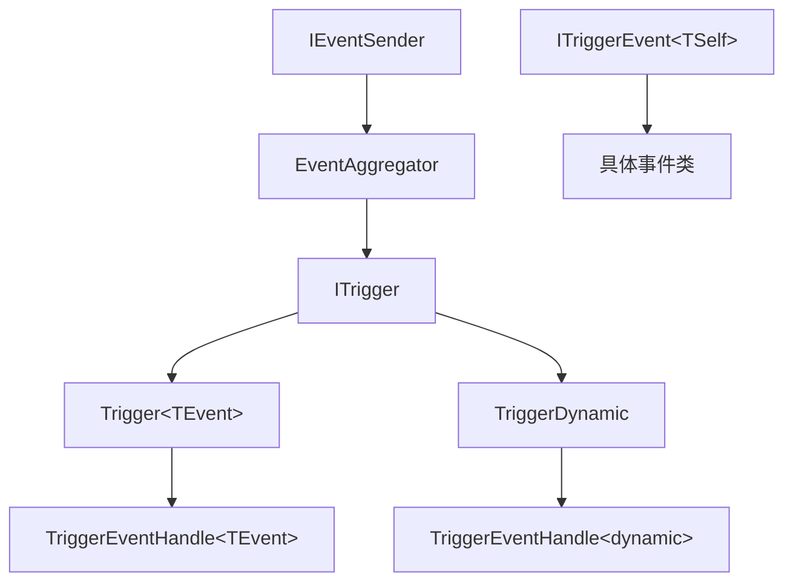

# 触发器系统文档

## 概述

WasiCore 框架提供了强大的触发器系统，基于事件驱动架构实现组件间的松耦合通信。触发器系统通过 `ITrigger` 接口和相关实现类，提供了高效、类型安全的事件处理机制，支持弱引用管理和自动垃圾回收，确保系统的性能和内存安全。

## 核心特性

- **类型安全**：编译时类型检查，避免运行时类型错误
- **高性能**：针对单一事件类型和多事件类型分别优化
- **弱引用管理**：自动管理事件订阅关系，防止内存泄漏
- **异步处理**：支持异步事件处理，不阻塞主线程
- **生命周期控制**：完整的资源管理和垃圾回收机制
- **灵活订阅**：支持动态添加和移除事件订阅

## 系统架构

### 核心组件



### 组件说明

- **IEventSender**：事件发送者接口，所有能发送事件的对象都实现此接口
- **EventAggregator**：事件聚合器，负责管理事件订阅和分发
- **ITrigger**：触发器基接口，定义触发器的基本行为
- **Trigger\<TEvent\>**：单一事件类型触发器，高性能实现
- **TriggerDynamic**：多事件类型触发器，支持动态事件处理
- **ITriggerEvent\<TSelf\>**：事件类型标记接口
- **TriggerEventHandle**：事件处理器委托

## 官方事件系统

### 常见官方事件类型

WasiCore 框架提供了丰富的内置事件类型，覆盖游戏开发的各个方面。这些事件遵循统一的命名规范和继承结构，提供强类型的事件数据访问。

#### 1. 实体事件（EventEntity 系列）

```csharp
// 实体基础事件 - 所有实体相关事件的基类
public abstract class EventEntity(Entity entity) : ITriggerEvent<EventEntity>

// 实体受到伤害事件
public class EventEntityDamageTaken(Entity entity, EffectDamage effect)
    : EventEntity(entity), ITriggerEvent<EventEntityDamageTaken>
{
    public EffectDamage EffectDamage { get; }     // 伤害效果
    public Damage DamageInstance { get; }        // 伤害实例
    public double DamageCurrent { get; }         // 当前伤害值
    public double DamageOriginal { get; }        // 原始伤害值
}

// 实体死亡事件
public class EventEntityDeath(Entity entity, DeathType deathType, IExecutionContext? context = null)
    : EventEntity(entity), ITriggerEvent<EventEntityDeath>
{
    public DeathType DeathType { get; }          // 死亡类型
    public Entity? Killer { get; }              // 击杀者
    public Unit? KillerUnit { get; }            // 击杀者单位
}

// 实体移除事件
public class EventEntityRemove(Entity entity)
    : EventEntity(entity), ITriggerEvent<EventEntityRemove>

// 实体位置变化事件
public class EventEntityPositionChangeStart(Entity entity, bool isMoverMove)
    : EventEntity(entity), ITriggerEvent<EventEntityPositionChangeStart>

public class EventEntityPositionChangeEnd(Entity entity, bool isMoverMove)
    : EventEntity(entity), ITriggerEvent<EventEntityPositionChangeEnd>
```

#### 2. 单位事件（EventUnit 系列）

```csharp
// 单位复活事件
public class EventUnitRevive(Unit unit) : ITriggerEvent<EventUnitRevive>

// 单位属性变化事件
public class EventUnitPropertyChange(Unit unit, PropertyUnit property)
    : ITriggerEvent<EventUnitPropertyChange>
{
    public PropertyUnit Property { get; }       // 变化的属性
}

// 单位复杂属性最终变化事件
public class EventUnitPropertyComplexFinalChange(Unit unit, IGameLink<GameDataUnitProperty> property, double value)
    : ITriggerEvent<EventUnitPropertyComplexFinalChange>
{
    public IGameLink<GameDataUnitProperty> Property { get; }  // 属性链接
    public double NewValue { get; }                           // 新值
}
```

#### 3. 物品事件（EventItem 系列）

```csharp
// 物品槽位变化事件
public class EventItemSlotChange(ItemPickable item, InventorySlot? slot, InventorySlot? slotPrevious)
    : ITriggerEvent<EventItemSlotChange>
{
    public ItemPickable Item { get; }           // 物品
    public InventorySlot? Slot { get; }         // 新槽位
    public InventorySlot? SlotPrevious { get; } // 之前的槽位
}

// 物品堆叠数量变化事件
public class EventItemStackChange(ItemPickable item, uint stack, uint stackPrevious)
    : ITriggerEvent<EventItemStackChange>
{
    public uint Stack { get; }                  // 新堆叠数量
    public uint StackPrevious { get; }          // 之前的堆叠数量
}

// 物品等级变化事件
public class EventItemLevelChange(Item item, uint level, uint levelPrevious)
    : ITriggerEvent<EventItemLevelChange>

// 物品品质变化事件
public class EventItemQualityChange(Item item, uint quality, uint qualityPrevious)
    : ITriggerEvent<EventItemQualityChange>
```

#### 4. 玩家事件（EventPlayer 系列）

```csharp
// 玩家按键事件
public class EventPlayerKeyDown(Player player) : ITriggerEvent<EventPlayerKeyDown>
{
    public VirtualKey Key { get; init; }                        // 按键
    public VirtualKeyModifiers Modifiers { get; init; }        // 修饰键
    public PointerButtons PointerButtons { get; init; }        // 鼠标按钮
    public bool IsRepeat { get; init; }                         // 是否重复按键
}

public class EventPlayerKeyUp(Player player) : ITriggerEvent<EventPlayerKeyUp>

// 玩家主单位变化事件
public class EventPlayerMainUnitChanged(Player player, Unit? unit) 
    : ITriggerEvent<EventPlayerMainUnitChanged>
```

#### 5. 区域事件（EventRegion 系列）

```csharp
// 区域基础事件
public abstract class EventRegion(Region region, Entity entity) : ITriggerEvent<EventRegion>
{
    public Region Region { get; }               // 区域
    public Entity Entity { get; }              // 实体
    public Unit? Unit => Entity as Unit;       // 单位（如果实体是单位）
}

// 进入区域事件
public class EventRegionEnter(Region region, Entity entity) 
    : EventRegion(region, entity), ITriggerEvent<EventRegionEnter>

// 离开区域事件  
public class EventRegionExit(Region region, Entity entity)
    : EventRegion(region, entity), ITriggerEvent<EventRegionExit>
```

#### 6. 游戏系统事件

```csharp
// 游戏开始事件
public class EventGameStart : ITriggerEvent<EventGameStart>

// 游戏帧更新事件
public class EventGameTick(int realTimeDeltaInMs) : ITriggerEvent<EventGameTick>
{
    public int RealTimeDeltaInMs { get; }       // 实际时间间隔（毫秒）
}

// 场景加载事件
public class EventSceneLoadStart(Scene scene) : ITriggerEvent<EventSceneLoadStart>
public class EventSceneLoadEnd(Scene scene) : ITriggerEvent<EventSceneLoadEnd>

// 效果执行事件
public class EventEffectExecuted(Effect effect) : ITriggerEvent<EventEffectExecuted>
```

### 多级事件注册机制

**重要特性**：大部分官方触发器都支持多级注册，这是WasiCore事件系统的核心特性之一。

#### EventEntity 系列的三级注册

所有继承自 `EventEntity` 的事件（名称通常以 `EventEntity` 开头）都支持三个级别的注册：

```csharp
// 1. 全局注册 - 监听所有实体的事件
var globalDeathTrigger = new Trigger<EventEntityDeath>(OnAnyEntityDeath);
globalDeathTrigger.Register(Game.Instance);  // 游戏中所有实体死亡时都会触发

// 2. 数编表注册 - 监听特定类型单位的事件
var orcDeathTrigger = new Trigger<EventEntityDeath>(OnOrcDeath);
orcDeathTrigger.Register(orcUnitData);  // 只有兽人单位死亡时才会触发

// 3. 实体注册 - 监听特定实体的事件
var heroDeathTrigger = new Trigger<EventEntityDeath>(OnHeroDeath);
heroDeathTrigger.Register(heroEntity);  // 只有该特定英雄死亡时才会触发
```

#### 事件传播机制

当一个实体发生事件时，事件会按以下顺序传播：

```csharp
// Unit 类的事件发布实现
public override void Publish<TEvent>(TEvent eventToPublish)
{
    Game.Instance.Publish(eventToPublish);    // 1. 发布到全局
    Cache.Publish(eventToPublish);            // 2. 发布到数编表
    base.Publish(eventToPublish);             // 3. 发布到实体自身
}
```

#### 实际应用示例

```csharp
// 监听所有单位的属性变化
var globalPropertyTrigger = new Trigger<EventUnitPropertyChange>(OnAnyUnitPropertyChange);
globalPropertyTrigger.Register(Game.Instance);

// 监听特定单位类型的属性变化（如所有法师单位）
var magePropertyTrigger = new Trigger<EventUnitPropertyChange>(OnMagePropertyChange);
magePropertyTrigger.Register(mageUnitData);  // GameDataUnit 实例

// 监听特定单位实例的属性变化
var heroPropertyTrigger = new Trigger<EventUnitPropertyChange>(OnHeroPropertyChange);
heroPropertyTrigger.Register(heroUnit);  // 具体的 Unit 实例

private static async Task<bool> OnAnyUnitPropertyChange(object sender, EventUnitPropertyChange eventArgs)
{
    Game.Logger.LogDebug("全局属性变化: {UnitName} 的 {Property} 发生变化", 
        eventArgs.Unit?.Name, eventArgs.Property);
    return true;
}

private static async Task<bool> OnMagePropertyChange(object sender, EventUnitPropertyChange eventArgs)
{
    if (eventArgs.Unit?.Cache == sender)  // 确保是法师单位
    {
        Game.Logger.LogInformation("法师单位属性变化: {Property}", eventArgs.Property);
        // 处理法师特定逻辑
    }
    return true;
}
```

#### 技能与物品事件的类似机制

技能和物品事件同样支持多级注册：

```csharp

// 物品事件的多级注册
var globalItemTrigger = new Trigger<EventItemLevelChange>(OnAnyItemLevelUp);
globalItemTrigger.Register(Game.Instance);         // 全局物品升级

var swordTrigger = new Trigger<EventItemLevelChange>(OnSwordLevelUp);
swordTrigger.Register(swordItemData);              // 特定类型物品升级

var legendaryItemTrigger = new Trigger<EventItemLevelChange>(OnLegendaryItemLevelUp);
legendaryItemTrigger.Register(legendaryItem);      // 特定物品实例升级
```

#### 区域事件的特殊性

**重要限制**：区域进入和离开事件是唯一的特例，仅允许注册到特定的区域对象上：

```csharp
// ✅ 正确：注册到特定区域
var regionTrigger = new Trigger<EventRegionEnter>(OnEnterDangerZone);
regionTrigger.Register(dangerZoneRegion);  // 只监听该危险区域的进入事件

// ❌ 错误：无法全局注册区域事件
var globalRegionTrigger = new Trigger<EventRegionEnter>(OnEnterAnyRegion);
// globalRegionTrigger.Register(Game.Instance);  // 这样做是无效的！

// 原因：性能优化考虑
// 区域检测是高频操作，全局注册会带来不必要的性能消耗
```

#### 注册级别选择指南

```csharp
// 根据需求选择合适的注册级别：

// 全局注册 - 适用于：
// • 统计和日志记录
// • 全局效果和特殊事件处理
// • 成就系统
globalStatsTrigger.Register(Game.Instance);

// 数编表注册 - 适用于：
// • 特定单位类型的共同行为
// • 种族或职业特定逻辑
// • 物品类别特定效果
raceSpecificTrigger.Register(elfUnitData);

// 实体注册 - 适用于：
// • Boss 特殊机制
// • 重要NPC的独特行为
// • 玩家角色的个性化功能
bossMechanicTrigger.Register(bossEntity);
```

## 基本用法

> **⚠️ 重要提醒：触发器生命周期管理**
> 
> 触发器对象如果没有被其他对象持有引用，且创建时未设置 `keepReference = true`，会被 .NET 垃圾回收器回收，导致触发器意外失效。这是使用触发器系统时最常见的问题！
> 
> **解决方案**：
> - 将触发器存储为类的字段或属性
> - 创建时设置 `keepReference = true`（记得在适当时机调用 `Destroy()`）
> - 使用触发器管理器集中管理触发器生命周期
> 
> 详细信息请参阅[故障排除](#故障排除)部分。

### 1. 创建自定义事件类

```csharp
// 定义自定义事件
public class PlayerDeathEvent : ITriggerEvent<PlayerDeathEvent>
{
    public Player Player { get; }
    public Entity Killer { get; }
    public DamageType DamageType { get; }
    public DateTime Timestamp { get; }

    public PlayerDeathEvent(Player player, Entity killer, DamageType damageType)
    {
        Player = player;
        Killer = killer;
        DamageType = damageType;
        Timestamp = DateTime.UtcNow;
    }
}

// 简单事件示例
public class GameStartEvent : ITriggerEvent<GameStartEvent>
{
    public string GameMode { get; }
    public int PlayerCount { get; }

    public GameStartEvent(string gameMode, int playerCount)
    {
        GameMode = gameMode;
        PlayerCount = playerCount;
    }
}
```

### 2. 创建单一事件触发器

```csharp
// 创建处理玩家死亡事件的触发器
var playerDeathTrigger = new Trigger<PlayerDeathEvent>(OnPlayerDeath);

// 事件处理方法
private static async Task<bool> OnPlayerDeath(object sender, PlayerDeathEvent eventArgs)
{
    var player = eventArgs.Player;
    var killer = eventArgs.Killer;
    
    try
    {
        // 记录死亡日志
        Game.Logger.LogInformation("玩家 {PlayerName} 被 {KillerName} 击杀", 
            player.Name, killer.Name);
        
        // 执行死亡逻辑
        await ProcessPlayerDeath(player, killer, eventArgs.DamageType);
        
        // 更新统计数据
        await UpdatePlayerStats(player, killer);
        
        // 触发相关效果
        await TriggerDeathEffects(player, eventArgs.DamageType);
        
        return true; // 表示事件处理成功
    }
    catch (Exception ex)
    {
        Game.Logger.LogError(ex, "处理玩家死亡事件失败");
        return false; // 表示事件处理失败
    }
}

// 注册触发器到事件发送者
playerDeathTrigger.Register(gameWorld);
```

#### 便捷的 Subscribe 方法

为了简化触发器的创建和注册流程，框架提供了 `Subscribe` 扩展方法，可以一行代码完成触发器的创建和注册：

```csharp
// ✅ 便捷方式：使用 Subscribe 方法，简洁明了
var trigger = Game.Instance.Subscribe<EventConversationCompleted>(async (sender, e) =>
{
    Game.Logger.LogInfo("对话完成: {0}", e.Conversation.Cache.Link.FriendlyName);
    // 执行对话完成后的逻辑
    return true;
});

// 等价于标准方式：
// var trigger = new Trigger<EventConversationCompleted>(async (sender, e) => { ... });
// trigger.Register(Game.Instance);
```

**便捷方式的优势：**

- ✅ **简洁**：一行代码完成创建和注册
- ✅ **不易出错**：避免忘记调用 `Register` 方法
- ✅ **直观**：API 设计符合事件订阅的直觉
- ✅ **灵活**：仍然返回触发器对象，可以后续控制

**标准方式的优势：**

- ✅ **灵活**：可以在创建后延迟注册
- ✅ **复用**：可以将同一触发器注册到多个事件发送者
- ✅ **控制**：提供更精细的生命周期管理

**方法签名：**

```csharp
public static Trigger<TEvent> Subscribe<TEvent>(
    this IEventSender sender,
    TriggerEventHandle<TEvent> handler,
    bool keepReference = true)
    where TEvent : class, ITriggerEvent<TEvent>
```

**参数说明：**

- `sender`：事件发送者（如 `Game.Instance`、实体对象、数编表对象等）
- `handler`：事件处理器委托
- `keepReference`：是否保持对触发器的硬引用（默认为 `true`）

**完整示例：**

```csharp
// 订阅单位死亡事件
var deathTrigger = Game.Instance.Subscribe<EventEntityDeath>(async (sender, e) =>
{
    Game.Logger.LogInfo("单位 {0} 死亡", e.Entity.Name);
    
    // 如果是英雄死亡，播放特殊效果
    if (e.Entity is Unit { IsHero: true } hero)
    {
        await PlayHeroDeathAnimation(hero);
    }
    
    return true;
});

// 订阅玩家按键事件
var keyTrigger = Game.Instance.Subscribe<EventPlayerKeyDown>(async (sender, e) =>
{
    if (e.Key == VirtualKey.Escape)
    {
        ShowPauseMenu();
    }
    return true;
});

// 订阅特定单位的属性变化
var heroPropertyTrigger = heroUnit.Subscribe<EventUnitPropertyChange>(async (sender, e) =>
{
    Game.Logger.LogInfo("英雄属性变化: {0}", e.Property);
    UpdateHeroUI();
    return true;
});

// 需要时可以销毁触发器
deathTrigger.Destroy();
keyTrigger.Destroy();
```

**何时使用便捷方式 vs 标准方式：**

| 场景 | 推荐方式 |
|------|---------|
| 简单的事件监听 | ✅ 便捷方式 (Subscribe) |
| 需要立即注册的触发器 | ✅ 便捷方式 (Subscribe) |
| 代码示例和文档 | ✅ 便捷方式 (Subscribe) |
| 需要延迟注册的触发器 | 标准方式 (new + Register) |
| 需要注册到多个发送者 | 标准方式 (new + Register) |
| 复杂的触发器管理逻辑 | 标准方式 (new + Register) |

### 3. 创建多事件触发器

```csharp
// 创建可以处理多种事件的动态触发器
var gameMasterTrigger = new TriggerDynamic(OnGameMasterEvent);

private static async Task<bool> OnGameMasterEvent(object sender, dynamic eventArgs)
{
    // 使用模式匹配处理不同类型的事件
    return eventArgs switch
    {
        PlayerDeathEvent death => await HandlePlayerDeath(sender, death),
        GameStartEvent start => await HandleGameStart(sender, start),
        ItemDropEvent drop => await HandleItemDrop(sender, drop),
        _ => await HandleUnknownEvent(sender, eventArgs)
    };
}

// 注册多种事件类型
gameMasterTrigger.AddEvent<PlayerDeathEvent>(gameWorld);
gameMasterTrigger.AddEvent<GameStartEvent>(gameWorld);
gameMasterTrigger.AddEvent<ItemDropEvent>(gameWorld);
```

### 4. 发布事件

```csharp
// 通过实现了 IEventSender 接口的对象发布事件
public class GameWorld : IEventSender
{
    private readonly EventAggregator aggregator = new();
    private WeakReference<EventAggregator>? aggregatorWeakReference;

    EventAggregator IEventSender.Aggregator => aggregator;
    public WeakReference<EventAggregator> AggregatorWeakReference => 
        aggregatorWeakReference ??= new WeakReference<EventAggregator>(aggregator);

    public void OnPlayerKilled(Player player, Entity killer, DamageType damageType)
    {
        // 创建事件实例
        var deathEvent = new PlayerDeathEvent(player, killer, damageType);
        
        // 发布事件 - 所有注册的触发器都会收到
        this.Publish(deathEvent);
        
        // 也可以使用扩展方法
        IEventSenderExtensions.Publish(this, deathEvent);
    }
}
```

## 高级功能

### 1. 触发器生命周期管理

```csharp
public class GameSessionManager
{
    private readonly List<ITrigger> _sessionTriggers = new();
    
    public void StartGameSession()
    {
        // 创建会话级别的触发器
        var sessionTriggers = new ITrigger[]
        {
            new Trigger<PlayerJoinEvent>(OnPlayerJoin),
            new Trigger<PlayerLeaveEvent>(OnPlayerLeave),
            new Trigger<GameEndEvent>(OnGameEnd)
        };
        
        // 注册所有触发器
        foreach (var trigger in sessionTriggers)
        {
            trigger.Register(Game.Instance);
            _sessionTriggers.Add(trigger);
        }
        
        Game.Logger.LogInformation("游戏会话触发器已注册，数量: {Count}", sessionTriggers.Length);
    }
    
    public void EndGameSession()
    {
        // 销毁所有会话触发器
        foreach (var trigger in _sessionTriggers)
        {
            trigger.Destroy();
        }
        
        _sessionTriggers.Clear();
        Game.Logger.LogInformation("游戏会话触发器已清理");
    }
}
```

### 2. 条件触发器

```csharp
// 创建具有条件逻辑的触发器
public class ConditionalTrigger<TEvent> where TEvent : class, ITriggerEvent<TEvent>
{
    private readonly Trigger<TEvent> _innerTrigger;
    private readonly Func<object, TEvent, bool> _condition;
    
    public ConditionalTrigger(
        Func<object, TEvent, bool> condition,
        TriggerEventHandle<TEvent> handler)
    {
        _condition = condition;
        _innerTrigger = new Trigger<TEvent>(ConditionalHandler);
    }
    
    private async Task<bool> ConditionalHandler(object sender, TEvent eventArgs)
    {
        // 只有满足条件时才执行处理逻辑
        if (_condition(sender, eventArgs))
        {
            return await _handler(sender, eventArgs);
        }
        
        return true; // 不满足条件时返回成功，避免错误日志
    }
    
    public void Register(IEventSender sender) => _innerTrigger.Register(sender);
    public void Unregister(IEventSender sender) => _innerTrigger.Unregister(sender);
    public void Destroy() => _innerTrigger.Destroy();
}

// 使用示例：只处理高级玩家的死亡事件
var highLevelPlayerDeathTrigger = new ConditionalTrigger<PlayerDeathEvent>(
    condition: (sender, eventArgs) => eventArgs.Player.Level >= 50,
    handler: async (sender, eventArgs) =>
    {
        // 特殊处理高级玩家死亡
        await ProcessHighLevelPlayerDeath(eventArgs.Player);
        return true;
    }
);
```

### 3. 触发器链和组合

```csharp
// 触发器链：按顺序执行多个处理器
public class TriggerChain<TEvent> where TEvent : class, ITriggerEvent<TEvent>
{
    private readonly List<TriggerEventHandle<TEvent>> _handlers = new();
    private readonly Trigger<TEvent> _trigger;
    
    public TriggerChain()
    {
        _trigger = new Trigger<TEvent>(ExecuteChain);
    }
    
    public TriggerChain<TEvent> AddHandler(TriggerEventHandle<TEvent> handler)
    {
        _handlers.Add(handler);
        return this;
    }
    
    private async Task<bool> ExecuteChain(object sender, TEvent eventArgs)
    {
        foreach (var handler in _handlers)
        {
            try
            {
                var success = await handler(sender, eventArgs);
                if (!success)
                {
                    Game.Logger.LogWarning("触发器链中断：处理器返回失败");
                    return false;
                }
            }
            catch (Exception ex)
            {
                Game.Logger.LogError(ex, "触发器链执行失败");
                return false;
            }
        }
        
        return true;
    }
    
    public void Register(IEventSender sender) => _trigger.Register(sender);
    public void Destroy() => _trigger.Destroy();
}

// 使用示例
var playerDeathChain = new TriggerChain<PlayerDeathEvent>()
    .AddHandler(LogPlayerDeath)           // 1. 记录日志
    .AddHandler(UpdateStatistics)        // 2. 更新统计
    .AddHandler(NotifyFriends)          // 3. 通知好友
    .AddHandler(HandleRespawn);         // 4. 处理重生

playerDeathChain.Register(gameWorld);
```

### 4. 事件过滤和转换

```csharp
// 事件过滤器
public class EventFilter<TSourceEvent, TTargetEvent> 
    where TSourceEvent : class, ITriggerEvent<TSourceEvent>
    where TTargetEvent : class, ITriggerEvent<TTargetEvent>
{
    private readonly Trigger<TSourceEvent> _sourceTrigger;
    private readonly IEventSender _targetSender;
    
    public EventFilter(
        Func<TSourceEvent, TTargetEvent?> transformer,
        IEventSender targetSender)
    {
        _targetSender = targetSender;
        _sourceTrigger = new Trigger<TSourceEvent>(async (sender, eventArgs) =>
        {
            var transformedEvent = transformer(eventArgs);
            if (transformedEvent != null)
            {
                _targetSender.Publish(transformedEvent);
            }
            return true;
        });
    }
    
    public void Register(IEventSender sender) => _sourceTrigger.Register(sender);
    public void Destroy() => _sourceTrigger.Destroy();
}

// 使用示例：将玩家死亡事件转换为经验奖励事件
var deathToExpFilter = new EventFilter<PlayerDeathEvent, ExperienceGainEvent>(
    transformer: deathEvent => 
    {
        if (deathEvent.Killer is Player killerPlayer)
        {
            var expGain = CalculateKillExperience(deathEvent.Player, killerPlayer);
            return new ExperienceGainEvent(killerPlayer, expGain, "PlayerKill");
        }
        return null;
    },
    targetSender: gameWorld
);

deathToExpFilter.Register(gameWorld);
```

### 5. 调试和监控

```csharp
// 触发器性能监控
public class TriggerPerformanceMonitor
{
    private readonly Dictionary<Type, TriggerStats> _stats = new();
    
    public Trigger<TEvent> CreateMonitoredTrigger<TEvent>(TriggerEventHandle<TEvent> handler)
        where TEvent : class, ITriggerEvent<TEvent>
    {
        return new Trigger<TEvent>(async (sender, eventArgs) =>
        {
            var eventType = typeof(TEvent);
            var stopwatch = Diagnostics.Stopwatch.StartNew();
            
            try
            {
                var result = await handler(sender, eventArgs);
                
                stopwatch.Stop();
                RecordSuccess(eventType, stopwatch.ElapsedMilliseconds);
                
                return result;
            }
            catch (Exception ex)
            {
                stopwatch.Stop();
                RecordFailure(eventType, stopwatch.ElapsedMilliseconds, ex);
                throw;
            }
        });
    }
    
    private void RecordSuccess(Type eventType, long elapsedMs)
    {
        if (!_stats.TryGetValue(eventType, out var stats))
        {
            stats = new TriggerStats();
            _stats[eventType] = stats;
        }
        
        stats.TotalExecutions++;
        stats.TotalExecutionTime += elapsedMs;
        stats.LastExecutionTime = DateTime.UtcNow;
    }
    
    private void RecordFailure(Type eventType, long elapsedMs, Exception ex)
    {
        if (!_stats.TryGetValue(eventType, out var stats))
        {
            stats = new TriggerStats();
            _stats[eventType] = stats;
        }
        
        stats.TotalExecutions++;
        stats.FailedExecutions++;
        stats.TotalExecutionTime += elapsedMs;
        stats.LastError = ex;
        stats.LastExecutionTime = DateTime.UtcNow;
    }
    
    public void LogStatistics()
    {
        foreach (var (eventType, stats) in _stats)
        {
            var avgTime = stats.TotalExecutions > 0 
                ? stats.TotalExecutionTime / stats.TotalExecutions 
                : 0;
                
            Game.Logger.LogInformation(
                "触发器统计 {EventType}: 执行次数={Total}, 失败次数={Failed}, 平均耗时={AvgMs}ms",
                eventType.Name, 
                stats.TotalExecutions, 
                stats.FailedExecutions, 
                avgTime);
        }
    }
}

// 使用监控
var monitor = new TriggerPerformanceMonitor();
var monitoredTrigger = monitor.CreateMonitoredTrigger<PlayerDeathEvent>(OnPlayerDeath);
```

## 系统集成

### 1. 与游戏对象集成

```csharp
// 游戏实体的事件支持
public partial class Entity : IEventSender
{
    protected EventAggregator? aggregator;
    private WeakReference<EventAggregator>? aggregatorWeakReference;

    EventAggregator IEventSender.Aggregator => aggregator ??= new();
    public WeakReference<EventAggregator> AggregatorWeakReference => 
        aggregatorWeakReference ??= new WeakReference<EventAggregator>(aggregator ??= new());

    // 实体死亡时发布事件
    protected virtual void OnDeath(Entity killer, DamageType damageType)
    {
        var deathEvent = new EntityDeathEvent(this, killer, damageType);
        this.Publish(deathEvent);
        
        // 同时向游戏实例发布，实现多级事件传播
        Game.Instance.Publish(deathEvent);
    }
}
```

### 2. 与技能系统集成

```csharp
// 技能事件
public class SkillCastEvent : ITriggerEvent<SkillCastEvent>
{
    public Entity Caster { get; }
    public Skill Skill { get; }
    public Entity? Target { get; }
    public Vector3 TargetPosition { get; }

    public SkillCastEvent(Entity caster, Skill skill, Entity? target, Vector3 targetPosition)
    {
        Caster = caster;
        Skill = skill;
        Target = target;
        TargetPosition = targetPosition;
    }
}

// 技能系统触发器
public class SkillSystemTriggers
{
    private readonly List<ITrigger> _triggers = new();
    
    public void Initialize()
    {
        var triggers = new ITrigger[]
        {
            new Trigger<SkillCastEvent>(OnSkillCast),
            new Trigger<SkillHitEvent>(OnSkillHit),
            new Trigger<SkillCooldownEvent>(OnSkillCooldown)
        };
        
        foreach (var trigger in triggers)
        {
            trigger.Register(Game.Instance);
            _triggers.Add(trigger);
        }
    }
    
    private static async Task<bool> OnSkillCast(object sender, SkillCastEvent eventArgs)
    {
        // 处理技能释放逻辑
        await ProcessSkillEffects(eventArgs.Caster, eventArgs.Skill, eventArgs.Target);
        await ConsumeSkillResources(eventArgs.Caster, eventArgs.Skill);
        
        return true;
    }
}
```

### 3. 与AI系统集成

```csharp
// AI决策事件
public class AIDecisionEvent : ITriggerEvent<AIDecisionEvent>
{
    public Entity AIEntity { get; }
    public string DecisionType { get; }
    public object DecisionData { get; }

    public AIDecisionEvent(Entity aiEntity, string decisionType, object decisionData)
    {
        AIEntity = aiEntity;
        DecisionType = decisionType;
        DecisionData = decisionData;
    }
}

// AI行为触发器
public class AIBehaviorTrigger
{
    private readonly TriggerDynamic _aiTrigger;
    
    public AIBehaviorTrigger()
    {
        _aiTrigger = new TriggerDynamic(ProcessAIEvent);
        
        // 注册多种AI相关事件
        _aiTrigger.AddEvent<AIDecisionEvent>(Game.Instance);
        _aiTrigger.AddEvent<EntityDeathEvent>(Game.Instance);
        _aiTrigger.AddEvent<PlayerEnterAreaEvent>(Game.Instance);
    }
    
    private async Task<bool> ProcessAIEvent(object sender, dynamic eventArgs)
    {
        return eventArgs switch
        {
            AIDecisionEvent decision => await HandleAIDecision(decision),
            EntityDeathEvent death => await HandleEntityDeath(death),
            PlayerEnterAreaEvent enter => await HandlePlayerEnter(enter),
            _ => true
        };
    }
}
```

## 性能优化

### 1. 触发器类型选择

```csharp
// ✅ 推荐：对于单一事件类型，使用 Trigger<TEvent>
var singleEventTrigger = new Trigger<PlayerDeathEvent>(OnPlayerDeath);

// ❌ 不推荐：对于单一事件类型使用 TriggerDynamic
var dynamicTrigger = new TriggerDynamic(async (sender, eventArgs) =>
{
    if (eventArgs is PlayerDeathEvent death)
    {
        return await OnPlayerDeath(sender, death);
    }
    return false;
});

// ✅ 推荐：只有需要处理多种事件类型时才使用 TriggerDynamic
var multiEventTrigger = new TriggerDynamic(async (sender, eventArgs) =>
{
    return eventArgs switch
    {
        PlayerDeathEvent death => await OnPlayerDeath(sender, death),
        PlayerLevelUpEvent levelUp => await OnPlayerLevelUp(sender, levelUp),
        PlayerItemPickupEvent pickup => await OnPlayerItemPickup(sender, pickup),
        _ => false
    };
});
```

### 2. 事件频率控制

```csharp
// 高频事件的优化处理
public class OptimizedMovementTrigger
{
    private readonly Trigger<PlayerMoveEvent> _trigger;
    private readonly Dictionary<int, DateTime> _lastProcessed = new();
    private readonly TimeSpan _minInterval = TimeSpan.FromMilliseconds(50); // 最小处理间隔
    
    public OptimizedMovementTrigger()
    {
        _trigger = new Trigger<PlayerMoveEvent>(ProcessMovement);
    }
    
    private async Task<bool> ProcessMovement(object sender, PlayerMoveEvent eventArgs)
    {
        var playerId = eventArgs.Player.Id;
        var now = DateTime.UtcNow;
        
        // 频率限制
        if (_lastProcessed.TryGetValue(playerId, out var lastTime) && 
            now - lastTime < _minInterval)
        {
            return true; // 跳过处理，但返回成功
        }
        
        _lastProcessed[playerId] = now;
        
        // 执行实际的移动处理逻辑
        await ProcessPlayerMovement(eventArgs.Player, eventArgs.NewPosition);
        
        return true;
    }
    
    public void Register(IEventSender sender) => _trigger.Register(sender);
}
```

### 3. 内存管理优化

```csharp
// 定期清理触发器的弱引用
public class TriggerMaintenanceService
{
    private readonly List<ITrigger> _triggers = new();
    private readonly Timer _cleanupTimer;
    
    public TriggerMaintenanceService()
    {
        // 每30秒执行一次清理
        _cleanupTimer = new Timer(PerformMaintenance, null, 
            TimeSpan.FromSeconds(30), TimeSpan.FromSeconds(30));
    }
    
    public void RegisterTrigger(ITrigger trigger)
    {
        _triggers.Add(trigger);
    }
    
    private void PerformMaintenance(object? state)
    {
        var cleanedCount = 0;
        
        foreach (var trigger in _triggers.ToList())
        {
            if (!trigger.IsValid)
            {
                _triggers.Remove(trigger);
                cleanedCount++;
                continue;
            }
            
            // 清理弱引用
            trigger.EventsGC();
        }
        
        if (cleanedCount > 0)
        {
            Game.Logger.LogDebug("触发器维护完成，清理了 {Count} 个无效触发器", cleanedCount);
        }
        
        // 强制垃圾回收（谨慎使用）
        if (cleanedCount > 10)
        {
            GC.Collect();
            GC.WaitForPendingFinalizers();
        }
    }
}
```

## 最佳实践

### 1. 事件设计原则

```csharp
// ✅ 推荐：事件应该是不可变的
public class PlayerLevelUpEvent : ITriggerEvent<PlayerLevelUpEvent>
{
    public Player Player { get; }
    public int OldLevel { get; }
    public int NewLevel { get; }
    public DateTime Timestamp { get; }
    
    public PlayerLevelUpEvent(Player player, int oldLevel, int newLevel)
    {
        Player = player;
        OldLevel = oldLevel;
        NewLevel = newLevel;
        Timestamp = DateTime.UtcNow;
    }
}

// ❌ 避免：可变的事件数据
public class BadPlayerEvent : ITriggerEvent<BadPlayerEvent>
{
    public Player Player { get; set; } = null!; // 可变属性
    public Dictionary<string, object> Data { get; set; } = new(); // 可变集合
}
```

### 2. 错误处理策略

```csharp
// ✅ 推荐：优雅的错误处理
private static async Task<bool> OnPlayerDeath(object sender, PlayerDeathEvent eventArgs)
{
    try
    {
        // 关键逻辑：必须成功
        await SavePlayerDeathRecord(eventArgs.Player);
        
        // 可选逻辑：失败不影响主流程
        try
        {
            await SendDeathNotification(eventArgs.Player);
            await UpdateLeaderboard(eventArgs.Player);
        }
        catch (Exception ex)
        {
            Game.Logger.LogWarning(ex, "玩家死亡后续处理部分失败，但不影响主流程");
        }
        
        return true;
    }
    catch (Exception ex)
    {
        Game.Logger.LogError(ex, "玩家死亡关键处理失败");
        return false;
    }
}
```

### 3. 触发器注册管理

```csharp
// ✅ 推荐：集中管理触发器注册
public class GameEventManager : IDisposable
{
    private readonly List<ITrigger> _gameTriggers = new();
    private bool _disposed = false;
    
    public void InitializeGameTriggers()
    {
        var triggers = new ITrigger[]
        {
            new Trigger<PlayerJoinEvent>(OnPlayerJoin),
            new Trigger<PlayerLeaveEvent>(OnPlayerLeave),
            new Trigger<GameStartEvent>(OnGameStart),
            new Trigger<GameEndEvent>(OnGameEnd)
        };
        
        foreach (var trigger in triggers)
        {
            trigger.Register(Game.Instance);
            _gameTriggers.Add(trigger);
        }
        
        Game.Logger.LogInformation("游戏事件触发器初始化完成，数量: {Count}", triggers.Length);
    }
    
    public void Dispose()
    {
        if (!_disposed)
        {
            foreach (var trigger in _gameTriggers)
            {
                trigger.Destroy();
            }
            
            _gameTriggers.Clear();
            _disposed = true;
            
            Game.Logger.LogInformation("游戏事件触发器已清理");
        }
    }
}
```

### 4. 事件发布时机

```csharp
// ✅ 推荐：在状态改变后发布事件
public void LevelUpPlayer(Player player, int newLevel)
{
    var oldLevel = player.Level;
    
    // 1. 先改变状态
    player.Level = newLevel;
    player.ExperiencePoints = 0;
    UpdatePlayerStats(player);
    
    // 2. 再发布事件
    var levelUpEvent = new PlayerLevelUpEvent(player, oldLevel, newLevel);
    this.Publish(levelUpEvent);
    
    Game.Logger.LogInformation("玩家 {PlayerName} 升级到 {NewLevel} 级", player.Name, newLevel);
}

// ❌ 避免：在状态改变前发布事件
public void BadLevelUpPlayer(Player player, int newLevel)
{
    var oldLevel = player.Level;
    
    // 错误：先发布事件，此时状态还未改变
    var levelUpEvent = new PlayerLevelUpEvent(player, oldLevel, newLevel);
    this.Publish(levelUpEvent);
    
    // 后改变状态 - 事件处理器可能看到不一致的状态
    player.Level = newLevel;
    player.ExperiencePoints = 0;
}
```

### 5. 测试和调试

```csharp
// 触发器单元测试示例
[TestClass]
public class TriggerSystemTests
{
    [TestMethod]
    public async Task TestPlayerDeathTrigger()
    {
        // Arrange
        var eventReceived = false;
        var receivedEvent = default(PlayerDeathEvent);
        
        var trigger = new Trigger<PlayerDeathEvent>(async (sender, eventArgs) =>
        {
            eventReceived = true;
            receivedEvent = eventArgs;
            return true;
        });
        
        var mockSender = new MockEventSender();
        trigger.Register(mockSender);
        
        var player = new Player { Id = 1, Name = "TestPlayer" };
        var killer = new Entity { Id = 2, Name = "TestKiller" };
        
        // Act
        var deathEvent = new PlayerDeathEvent(player, killer, DamageType.Physical);
        mockSender.Publish(deathEvent);
        
        // 等待异步处理完成
        await Task.Delay(100);
        
        // Assert
        Assert.IsTrue(eventReceived);
        Assert.IsNotNull(receivedEvent);
        Assert.AreEqual(player.Id, receivedEvent.Player.Id);
        Assert.AreEqual(killer.Id, receivedEvent.Killer.Id);
    }
    
    [TestMethod]
    public void TestTriggerLifecycle()
    {
        // Arrange
        var trigger = new Trigger<PlayerDeathEvent>(async (s, e) => true);
        var mockSender = new MockEventSender();
        
        // Act & Assert
        Assert.IsTrue(trigger.IsValid);
        Assert.IsTrue(trigger.IsEnabled);
        
        trigger.Register(mockSender);
        Assert.AreEqual(1, trigger.Events().Count());
        
        trigger.Unregister(mockSender);
        Assert.AreEqual(0, trigger.Events().Count());
        
        trigger.Destroy();
        Assert.IsFalse(trigger.IsValid);
    }
}
```

## 故障排除

### 常见问题和解决方案

#### 1. 触发器意外失效（垃圾回收导致）

**问题**：触发器创建后能正常工作一段时间，但在游戏运行一段时间后突然不再响应事件。

**原因**：这是最常见的触发器问题！如果触发器没有被其他对象引用，且创建时没有设置 `keepReference = true`，触发器对象会被 .NET 垃圾回收器回收，导致触发器失效。

**典型场景**：
```csharp
// ❌ 错误做法：触发器没有被持有引用
public void SetupEventHandling()
{
    // 创建触发器，但没有保存引用
    var trigger = new Trigger<PlayerDeathEvent>(OnPlayerDeath);
    trigger.Register(Game.Instance);
    
    // 方法结束后，trigger 变量超出作用域
    // 在下次 GC 时，触发器会被回收！
}

// ❌ 错误做法：局部变量触发器
public void InitializeGameEvents()
{
    var deathTrigger = new Trigger<PlayerDeathEvent>(OnPlayerDeath);
    var levelTrigger = new Trigger<PlayerLevelUpEvent>(OnPlayerLevelUp);
    
    deathTrigger.Register(Game.Instance);
    levelTrigger.Register(Game.Instance);
    
    // 这些触发器在 GC 时会被回收！
}
```

**解决方案**：

**方案一：保持对触发器的引用**
```csharp
// ✅ 正确做法：在类中保持对触发器的引用
public class GameEventManager
{
    // 将触发器存储为字段，防止被回收
    private readonly Trigger<PlayerDeathEvent> _deathTrigger;
    private readonly Trigger<PlayerLevelUpEvent> _levelTrigger;
    private readonly List<ITrigger> _allTriggers = new();
    
    public GameEventManager()
    {
        _deathTrigger = new Trigger<PlayerDeathEvent>(OnPlayerDeath);
        _levelTrigger = new Trigger<PlayerLevelUpEvent>(OnPlayerLevelUp);
        
        _deathTrigger.Register(Game.Instance);
        _levelTrigger.Register(Game.Instance);
        
        // 可选：统一管理
        _allTriggers.Add(_deathTrigger);
        _allTriggers.Add(_levelTrigger);
    }
    
    public void Cleanup()
    {
        foreach (var trigger in _allTriggers)
        {
            trigger.Destroy();
        }
        _allTriggers.Clear();
    }
}
```

**方案二：使用 keepReference 参数**
```csharp
// ✅ 正确做法：使用 keepReference 防止垃圾回收
public void SetupEventHandling()
{
    // keepReference = true 会将触发器添加到硬引用集合中
    var trigger = new Trigger<PlayerDeathEvent>(OnPlayerDeath, keepReference: true);
    trigger.Register(Game.Instance);
    
    // 即使没有其他引用，触发器也不会被回收
    // 注意：使用完毕后必须调用 Destroy() 来清理
}

// 记住在适当时机清理
public void CleanupGameSession()
{
    // 清理所有硬引用的触发器
    foreach (var trigger in ITrigger.HardReferences.ToList())
    {
        trigger.Destroy(); // 这会从硬引用集合中移除触发器
    }
}
```

**方案三：使用静态触发器管理器**
```csharp
// ✅ 推荐做法：集中管理触发器生命周期
public static class GlobalTriggerManager
{
    private static readonly List<ITrigger> _triggers = new();
    
    public static void RegisterTrigger<TEvent>(TriggerEventHandle<TEvent> handler, IEventSender sender)
        where TEvent : class, ITriggerEvent<TEvent>
    {
        var trigger = new Trigger<TEvent>(handler);
        trigger.Register(sender);
        _triggers.Add(trigger);
    }
    
    public static void ClearAllTriggers()
    {
        foreach (var trigger in _triggers)
        {
            trigger.Destroy();
        }
        _triggers.Clear();
    }
}

// 使用方式
GlobalTriggerManager.RegisterTrigger<PlayerDeathEvent>(OnPlayerDeath, Game.Instance);
```

**诊断和调试**：
```csharp
// 检查触发器是否仍然有效
public void DiagnoseTriggerIssues()
{
    // 检查硬引用集合中的触发器数量
    Game.Logger.LogInformation("当前硬引用触发器数量: {Count}", 
        ITrigger.HardReferences.Count);
    
    // 强制垃圾回收来测试触发器是否会被回收
    GC.Collect();
    GC.WaitForPendingFinalizers();
    GC.Collect();
    
    // 发布测试事件
    Game.Instance.Publish(new PlayerDeathEvent(testPlayer, testKiller, DamageType.Physical));
}

// 在触发器中添加日志来确认是否被调用
private static async Task<bool> OnPlayerDeath(object sender, PlayerDeathEvent eventArgs)
{
    Game.Logger.LogInformation("触发器被调用: 玩家 {Player} 死亡", eventArgs.Player);
    return true;
}
```

#### 2. 触发器未收到事件

**问题**：创建了触发器但没有收到预期的事件。

**解决方案**：
```csharp
// 检查触发器是否正确注册
var trigger = new Trigger<PlayerDeathEvent>(OnPlayerDeath);
trigger.Register(eventSender); // 确保注册到正确的事件发送者

// 检查事件发送者是否正确发布事件
eventSender.Publish(new PlayerDeathEvent(player, killer, damageType));

// 启用调试日志
Game.Logger.LogLevel = LogLevel.Debug;
```

#### 3. 内存泄漏

**问题**：触发器导致内存泄漏。

**解决方案**：
```csharp
// 确保在不需要时销毁触发器
public void CleanupTriggers()
{
    foreach (var trigger in _triggers)
    {
        trigger.Destroy(); // 重要：必须调用 Destroy
    }
    _triggers.Clear();
}

// 定期清理弱引用
private void PerformMaintenanceTask()
{
    foreach (var trigger in _triggers)
    {
        trigger.EventsGC(); // 清理失效的弱引用
    }
}
```

#### 4. 性能问题

**问题**：触发器处理导致性能下降。

**解决方案**：
```csharp
// 使用性能分析器识别瓶颈
private static async Task<bool> OnHighFrequencyEvent(object sender, HighFrequencyEvent eventArgs)
{
    using var activity = Game.Diagnostics.StartActivity("ProcessHighFrequencyEvent");
    
    // 避免在高频事件中执行重操作
    if (ShouldProcess(eventArgs))
    {
        await ProcessEventAsync(eventArgs);
    }
    
    return true;
}

// 批量处理高频事件
private readonly List<HighFrequencyEvent> _pendingEvents = new();
private readonly Timer _batchProcessor;

private void QueueEvent(HighFrequencyEvent eventArgs)
{
    lock (_pendingEvents)
    {
        _pendingEvents.Add(eventArgs);
    }
}

private void ProcessBatch(object? state)
{
    List<HighFrequencyEvent> batch;
    lock (_pendingEvents)
    {
        batch = _pendingEvents.ToList();
        _pendingEvents.Clear();
    }
    
    // 批量处理
    ProcessEventsBatch(batch);
}
```

## 总结

触发器系统是 WasiCore 框架事件驱动架构的核心组件，提供了强大、灵活且高性能的事件处理机制。通过合理使用单一事件触发器和多事件触发器，配合完善的生命周期管理和错误处理策略，可以构建出松耦合、可维护的游戏系统架构。

关键要点：
- **⚠️ 重要**：确保触发器不被垃圾回收（保持引用或使用 `keepReference = true`）
- 优先使用 `Trigger<TEvent>` 获得最佳性能
- 只在必要时使用 `TriggerDynamic` 处理多种事件
- 始终记得调用 `Destroy()` 方法清理资源
- 合理设计事件结构，保持不可变性
- 实施适当的错误处理和性能监控
- 定期进行内存管理和弱引用清理