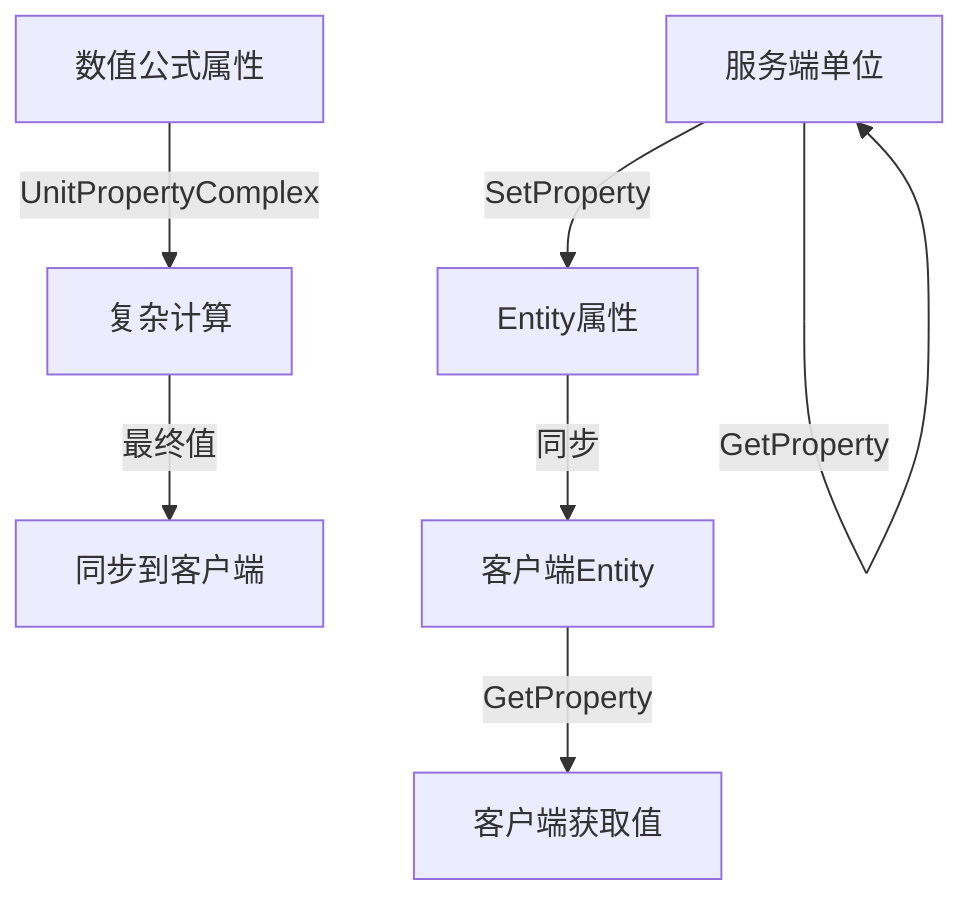

# 单位属性系统文档

## 概述

单位属性系统是一个高性能的属性管理框架，支持服务端与客户端之间的属性同步，以及复杂的数值公式计算。系统主要包含两种属性类型：

1. **基础属性** (`PropertyUnit` / `PropertyEntity`) - 支持任何可序列化类型的简单属性
2. **数值公式属性** (`UnitPropertyComplex`) - 支持复杂计算公式的 `double` 类型属性

## 同步机制

### 服务端与客户端同步



### 同步特性

- **服务端权威**：服务端可以设置和获取所有属性
- **客户端只读**：客户端只能获取属性，无法直接设置
- **选择性同步**：每个属性可以单独配置同步范围（默认仅同步给属性所有者）
- **自动重连同步**：客户端连接或重连时，自动同步当前可见单位的所有属性

## 基础属性系统

### PropertyUnit 和 PropertyEntity

基础属性支持任何可序列化的数据类型，适用于简单的属性存储和同步。

#### 服务端使用示例

```csharp
// 设置单位属性
unit.SetProperty(PropertyUnit.Health, 100.0f);
unit.SetProperty(PropertyUnit.Name, "勇士");
unit.SetProperty(PropertyUnit.Level, 5);

// 获取单位属性
var health = unit.GetProperty<float>(PropertyUnit.Health);
var name = unit.GetProperty<string>(PropertyUnit.Name);
var level = unit.GetProperty<int>(PropertyUnit.Level);
```

#### 客户端使用示例

```csharp
// 客户端只能获取属性
var health = unit.GetProperty<float>(PropertyUnit.Health);
var name = unit.GetProperty<string>(PropertyUnit.Name);

// 客户端无法设置属性（以下代码在客户端无效）
// unit.SetProperty(PropertyUnit.Health, 80.0f); // 这在客户端不会生效
```

#### 扩展自定义属性

系统支持通过 `EnumExtension` 特性扩展 `PropertyUnit` 等可扩展枚举，允许您在项目中添加自定义属性类型。

##### 定义扩展属性

```csharp
// 在您的项目中扩展 PropertyUnit 枚举
[EnumExtension(Extends = typeof(PropertyUnit))]
public enum ECustomPropertyUnit
{
    MagicPower = 1000,    // 魔法强度
    CriticalRate = 1001,  // 暴击率
    Inventory = 1002,     // 背包数据
}
```

##### 代码生成机制

`EnumExtension` 特性会自动生成扩展代码，实现以下功能：

- **自动生成属性**：上文的代码会生成 `CustomPropertyUnit.MagicPower`、`CustomPropertyUnit.CriticalRate`、`CustomPropertyUnit.Inventory` 等属性
- **无缝集成**：生成的属性可以在任何需要 `PropertyUnit` 参数的地方使用
- **命名约定**：源枚举必须以 `E` 开头，生成的属性会自动去除 `E` 前缀

##### 命名规则

| 源枚举名称            | 生成的属性名称          | 说明                    |
|---------------------|----------------------|------------------------|
| `ECustomPropertyUnit` | `CustomPropertyUnit`  | 去除 E 前缀            |
| `EPlayerAttribute`    | `PlayerAttribute`     | 保持后续命名不变        |

##### 使用示例

```csharp
// 使用自定义属性设置值
unit.SetProperty(CustomPropertyUnit.MagicPower, 250.5);
unit.SetProperty(CustomPropertyUnit.CriticalRate, 0.15f);
unit.SetProperty(CustomPropertyUnit.Inventory, inventoryData);

// 获取自定义属性值
var magicPower = unit.GetProperty<double>(CustomPropertyUnit.MagicPower);
var criticalRate = unit.GetProperty<float>(CustomPropertyUnit.CriticalRate);
var inventory = unit.GetProperty<InventoryData>(CustomPropertyUnit.Inventory);
```

##### 最佳实践


1. **类型一致性**：确保相同属性在不同地方使用相同的数据类型
2. **文档记录**：为每个自定义属性添加注释说明其用途

```csharp
[EnumExtension(Extends = typeof(PropertyUnit))]
public enum EGameplayPropertyUnit
{
    // 战斗相关属性
    MagicPower,        // 魔法强度 (double)
    CriticalRate,      // 暴击率 (float, 0.0-1.0)
    CriticalDamage,    // 暴击伤害倍数 (float)
    
    // 角色数据
    PlayerLevel,       // 玩家等级 (int)
    Experience,        // 经验值 (long)
    Inventory,         // 背包数据 (InventoryData)
    
    // 状态信息 
    LastLoginTime,     // 最后登录时间 (DateTime)
    OnlineStatus,      // 在线状态 (OnlineStatus)
}
```

## 数值公式属性系统

`UnitPropertyComplex` 组件提供了强大的数值计算功能，支持依赖关系管理和自动重算。

### 核心特性

- **类型限制**：所有子属性值和最终值必须是 `double` 类型
- **公式计算**：支持复杂的数学公式和依赖关系
- **自动更新**：当依赖属性改变时，自动重新计算相关属性
- **循环检测**：自动检测并防止循环依赖

### 属性子类型

每个数值公式属性都可包含多个子类型，默认包含 Base 一个子类型。

```csharp
public enum PropertySubType
{
    Base,      // 基础值
}
```
可通过与 PropertyUnit 类似的方式来扩展 PropertySubType 枚举，以支持更多的子类型。 EnumExtension 可以对所有可扩展枚举进行扩展。

```csharp
[EnumExtension(Extends = typeof(PropertySubType))]
public enum EPropertySubTypeEx
{
    Bonus,     // 奖励值
    Multiplier,// 乘数
}
```

### 服务端API使用示例

#### 基本操作

```csharp
// 获取或创建 UnitPropertyComplex 组件
var propertyComponent = unit.GetOrCreateComponent<UnitPropertyComplex>();

// 设置属性的子类型值
propertyComponent.SetFixed(PropertyUnitNumeric.AttackPower, PropertySubType.Base, 100.0);
propertyComponent.SetFixed(PropertyUnitNumeric.AttackPower, PropertySubTypeEx.Bonus, 25.0);
propertyComponent.SetFixed(PropertyUnitNumeric.AttackPower, PropertySubTypeEx.Multiplier, 1.2);

// 添加数值到现有值
propertyComponent.AddFixed(PropertyUnitNumeric.AttackPower, PropertySubType.Bonus, 10.0); // Bonus 现在为 35.0

// 获取子类型值
var baseAttack = propertyComponent.GetFixed(PropertyUnitNumeric.AttackPower, PropertySubType.Base);
var bonusAttack = propertyComponent.GetFixed(PropertyUnitNumeric.AttackPower, PropertySubTypeEx.Bonus);

// 获取最终计算值
var finalAttack = propertyComponent.GetFinal(PropertyUnitNumeric.AttackPower);
```

#### 高级功能

```csharp
// 检查属性是否存在
if (propertyComponent.ContainsProperty(PropertyUnitNumeric.MagicPower))
{
    var magic = propertyComponent.GetFinal(PropertyUnitNumeric.MagicPower);
}

// 安全获取属性（可能返回 null）
var criticalRate = propertyComponent.GetFinalOrNull(PropertyUnitNumeric.CriticalRate);
if (criticalRate.HasValue)
{
    // 处理暴击率
}
```

### 客户端API使用示例

```csharp
// 客户端只能获取最终值
var finalAttack = unit.GetUnitPropertyFinal(PropertyUnitNumeric.AttackPower);
if (finalAttack.HasValue)
{
    // 更新UI显示
    attackPowerText.text = finalAttack.Value.ToString("F1");
}
```

### 公式系统

#### 注册自定义公式

```csharp
// 定义攻击力计算公式：(基础值 + 奖励值) × 乘数
var attackFormula = new UnitPropertyFormula
{
    Formula = (propertyComplex) =>
    {
        var baseValue = propertyComplex.GetFixed(PropertyUnitNumeric.AttackPower, PropertySubType.Base);
        var bonus = propertyComplex.GetFixed(PropertyUnitNumeric.AttackPower, PropertySubTypeEx.Bonus);
        var multiplier = propertyComplex.GetFixed(PropertyUnitNumeric.AttackPower, PropertySubTypeEx.Multiplier);
        
        return (baseValue + bonus) * multiplier;
    },
    DependedProperties = new[]
    {
        PropertyUnitNumeric.AttackPower // 依赖自身的子属性
    }
};

// 注册公式
UnitPropertyComplex.RegisterFormula(PropertyUnitNumeric.AttackPower, attackFormula);
```

#### 复杂依赖关系示例

```csharp
// 总生命值 = 基础生命值 + (体质 × 生命值系数)
var healthFormula = new UnitPropertyFormula
{
    Formula = (propertyComplex) =>
    {
        var baseHealth = propertyComplex.GetFixed(PropertyUnitNumeric.Health, PropertySubType.Base);
        var constitution = propertyComplex.GetFinal(PropertyUnitNumeric.Constitution);
        var healthCoefficient = propertyComplex.GetFixed(PropertyUnitNumeric.HealthCoefficient, PropertySubType.Base);
        
        return baseHealth + (constitution * healthCoefficient);
    },
    DependedProperties = new[]
    {
        PropertyUnitNumeric.Health,
        PropertyUnitNumeric.Constitution,
        PropertyUnitNumeric.HealthCoefficient
    }
};

UnitPropertyComplex.RegisterFormula(PropertyUnitNumeric.Health, healthFormula);
```

## 实际应用场景

### 角色属性系统

```csharp
public class CharacterStats
{
    private UnitPropertyComplex propertyComplex;
    
    public void InitializeCharacter(Unit character)
    {
        propertyComplex = character.GetOrCreateComponent<UnitPropertyComplex>();
        
        // 设置基础属性
        propertyComplex.SetFixed(PropertyUnitNumeric.Strength, PropertySubType.Base, 10);
        propertyComplex.SetFixed(PropertyUnitNumeric.Agility, PropertySubType.Base, 8);
        propertyComplex.SetFixed(PropertyUnitNumeric.Intelligence, PropertySubType.Base, 12);
        
        // 设置派生属性基础值
        propertyComplex.SetFixed(PropertyUnitNumeric.Health, PropertySubType.Base, 100);
        propertyComplex.SetFixed(PropertyUnitNumeric.Mana, PropertySubType.Base, 50);
    }
    
    public void EquipItem(ItemData item)
    {
        // 装备提供属性奖励
        foreach (var bonus in item.PropertyBonuses)
        {
            propertyComplex.AddFixed(bonus.Property, PropertySubTypeEx.Bonus, bonus.Value);
        }
    }
    
    public void ApplyBuff(BuffData buff)
    {
        // Buff 提供百分比加成
        propertyComplex.AddFixed(buff.TargetProperty, PropertySubTypeEx.Multiplier, buff.Multiplier);
    }
}
```

### UI 更新监听

```csharp
public class PropertyUI : MonoBehaviour
{
    [SerializeField] private Text attackPowerText;
    [SerializeField] private Text healthText;
    
    private Unit trackedUnit;
    
    public void TrackUnit(Unit unit)
    {
        trackedUnit = unit;
        
        // 监听属性变化事件
        unit.GetPublisher<EventUnitPropertyComplexFinalChange>()?.Subscribe(OnPropertyChanged);
        
        // 初始更新
        UpdateUI();
    }
    
    private void OnPropertyChanged(EventUnitPropertyComplexFinalChange eventData)
    {
        UpdateUI();
    }
    
    private void UpdateUI()
    {
        if (trackedUnit == null) return;
        
        var attackPower = trackedUnit.GetUnitPropertyFinal(PropertyUnitNumeric.AttackPower);
        var health = trackedUnit.GetUnitPropertyFinal(PropertyUnitNumeric.Health);
        
        attackPowerText.text = attackPower?.ToString("F0") ?? "0";
        healthText.text = health?.ToString("F0") ?? "0";
    }
}
```

## 性能优化建议

### 缓存机制

- 系统内置了完整的缓存机制，避免重复计算
- 只有当依赖属性发生变化时才会重新计算
- 使用 `GetFinalOrNull()` 方法避免不必要的计算

### 依赖关系管理

```csharp
// 正确：明确声明依赖关系
var formula = new UnitPropertyFormula
{
    Formula = (pc) => pc.GetFinal(PropertyUnitNumeric.Strength) * 2,
    DependedProperties = new[] { PropertyUnitNumeric.Strength } // 重要：声明依赖
};

// 错误：未声明依赖关系可能导致值不更新
var badFormula = new UnitPropertyFormula
{
    Formula = (pc) => pc.GetFinal(PropertyUnitNumeric.Strength) * 2,
    DependedProperties = new PropertyUnitNumeric[0] // 缺少依赖声明
};
```

### 批量操作

```csharp
// 推荐：批量设置属性
propertyComplex.SetFixed(PropertyUnitNumeric.Strength, PropertySubType.Base, 15);
propertyComplex.SetFixed(PropertyUnitNumeric.Agility, PropertySubType.Base, 12);
propertyComplex.SetFixed(PropertyUnitNumeric.Intelligence, PropertySubType.Base, 18);

// 避免：频繁的单个操作可能触发多次重算
```

## 故障排除

### 常见错误

1. **循环依赖检测**
```
InvalidOperationException: Circular get final of property 'AttackPower' detected
```
**解决方案**：检查公式依赖关系，确保没有 A→B→A 的循环依赖。

2. **类型不匹配**
```csharp
// 错误：数值公式属性必须使用 double 类型
propertyComplex.SetFixed(property, PropertySubType.Base, 100u); // uint 类型
// 正确：
propertyComplex.SetFixed(property, PropertySubType.Base, 100.0); // double 类型
```

3. **客户端设置属性无效**
```csharp
#if CLIENT
// 这在客户端不会生效
propertyComplex.SetFixed(property, PropertySubType.Base, 100.0);
#endif
```

### 调试技巧

```csharp
// 检查属性是否正确注册
var formula = UnitPropertyComplex.GetFormula(PropertyUnitNumeric.AttackPower);
if (formula != null)
{
    Game.Logger.LogInformation("Formula registered for AttackPower with {DependencyCount} dependencies", 
        formula.DependedProperties.Length);
}

// 检查属性值
Game.Logger.LogDebug("Base: {BaseValue}", propertyComplex.GetFixed(property, PropertySubType.Base));
Game.Logger.LogDebug("Bonus: {BonusValue}", propertyComplex.GetFixed(property, PropertySubTypeEx.Bonus));
Game.Logger.LogDebug("Final: {FinalValue}", propertyComplex.GetFinal(property));
```

## 总结

单位属性系统提供了灵活而强大的属性管理功能：

- **基础属性**适用于简单的数据存储和同步
- **数值公式属性**适用于需要复杂计算的数值系统
- **自动同步机制**确保服务端与客户端的数据一致性
- **依赖管理系统**保证属性间关系的正确维护

通过合理使用这两种属性类型，您可以构建出复杂而高效的游戏数值系统。 